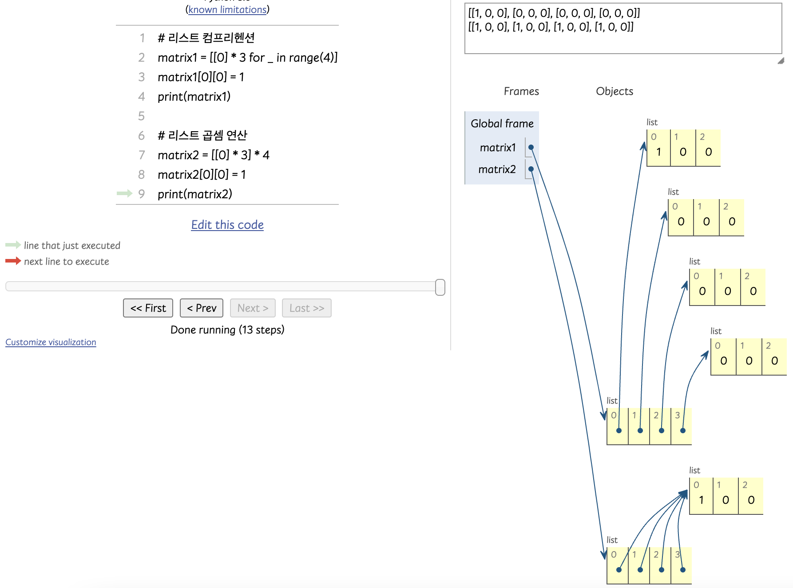
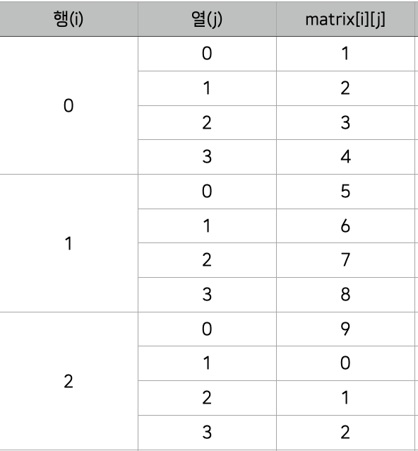
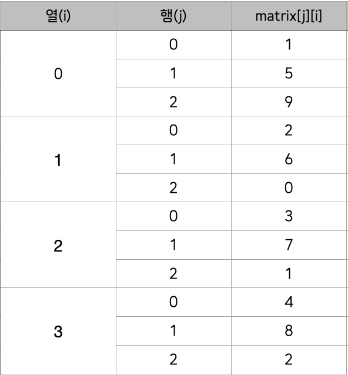
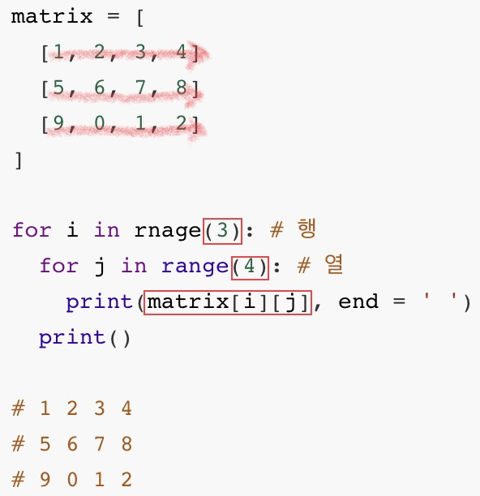
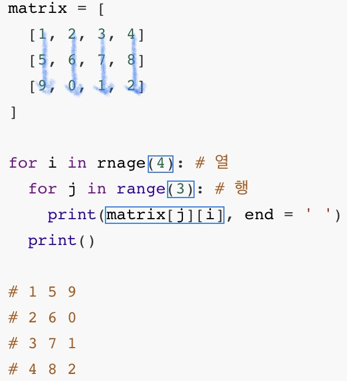

### `이차원 리스트`

------------

#### ✍️ 이차원 리스트

<span style='color:#2D3748; background-color:#fff5b1'>리스트를 원소로 가지는 리스트</span>

```python
           0  1  2    3  4  5    6  7  8
matrix = [[1, 2, 3], [4, 5, 6], [7, 8, 9]]
              0          1          2
  
print(matrix[0][0])
# 1
print(matrix[1][2])
# 6
print(matrix[2][0])
# 7
```


<span style='color:#2D3748; background-color:#fff5b1'>행렬(matrix)</span>의 형태로 보기 좋게 정렬

```python
matrix = [
  0 [1, 2, 3],
  1 [4, 5, 6],
  2 [7, 8, 9]
]    0  1  2
```


💡 이차원 리스트는 <span style='color:#2D3748; background-color:#fff5b1'>행렬(matrix)</span>


`특정 값으로 초기화 된 이차원 리스트 만들기`

1. 직접 작성 (4 x 3 행렬)

   ```python
   matrix1 = [[0, 0, 0], [0, 0, 0], [0, 0, 0], [0, 0, 0]]
   
   matrix2 = [
     [0, 0, 0]
     [0, 0, 0]
     [0, 0, 0]
     [0, 0, 0]
   ]
   ```

2. 반복문으로 작성 (100 x 100 행렬)

   ```python
   matrix = []
   
   for _ in range(100):
     matrix.appemd([0] * 100)
   ```

   반복문으로 작성 (n x m 행렬)

   ```python
   n = 4 # 행
   m = 3 # 열
   matrix = []
   
   for _ in range(n):
     matrix.append([0] * m)
     
   print(matrix)
   # [[0, 0, 0], [0, 0, 0], [0, 0, 0], [0, 0, 0]]
   ```

3. 리스트 컴프리헨션으로 작성 (n x m 행렬)

   ```python
   n = 4 # 행
   m = 3 # 열
   
   matrix = [[0] * m for _ in range(n)]
   
   print(matrix)
   
   # [[0, 0, 0], [0, 0, 0], [0, 0, 0], [0, 0, 0]]
   ```

   

❗️<span style='color:#2D3748; background-color:#fff5b1'>주의</span>❗️ 리스트 컴프리헨션 vs 리스트 곱셈 연산

```python
n = 4 # 행
m = 3 # 열

matrix1 = [[0] * for _ in range(n)]
matrix2 = [[0] * m] * n

matrix1[0][0] = 1
matrix2[0][0] = 1

print(matrix1)
# [[0, 0, 0], [0, 0, 0], [0, 0, 0], [0, 0, 0]]
print(matrix2)
# [[1, 0, 0], [1, 0, 0], [1, 0, 0], [1, 0, 0]]
```




#### ✍️ 입력 받기

1. `행렬의 크기가 미리 주어지는 경우`

   ```python
   '''
   3 x 3 크기의 입력을 받자
   
   1 2 3
   4 5 6
   7 8 9
   '''
   
   matrix = []
   
   for _ in range(3):
     line = list(map(int, input().split()))
     matrix.append(line)
     
   ------------------------------------------
   
   matrix = [list[map(int, input().split())] for _ in range(3)]
   ```

2. `행렬의 크기가 입력으로 주어지는 경우`

   ```python
   '''
   n x m 크기의 입력을 받자
   
   3 4
   1 2 3 4
   5 6 7 8
   9 0 1 2
   '''
   
   n, m = map(int, input().split()) # 3 4
   matrix = []
   
   for _ in ragne(n):
     line = list(map(int, input().split()))
     matrix.append(line)
     
   ------------------------------------------
   
   matrix = [list(map(int, input().split())) for _ in range(n)]
   ```

   


#### ✍️ 순회

이차원 리스트를 단순히 출력하면 아래와 같이 나옴

```python
matrix = [
  [1, 2, 3, 4]
  [5, 6, 7, 8]
  [9, 0, 1, 2]
]
# [[1, 2, 3, 4], [5, 6, 7, 8], [9, 0, 1, 2]]
```


만약 이차원 리스트에 담긴 모든 원소를 아래와 같이 출력하고 싶다면 인덱스를 통해 각각 출력하면 가능하지만 리스트의 크기가 커지면 일일이 인덱스를 출력하기 어렵다.

➡︎ 따라서 이중 반복문을 통해 순회하며 이차원 리스트를 출력


1. `이중 for문을 이용한 행 우선 순회`

   ```python
   matrix = [
     [1, 2, 3, 4]
     [5, 6, 7, 8]
     [9, 0, 1, 2]
   ]
   
   for i in rnage(3): # 행
     for j in range(4): # 열
       print(matrix[i][j], end = ' ')
     print()
     
   # 1 2 3 4
   # 5 6 7 8
   # 9 0 1 2
   ```

   

2. `이중 for문을 이용한 열 우선 순회`

   ```python
   matrix = [
     [1, 2, 3, 4]
     [5, 6, 7, 8]
     [9, 0, 1, 2]
   ]
   
   for i in rnage(4): # 열
     for j in range(3): # 행
       print(matrix[j][i], end = ' ')
     print()
     
   # 1 5 9
   # 2 6 0
   # 3 7 1
   # 4 8 2
   ```

   

   

3. <span style='color:red'>행 우선 순회</span> vs <span style='color:blue'>열 우선 순회</span>

   

   

   

4. `행 우선 순회를 이용해 이차원 리스트의 총합 구하기`

   ```python
   matrix = [
     [1, 1, 1, 1],
     [1, 1, 1, 1],
     [1, 1, 1, 1]
   ]
   
   total = 0
   
   for i in range(3):
     for j in range(4):
       total += matrix[i][j]
       
   print(total) # 12
   ```

   🔖 [참고] Pythonic한 방법으로 이차원 리스트의 총합 구하기

   ```python
   matrix = [
     [1, 1, 1, 1],
     [1, 1, 1, 1],
     [1, 1, 1, 1]
   ]
   
   total = sum(map(sum, matrix))
   print(total) # 12
   ```


5. `행 우선 순회를 이용해 이차원 리스트의 최대값, 최소값 구하기`

   ```python
   # 최대값
   matrix = [
     [0, 5, 3, 1],
     [4, 6, 10, 8],
     [9, -1, 1, 5]
   ]
   
   max_value = 0
   
   for i in range(3):
     for j in range(4):
       if matrix[i][j] > max_value:
         max_value = matrix[i][j]
         
   print(max_value) # 10
   ```

   ```python
   # 최소값
   matrix = [
     [0, 5, 3, 1],
     [4, 6, 10, 8],
     [9, -1, 1, 5]
   ]
   
   max_value = 999999999
   
   for i in range(3):
     for j in range(4):
       if matrix[i][j] > min_value:
         min_value = matrix[i][j]
         
   print(min_value) # -1
   ```

   🔖 [참고] Pythonic한 방법으로 이차원 리스트의 최대값, 최소값 구하기

   ```python
   matrix = [
     [0, 5, 3, 1],
     [4, 6, 10, 8],
     [9, -1, 1, 5]
   ]
   
   max_value = max(map(max, matrix))
   min_value = min(map(min, matrix))
   
   print(max_value) # 10
   print(min_value) # -1
   ```

   


#### ✍️ 전치(transpose)

- `전치란?` 행렬의 행과 열을 서로 맞바꾸는 것을 의미

  ```python
  matrix = [
    [1, 2, 3, 4],
    [5, 6, 7, 8],
    [9, 0, 1, 2]
  ]
  
  # 전치 행렬을 담을 이차원 리스트 초기화
  # 행과 열의 크기가 반대
  transposed_matrix = [[0] * 3 for _ in range(4)]
  
  for i in range(4):
    for j in range(3):
      transposed_matrix[i][j] = matrix[j][i] # 행, 열 맞바꾸기
      
  '''
  transposed_matrix = [
  	[1, 5, 9]
  	[2, 6, 0]
  	[3, 7, 1]
  	[4, 8, 2]
  ]
  '''
  ```


#### ✍️ 회전

- `왼쪽으로 90도 회전하기`

  ```python
  matrix = [
    [1, 2, 3],
    [4, 5, 6],
    [7, 8, 9]
  ]
  
  n = 3
  rotated_matrix = [[0] * n for _ in rnage(n)]
  
  for i in range(n):
    for j in range(n):
      rotated_matrix[i][j] = matrix[j][n - i - 1]
      
  '''
  rotated_matrix = [
  	[3, 6, 9],
  	[2, 5, 8],
  	[1, 4, 7]
  ]
  '''
  ```

- `오른쪽으로 90도 회전하기`

  ```python
  matrix = [
    [1, 2, 3],
    [4, 5, 6],
    [7, 8, 9]
  ]
  
  n = 3
  rotated_matrix = [[0] * n for _ in rnage(n)]
  
  for i in range(n):
    for j in range(n):
      rotated_matrix[i][j] = matrix[n - j - 1][i]
      
  '''
  rotated_matrix = [
  	[7, 4, 1],
  	[8, 5, 2],
  	[9, 6, 3]
  ]
  '''
  ```

  