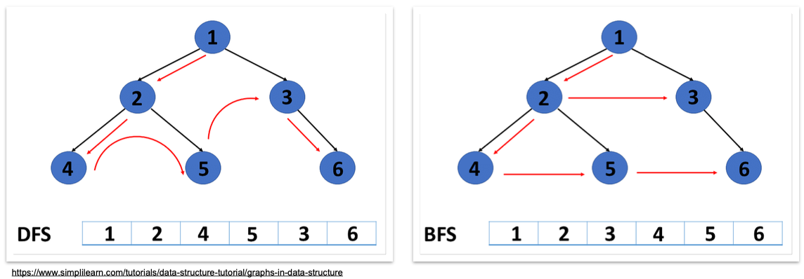
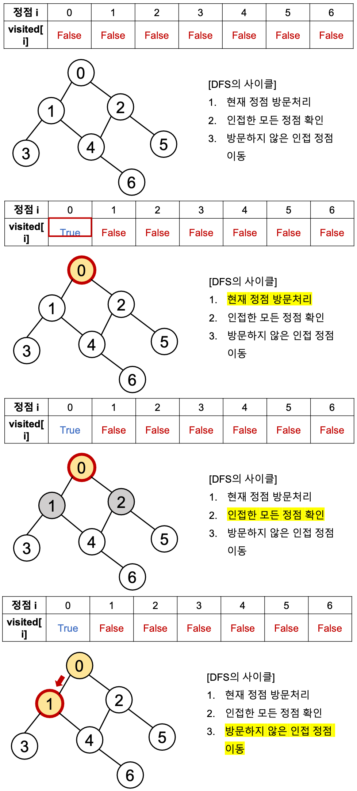
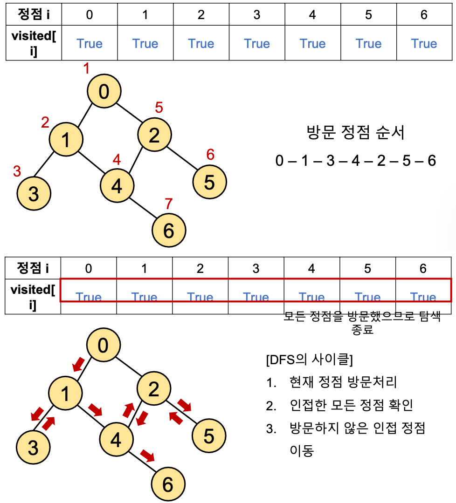

### `깊이우선탐색 (DFS)`

***

#### 📚 그래프 탐색 알고리즘

시작 정점에서 <span style='color:#2D3748; background-color:#fff5b1'>간선을 타고 이동할 수 있는 모든 정점을 찾는</span> 알고리즘

그래프 자료구조는 <span style='color:#2D3748; background-color:#fff5b1'>탐색 알고리즘</span>에 활용됨


그래프 탐색 알고리즘에는 `깊이우선탐색`과 `너비우선탐색`이 있음

스택, 그래프, 큐 자료구조의 개념을 함께 활용함

- 스택 + 그래프 ➡︎ 깊이우선탐색 (Depth-First Search, <span style='color:blue'>DFS</span>)

  그래프의 깊이를 우선으로 탐색하기 위해 <span style='color:blue'>스택</span>의 개념 활용

- 그래프 + 큐 ➡︎ 너비우선탐색 (Breadth-First Search, <span style='color:red'>BFS</span>)

  그래프의 너비를 우선으로 탐색하기 위해 <span style='color:red'>큐</span>의 개념 활용




#### 📚 깊이우선탐색(DFS)

시작 정점으로부터 <span style='color:#2D3748; background-color:#fff5b1'>갈 수 있는 하위 정점까지 가장 깊게 탐색</span>하고,

더 이상 갈 곳이 없다면 마지막 갈림길로 돌아와서 다른 정점을 탐색하며 결국 모든 정점을 방문하는 순회 방법


`특징`

- <span style='color:#2D3748; background-color:#fff5b1'>모든 정점을 방문</span>할 때 유리. 따라서 <span style='color:#2D3748; background-color:#fff5b1'>경우의 수, 순열과 조합</span> 문제에서 많이 사용
- 너비우선탐색(BFS)에 비해 코드 구현이 간단
- 단, 모든 정점을 방문할 필요가 없거나 최단 거리를 구하는 경우에는 너비우선탐색이 유리


#### 📚 DFS의 동작 과정

일단 탐색을 진행할 그래프가 필요. 그래프는 인접 행렬 또는 인접 리스트 방식으로 표현할 수 있다.

```python
# 인접 행렬
graph = [
  [0, 1, 1, 0, 0, 0, 0],
  [1, 0, 0, 1, 1, 0, 0],
  [1, 0, 0, 0, 1, 1, 0],
  [0, 1, 0, 0, 0, 0, 0],
  [0, 1, 1, 0, 0, 0, 1],
  [0, 0, 1, 0 ,0, 0, 0],
  [0, 0, 0, 0, 1, 0, 0]
]

# 인접 리스트
graph = [
  [1, 2]
  [0, 3, 4]
  [0, 4, 5]
  [1]
  [1, 2, 6]
  [2]
  [4]
]
```


<span style='color:#2D3748; background-color:#fff5b1'>각 정점을 방문했는지 여부를 판별</span>할 방문 체크 리스트가 필요

```python
# n은 정점의 개수
visited = [False] * n
```

| 정점 i     | 0     | 1     | 2     | 3     | 4     | 5     | 6     |
| ---------- | ----- | ----- | ----- | ----- | ----- | ----- | ----- |
| Visited[i] | False | False | False | False | False | False | False |

인덱스는 각 정점의 번호

방문한 정점은 <span style='color:blue'>True</span>, 방문하지 않은 정점은 <span style='color:red'>False</span>


`DFS의 사이클`

1. 현재 정점 방문 처리
2. 인접한 모든 정점 확인
3. 방문하지 않은 인접 정점 이동




위와 같은 사이클로 모든 정점을 방문하고 나면..




탐색 종료


#### 📚 DFS의 구현 방식

`반복문을 이용한 DFS`

DFS는 직전에 방문한 정점으로 차례로 돌아가야 하므로

후입선출(LIFO) 구조의 <span style='color:red'>스택</span>을 사용

```python
# 인접 리스트
graph = [
  [1, 2]
  [0, 3, 4]
  [0, 4, 5]
  [1]
  [1, 2, 6]
  [2]
  [4]
]
```

```python
# 방문 처리 리스트 만들기
visited = [False] * n 

def fgs(start):
  # 돌아올 곳을 기록
  stack = [start]
  # 시작 정점 방문 처리
  visited[start] = True
  
  # 스택이 빌 때까지(돌아갈 곳이 없을때까지) 반복
  while stack:
    #현재 방문 정점(후입선출)
    cur = stack.pop()
    
    # 인접한 모든 정점에 대해
    for adj in graph[cur]:
      # 아직 방문하지 않았다면
      if not visited[adj]:
        # 방문 처리
        visited[adj] = True
        # 스택에 넣기
        stack.append(adj)
        
# 0번 정점에서 시작
dfs(0)
```

