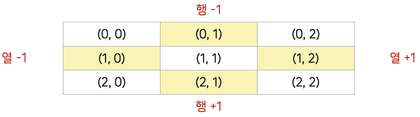
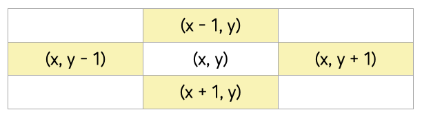
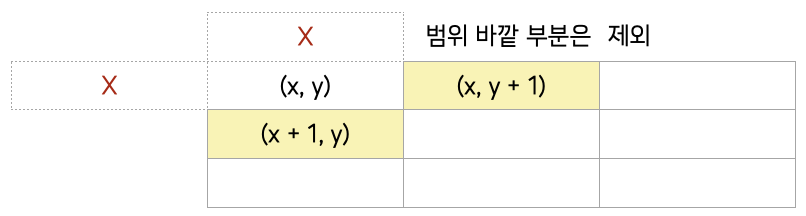
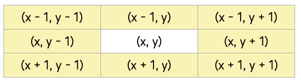

### `완전탐색 1 (Exhaustive Search)`

***

#### ✏️ Brute-Force

- <span style='color:#2D3748; background-color:#fff5b1'>모든 경우의 수</span>를 탐색하여 문제를 해결하는 방식 *무식하게 밀어붙인다는 뜻*
- 가장 단순한 풀이 기법. 단순 조건문과 반복문을 이용해서 풀 수 있음
- 복잡한 알고리즘 보다는 아이디어를 어떻게 코드로 구현할 것인지가 중요


`예시` 블랙잭 문제 완전탐색 풀이

```python
def blackjack(n, m, cards):
  max_total = 0 # 현재 가장 큰 합
  
  # 완전탐색(Brute-force)
  for i in ragne(n -2):
    for j in range(i + 1, n - 1):
      for k in range(j + 1, n):
        total = cards[i] + cards[j] + cards[k]
        
        # 현재 가장 큰 합보다는 크고 m을 넘지 않아야 갱신
        if max_total < total <= m:
          max_total = total
          
        # 합과 m이 같으면 더이상 탐색하는 의미가 없으므로 종료
        if total == m:
          return total
        
  return max_total
```

- 3중 for문을 이용해 모든 경우의 수를 탐색
- i, j, k는 세 장의 카드의 인덱스를 의미
- 중복으로 뽑는 경우를 방지하기 위해 range 범위


#### ✏️ 델타 탐색 (Delta Search)

(0, 0)에서부터 이차원 리스트의 모든 원소를 순회하며 *(완전탐색)*

<span style='color:#2D3748; background-color:#fff5b1'>각 지점에서 상하좌우에 위치한 다른 지점을 조회하거나 이동</span>하는 방식




델타(Delta)값을 이용해 상하좌우 이동하기

```python
# 행을 x, 열을 y로 표현
dx = [-1, 1, 0, 0]
dy = [0, 0, -1, 1]

# 행을 r, 열을 c로 표현
dr = [-1, 1, 0, 0]
dc = [0, 0, -1, 1]
```




```python
# 상(x - 1, y)
nx = x + dx[0]
ny = y + dy[0]

# 하(x + 1, y)
nx = x + dx[1]
ny = y + dy[1]

# 좌(x, y - 1)
nx = x + dx[2]
ny = y + dy[2]

# 우(x, y + 1)
nx = x + dx[3]
ny = y + dy[3]

# 상하좌우
for i in range(4):
  nx = x + dx[i]
  ny = y + dy[i]
```


상하좌우로 이동 후 범위를 벗어나지 않는지 확인 및 갱신

```python
# 델타값을 이용해 상하좌우 이동
for i in range(4):
  nx = x + dx[i]
  ny = y + dy[i]
  
  # 범위를 벗어나지 않으면 갱신
  if <= nx < 3 and 0 <= ny < 3:
    x = nx
    y = ny
```




```python
# 델타값 정의(상하좌우)
dx = [-1, 1, 0, 0]
dy = [0, 0 -1, 1]

# 이차원 리스트 순회
for x in range(n):
  for y in range(m):
    
    # 델타값을 이용해 상하좌우 이동
    for i in range(4):
      nx = x + dx[i]
      ny = y + dy[i]
      
      # 범위를 벗어나지 않으면 갱신
      if 0 <= nx < n and 0 <= ny < m:
        x = nx
        y = ny
```


🔖 [참고] <span style='color:#2D3748; background-color:#fff5b1'>상하좌우 + 대각선</span>의 8방향 델타값

```python
# 상, 하, 좌, 우, 좌상, 좌하, 우상, 우하

dx = [-1, 1, 0, 0, -1, 1, -1, 1]
dy = [0, 0, -1, 1, -1, -1, 1, 1]
```




