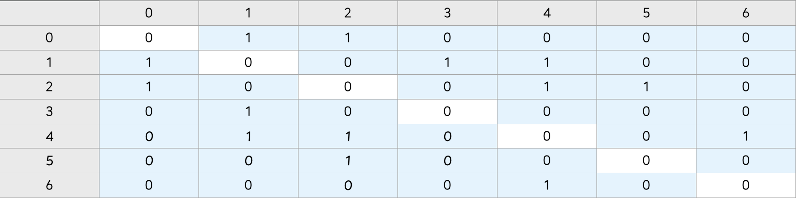
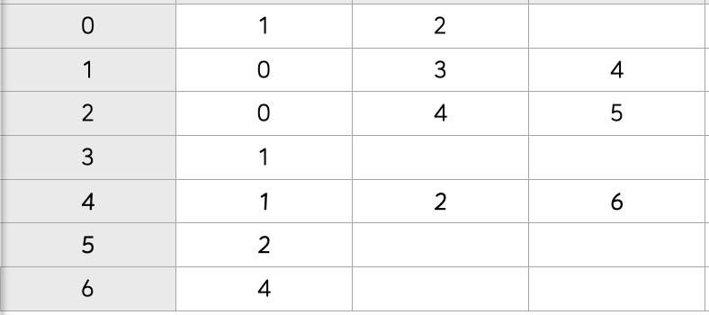

### `그래프 (Graph)`

***

#### 🔎 그래프에 대한 이해

<span style='color:#2D3748; background-color:#fff5b1'>정점(Vertex)</span>과 이를 연결하는 <span style='color:#2D3748; background-color:#fff5b1'>간선(Edge)</span>들의 집합으로 이루어진 비선형 자료구조

*ex) 소셜 네트워크, 지하철 노선도*


`그래프 관련 용어`

<span style='color:#2D3748; background-color:#fff5b1'>정점(Vertex)</span> 간선으로 연결되는 객체이며 노드(Node)라고도 함

<span style='color:#2D3748; background-color:#fff5b1'>간선(Edge)</span> 정점 간의 관계(연결)를 표현하는 선을 의미

<span style='color:#2D3748; background-color:#fff5b1'>경로(Path)</span> 시작 정점부터 도착 정점까지 거치는 정점을 나열한 것

<span style='color:#2D3748; background-color:#fff5b1'>인접(Adjacency)</span> 두 개의 정점이 하나의 간선으로 직접 연결된 상태


#### 🔎 그래프의 종류

1. `무방향 그래프 (Undirected graph)`
   - 간선의 <span style='color:#2D3748; background-color:#fff5b1'>방향이 없는</span> 가장 일반적인 그래프
   - 간선을 통해 양방향의 정점 이동 가능
   - <span style='color:#2D3748; background-color:#fff5b1'>차수(Degree)</span> : 하나의 정점에 연결된 간선의 개수
   - 모든 정점의 차수의 합 = 간선 수 * 2
2. `유방향 그래프(Directed graph)`
   - 간선의 <span style='color:#2D3748; background-color:#fff5b1'>방향이 있는</span> 가장 일반적인 그래프
   - 간선의 방향이 가리키는 정점으로 이동 가능
   - <span style='color:#2D3748; background-color:#fff5b1'>차수(Degree)</span> : 진입 차수와 진출 차수로 나누어짐
     - 진입 차수 (In-degree) : 외부 정점에서 한 정점으로 들어오는 간선의 수
     - 진출 차수 (Out-degree) : 한 정점에서 외부 정점으로 나가는 간선의 수


#### 🔎 그래프의 표현

1. `인접 행렬 (Adjacent matrix)`

   두 정점을 연결하는 <span style='color:#2D3748; background-color:#fff5b1'>간선이 없으면 0, 있으면 1</span>을 가지는 <span style='color:#2D3748; background-color:#fff5b1'>행렬</span>로 표현하는 방식

   

   ```python
   # 입력
   0 1
   0 2
   1 3
   1 4
   2 4
   2 5
   4 6
   ```

   ```python
   # 인접 행렬 만들기
   
   n = 7 # 정점 개수
   m = 7 # 간선 개수
   
   graph = [[0] * n for _ in range(n)]
   
   for _ in range(m):
     v1, v2 = map(int, input().split())
     graph[v1][v2] = 1
     grpah[v2][v1] = 1
   ```

   ```python
   # 인접 행렬 결과
   graph = [
     [0, 1, 1, 0, 0, 0, 0],
     [1, 0, 0, 1, 1, 0, 0],
     [1, 0, 0, 0, 1, 1, 0],
     [0, 1, 0, 0, 0, 0, 0],
     [0, 1, 1, 0, 0, 0, 1],
     [0, 0, 1, 0 ,0, 0, 0],
     [0, 0, 0, 0, 1, 0, 0]
   ]
   ```

2. `인접 리스트 (Adjacent list)`

   <span style='color:#2D3748; background-color:#fff5b1'>리스트</span>를 통해 각 정점에 대한 인접 정점들을 <span style='color:#2D3748; background-color:#fff5b1'>순차적</span>으로 표현하는 방식

   

   ```python
   # 입력
   0 1
   0 2
   1 3
   1 4
   2 4
   2 5
   4 6
   ```

   ```python
   # 인접 리스트 만들기
   
   n = 7 # 정점 개수
   m = 7 # 간선 개수
   
   graph = [[] * n for _ in range(n)]
   
   for _ in range(m):
     v1, v2 = map(int, input().split())
     graph[v1].append(v2)
     grpah[v2].append(v1)
   ```

   ```python
   # 인접 리스트 결과
   # 인덱스 번호가 정점의 번호를 의미
   graph = [
     [1, 2]
     [0, 3, 4]
     [0, 4, 5]
     [1]
     [1, 2, 6]
     [2]
     [4]
   ]
   ```


📝 인접 행렬 vs 인접 리스트

<span style='color:#2D3748; background-color:#fff5b1'>인접 행렬</span>은 직관적이고 만들기 편하지만 불필요하게 공간이 낭비 됨

<span style='color:#2D3748; background-color:#fff5b1'>인접 리스트</span>는 연결된 정점만 저장하여 효율적이므로 자주 사용 됨