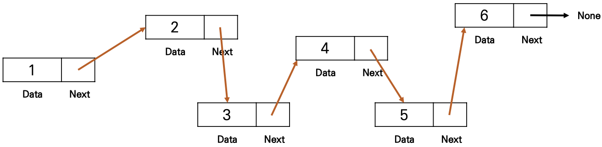

### `리스트 (List)`

-------------

#### 📝 배열 vs 연결리스트

`배열 (Array)`

🔖 여러 데이터들이 연속된 메모리 공간에 저장되어 있는 자료구조

- 인덱스(Index)를 통해 데이터에 빠르게 접근
- 배열의 길이는 변경 불가능 ➡︎ 길이를 변경하고 싶다면 새로 생성
- 데이터 타입은 고정

| 메모리 주소 | 데이터 | 인덱스 |
| ----------- | ------ | ------ |
| 1000        | 1      | A[0]   |
| 1004        | 2      | A[1]   |
| 1008        | 3      | A[2]   |
| 1012        | 4      | A[3]   |
| 1016        | 5      | A[4]   |
| 1020        | 6      | A[5]   |
| 1024        | 7      | A[6]   |


`연결 리스트 (Linked List)`

🔖 데이터가 담긴 여러 노드들이 순차적으로 연결된 형태의 자료구조

- 맨 처음 노드부터 순차적으로 탐색
- 연결리스트의 길이는 자유롭게 변경 가능 ➡︎ 삽입, 삭제가 편리
- 다양한 데이터 타입 저장
- 데이터가 메모리에 연속적으로 저장되지 않음




배열 `인덱스 접근` ➡︎ 파이썬의 리스트 (List) ⬅︎ 연결리스트 `가변 길이`

| 인덱스 | A[0] | A[1] | A[2] | A[3] | A[4] | A[5] |
| ------ | ---- | ---- | ---- | ---- | ---- | ---- |
| 주소   | 2456 | 3882 | 6428 | 1003 | 2938 | 8472 |

​								⬇︎					⬇︎					⬇︎				  ⬇︎					⬇︎				  ⬇︎

| 데이터 | 0    | 1.5  | 2    | 3    | "a"  | [1, 2] |
| ------ | ---- | ---- | ---- | ---- | ---- | ------ |


#### 📖 파이썬의 리스트

파이썬 리스트의 메서드

- `.append(원소)` 리스트 맨 끝에 새로운 원소 **삽입**

  ```python
  a = [1, 2, 3, 4, 5]
  a.append(6)
  ```

  > [1, 2, 3, 4, 5, 6]

  ```python
  a = [1, 2, 3, 4, 5]
  a.append(['a', 'b'])
  ```

  > [1, 2, 3, 4, 5, ['a', 'b']]

- `.pop(인덱스)` 특정 인덱스에 있는 원소를 **삭제 및 반환**

  ```python
  a = [1, 2, 3, 4, 5]
  b = a.pop()
  ```

  > [1, 2, 3, 4]
  >
  > 5

  ```python
  a = [1, 2, 3, 4, 5]
  b = a.pop(2)
  ```

  >[1, 2, 4, 5]
  >
  >3

- `.count(원소)` 리스트에서 해당 원소의 **개수**를 반환

  ```python
  a = [1, 2, 2, 3, 3, 3]
  print(a.count(2))
  ```

  > 2

  ```python
  a = [1, 2, 2, 3, 3, 3]
  print(a.count(3))
  ```

  > 3

- `.index(원소)` 리스트에서 처음으로 원소가 등장하는 **인덱스** 반환

  ```python
  a = [1, 2, 3, 2, 5]
  print(a.index(2))
  ```

  > 1

  ```python
  a = [1, 2, 3, 2, 5]
  print(a.index(7))
  ```

  > ---------------------------
  >
  > ValueError
  >
  > Input In [5], In <cell l1 a = [1, 2, 3, 2,  5]
  >
  > ---- > 3 print(a.index(7))
  >
  > -----------------------------------
  >
  > ValueError: 8 is not In

- `.sort()` 리스트를 오름차순으로 **정렬**

  **reverse=True** 옵션을 통해 내림차순으로 정렬 가능

  ```python
  a = [5, 2, 4, 0, -1]
  a.sort()
  ```

  > [-1, 0, 2, 4, 5]

  ```python
  a = [5, 2, 4, 0, -1]
  a.sort(reverse=True)
  ```

  > [5, 4, 2, 0, -1]

- `reverse()` 리스트의 원소들의 순서를 거꾸로 **뒤집기**

  ```python
  a = [1, 2, 3, 4, 5]
  a.reverse()
  ```

  > [5, 4, 3, 2, 1]


자주 쓰이는 리스트 관련 내장함수

- `len(iterable)` 리스트의 **길이**(원소의 개수)를 반환

  ```python
  a = [1, 2, 3, 4, 5]
  print(len(a))
  ```

  > 5

- `sum(iterable)` 리스트의 모든 원소의 **합**을 반환

  ```python
  a = [1, 2, 3, 4, 5]
  print(sum(a))
  ```

  > 15

- `max(iterable)` 리스트의 원소 중 **최대값**을 반환

  ```python
  a = [1, 2, 3, 4, 5]
  print(max(a))
  ```

  > 5

- `min(iterable)` 리스트의 원소 중 **최소값**을 반환

  ```python
  a = [1, 2, 3, 4, 5]
  print(min(a))
  ```

  > 1

- `sorted(iterable)` 오름차순으로 **정렬**된 새로운 리스트 반환

  원본 리스트는 변화 없음

  ```python
  a = [5, 2, -1, 0, 1]
  b = sorted(a)
  c = sorted(a, reverse=True)
  
  print(a) # 원본
  print(b) # 오름차순 정렬
  print(c) # 내림차순 정렬
  ```

  >[5, 2, -1, 0, 1]
  >
  >[-1, 0, 1, 2, 5]
  >
  >[5, 2, 1, 0, -1]

- `reversed(iterable)` 리스트의 순서를 거꾸로 **뒤집은** 새로운 객체 반환

  원본 리스트는 변화 없음

  ```python
  a = [1, 2, 3, 4, 5]
  b = reversed(a)
  c = list(reversed(a))
  
  print(a) # 원본
  print(b) # reversed(a)
  print(c) # list(reversed(a))
  ```

  > [1, 2, 3, 4, 5]
  >
  > <list_reverseliterator object at 0x00000298CE25E740>
  >
  > [5, 4, 3, 2, 1]


#### 📖 리스트 컴프리헨션 (List Comprehension)

- 코드 **한 줄**만으로 새로운 리스트를 만드는 방법

  ```python
  numbers = []
  for i in range(5):
    numbers.append(i)
  # [0, 1, 2, 3, 4]
  
  ⬇︎
  
  numbers = [i for i in range(5)]
  # [0, 1, 2, 3, 4]
  ```

  ```python
  odd_numbers = [i for i in range(10) if i % 2 == 1]
  # [1, 3, 5, 7, 9]
  # if문으로 필터링도 가능
  ```

  

