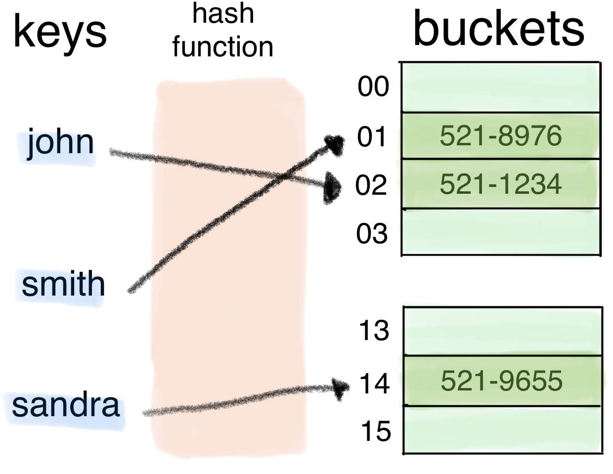

### `딕셔너리 (Dictionary)`

-------------

#### 🗒 해시 테이블

파이썬에는 딕셔너리(dict) 자료구조가 내장 되어 있다.

<span style='color:#2D3748; background-color:#fff5b1'>Non-sequence & Key-Value</span>

```python
{
  'name': 'bada'
  'gender': 'female'
  'address': 'Seoul'
}     ⬆︎
  Key는 immutale
  (변경 불가능)
```


<span style='color:#2D3748; background-color:#fff5b1'>Key:Value</span>가 저장되는 원리가 무엇일까?


리스트를 이용해 Key:Value를 저장하면 탐색이 많아질수록 오래 걸림


딕셔너리는 <span style='color:#2D3748; background-color:#fff5b1'>해시 테이블(Hash Table)</span>을 이용하여 Key:Value 저장

```python
{
  210701: 'haley'
  211209: 'alex'
  210218: 'justin'
  210405: 'kyle'
  210617: 'chris'
}
```


<span style='color:#2D3748; background-color:#fff5b1'>해시 함수</span> : 임의 길이의 데이터를 고정 길이의 데이터로 매핑하는 함수

<span style='color:#2D3748; background-color:#fff5b1'>해시</span> : 해시 함수를 통해 얻어진 값

```python
{
  'john': '521-1234'
  'smith': '521-8976'
  'sandra': '521-9655'
}
```

![


📝 파이썬의 딕셔너리는 해시 함수와 해시 테이블을 이용하여

​	  삽입, 삭제, 수정, 조회 <span style='color:#2D3748; background-color:#fff5b1'>연산의 속도가 리스트보다 빠르다.</span>


#### 🗒 딕셔너리 기본 문법

`기본적인 딕셔너리 사용법`

- <span style='color:#2D3748; background-color:#fff5b1'>선언</span>

  변수 = {<span style='color:red'>key1</span>: <span style='color:blue'>value1</span>, <span style='color:red'>key2</span>: <span style='color:blue'>value2</span> ...}

  ```python
  a = {
    'name': 'bada'
    'gender': 'female'
    'address': 'Seoul'
  }
  print(a)
  ```

  > {'name': 'bada', 'gender': 'female', 'address': 'Seoul'}

- <span style='color:#2D3748; background-color:#fff5b1'>삽입/수정</span>

  딕셔너리[<span style='color:red'>key</span>] = <span style='color:blue'>value</span>

  내부에 해당 key가 없으면 삽입, 있으면 수정

  ```python
  a = {
    'name': 'bada'
    'gender': 'female'
    'address': 'Seoul'
  }
  a['job'] = 'coach'
  ```

  > {'name': 'bada', 'gender': 'female', 'address': 'Seoul', 'job': 'coach'}

  ```python
  a = {
    'name': 'bada'
    'gender': 'female'
    'address': 'Seoul'
  }
  a['name'] = 'chris'
  ```

  > {'name': 'Chris', 'gender': 'female', 'address': 'Seoul'}

- <span style='color:#2D3748; background-color:#fff5b1'>삭제</span>

  딕셔너리.pop(<span style='color:red'>key</span>)

  내부에 존재하는 key에 대한 value 삭제 및 반환, 존재하지 않는 key에 대해서는 KeyError 발생

  ```python
  a = {
    'name': 'bada'
    'gender': 'female'
    'address': 'Seoul'
  }
  gender = a.pop('gender')
  
  print(a)
  print(gender)
  ```

  > {'name': 'bada', 'address': 'Seoul'}
  >
  > female

  ```python
  a = {
    'name': 'bada'
    'gender': 'female'
    'address': 'Seoul'
  }
  phone = a.pop('phone')
  
  print(a)
  print(phone)
  ```

  > KeyError

  딕셔너리.pop(<span style='color:red'>key</span>, <span style='color:blue'>default</span>)

  두 번째 인자로 default(기본)값을 지정하여 KeyError 방지 가능

  ```python
  a = {
    'name': 'bada'
    'gender': 'female'
    'address': 'Seoul'
  }
  phone = a.pop('phone', '010-1234-5678')
  
  print(a)
  print(phone)
  ```

  > {'name': 'Chris', 'gender': 'female', 'address': 'Seoul'}
  >
  > 010-1234-5678

- <span style='color:#2D3748; background-color:#fff5b1'>조회</span>

  key에 해당하는 value 반환

  ```python
  # 딕셔너리[key]
  a = {
    'name': 'bada'
    'gender': 'female'
    'address': 'Seoul'
  }
  print(a['name'])
  print(a['phone'])
  ```

  > bada
  > KeyError: 'phone'

  ```python
  # 딕셔너리.get(key)
  a = {
    'name': 'bada'
    'gender': 'female'
    'address': 'Seoul'
  }
  print(a.get('name')
  ```

  > bada

  ```python
  # 딕셔너리.get(key, default)
  a = {
    'name': 'bada'
    'gender': 'female'
    'address': 'Seoul'
  }
  
  print(a.get('phone'))
  print(a.get('phone', '없음'))
  ```

  > None
  >
  > 없음


#### 🗒 딕셔너리 메서드

- `.keys()`

  딕셔너리 <span style='color:#2D3748; background-color:#fff5b1'>key 목록</span>이 담긴 dict_keys 객체 반환

  ```python
  a = {
    'name': 'bada'
    'gender': 'female'
    'address': 'Seoul'
  }
  print(a.keys())
  ```

  > dict_keys(['name', 'gender', 'address'])

  ```python
  for key in a.keys()
  print(key)
  ```

  > name
  >
  > gender
  >
  > address

  ```python
  for key in a:
    print(key)
  ```

  >name
  >
  >gender
  >
  >address

- `.values()`

  딕셔너리의 <span style='color:#2D3748; background-color:#fff5b1'>value 목록</span>이 담긴 dict_values 객체 반환

  ```python
  a = {
    'name': 'bada'
    'gender': 'female'
    'address': 'Seoul'
  }
  print(a.values())
  ```

  > dict_values(['bada', 'female', 'Seoul'])

  ```python
  for value in a.values():
    print(value)
  ```

  >bada
  >
  >female
  >
  >Seoul

- `.items()`

  딕셔너리의 <span style='color:#2D3748; background-color:#fff5b1'>(key, value) 쌍 목록</span>이 담긴 dict_items 객체 반환

  ```python
  a = {
    'name': 'bada'
    'gender': 'female'
    'address': 'Seoul'
  }
  print(a.items())
  ```

  > dict_items([('name', 'bada'), ('gender', 'female'), ('address', 'Seoul')])

  ```python
  a = {
    'name': 'bada'
    'gender': 'female'
    'address': 'Seoul'
  }
  
  for item in a.items():
    print(item)
  ```

  > ('name', 'bada')
  >
  > ('gender', 'female')
  >
  > ('address', 'Seoul')

  ```python
  a = {
    'name': 'bada'
    'gender': 'female'
    'address': 'Seoul'
  }
  
  for ket, value in a.items():
    print(key, value)
  ```

  > name bada
  >
  > gender female
  >
  > Address Seoul

  

