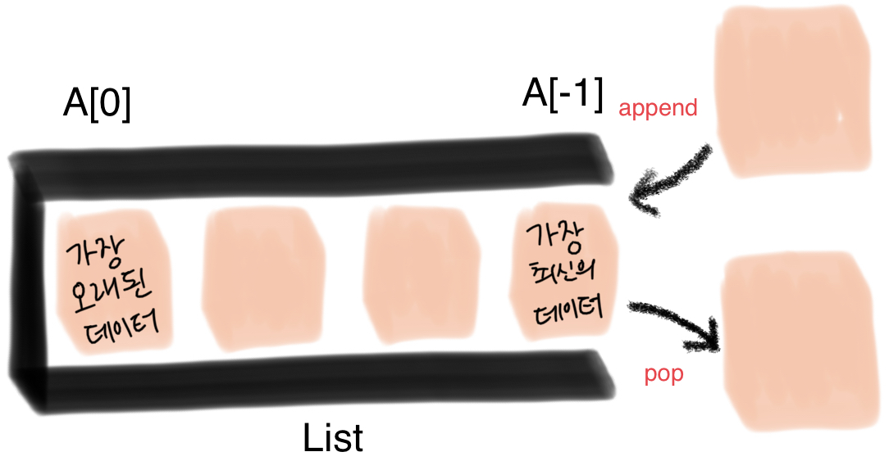
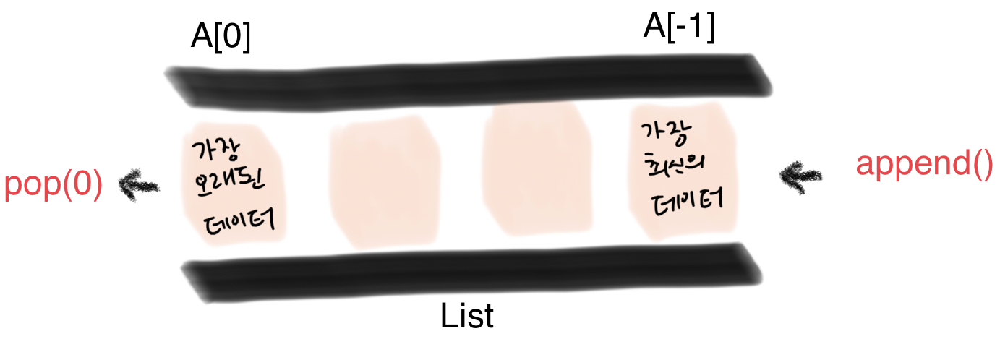
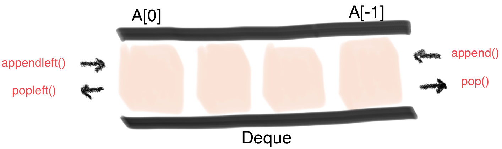

### `스택, 큐 (Stack, Queue)`

-------------

#### 👩🏻‍💻 들어가기 전에

프로그램 = 데이터 구조 + 알고리즘

Data Structure 데이터 구조

➡︎ 데이터를 다양한 방식으로 저장하고 조회, 삽입, 변경, 삭제와 같은 조작 기능 제공

🤷🏻‍♀️ 그렇다면 왜 데이터 구조가 중요할까?

​	  문제 상황에 따라 더 적합한 통과 도구가 필요하다.

​	  ➡︎ 데이터 구조 == 데이터 + 구조

​		  문제를 더 효율적으로 풀기 위한 도구가 된다.

파이썬의 기본 데이터 구조

#### 📚 스택 (Stack)

`Stack`은 쌓는다는 의미. 데이터를 한쪽에서만 넣고 빼는 자료구조

가장 마지막에 들어온 데이터가 가장 먼저 나가므로 LIFO(Last-in First-out, 후입선출) 방식

🤷🏻‍♀️ 그렇다면 왜 Stack을 써야할까?

`뒤집기, 되돌리기, 되돌아가기`

- Stack이 필요한 이유 == Stack의 Use Case

​	   ex) 브라우저 히스토리, ctrl + z, 단어 뒤집기

`마무리 되지 않은 일을 임시 저장`

- 활용 예시) 괄호 매칭, 함수 호출, 백트래킹, DFS(깊이 우선 탐색)

  리스트(List)로 스택을 간편하게 사용할 수 있다.

#### 📚 큐(Queue)

`Queue`는 한 쪽 끝에서 데이터를 넣고, 다른 한 쪽에서만 데이터를 뺄 수 있는 자료구조

가장 먼저 들어온 데이터가 가장 먼저 나가므로 FIFO(First-in First-out, 선입선출) 방식

큐 자료구조도 리스트(List)로 간편하게 사용할 수 있다.

❗️ 리스트를 이용한 큐 자료구조의 단점

데이터를 뺄 때 큐 안에 있는 데이터가 많은 경우 비효율적

맨 앞 데이터가 빠지면서, 리스트의 인덱스가 하나씩 당겨지기 때문

#### 📚 덱 (Deque, Double-Ended Queue) 자료구조

양 방향으로 삽입과 삭제가 자유로운 큐

양 방향 삽입, 추출이 모두 큐보다 훨씬 빠르다.

따라서 데이터의 삽입, 추출이 많은 경우 시간을 크게 단축 시킬 수 있다.

