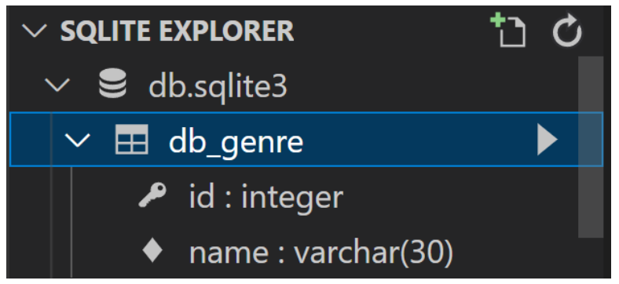

### `ORM`

***

- Object-Relational-Mapping
- 객체 지향 프로그래밍 언어를 사용하여 호환되지 않는 유형의 시스템 간의 데이터를 변환하는 프로그래밍 기술
- 파이썬에서는 SQLAlchemy, peewee 등 라이브러리가 있으며 Django 프레임워크에서는 내장 Django ORM을 활용
- 데이터베이스 조작(Datebase API)

```sqlite
Genre.objects.all()
```

> Genre ➡︎ Class Name
>
> objects ➡︎ Manager
>
> all() ➡︎ QuerySet API


- 모델 설계 및 반영

  - 클래스를 생성하여 내가 원하는 DB의 구조를 만든다

  ```sqlite
  Class Genre(models.Model):
  	name = models.CharField(max_length = 30)
  ```

  - 클래스의 내용으로 데이터베이스에 반영하기 위한 마이그레이션 파일을 생성한다

    ```python
    $ python manage.py makemigrations
    ```

    

  - DB에 migrate 한다

  ```python
  $ python manage.py migrate
  ```

  


- Migration(마이그레이션)
  - Model에 생긴 변화를 DB에 반영하기 위한 방법
  - 마이그레이션 파일을 만들어 DB 스키마를 반영
  - 명령어
    - makemigrations : 마이그레이션 파일 생성
    - Migrate : 마이그레이션을 DB에 반영


##### 📌 ORM 기본조작

- `Create`

```sqlite
-- create 메서드 활용
Genre.objects.create(name = '발라드')

-- 인스턴스 조작
genre = Genre()
genre.name = '인디밴드'
genre.save()
```

- `Read`

```sqlite
-- 전체 데이터 조회
Genre.objects.all()
-- <QuerySet [<Genre: Genre ogject (1)>, <Genre: Genre ogject (2)>]>

-- 일부 데이터 조회(get)
Genre.objects.get(id = 1)
-- <Genre: Genre object (1)>

-- 일부 데이터 조회(filter)
Genre.objects.filter(id = 1)
-- <QuerySet [<Genre: Genre object (1)>]>
```

- `Update`

```sqlite
-- genre 객체 활용
genre = Genre.objects.get(id = 1)

-- genre 객체 속성 변경
genre.name = '트로트'

-- genre 객체 저장
genre.save()
```

- `Daelete`

```sqlite
-- genre 객체 활용
genre = Genre.objects.get(id = 1)

-- genre 객체 삭제
genre.delete()
```

