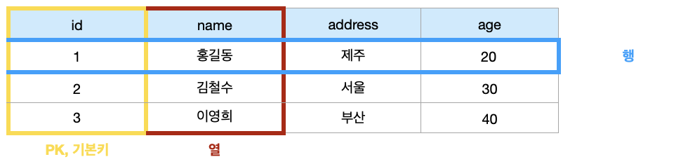

### `Database`

***

- 데이터베이스는 <span style='color:#2D3748; background-color:#fff5b1'>체계화된 데이터</span>의 모임
- <span style='color:#2D3748; background-color:#fff5b1'>몇 개의 자료 파일을 조직적으로 통합</span>하여 <span style='color:#2D3748; background-color:#fff5b1'>자료 항목의 중복을 없애고 자료를 구조화하여 기억시켜 놓은 자료의 집합체</span>


👩🏻‍💻 데이터베이스로 얻는 장점들

- 데이터 중복 최소화
- 데이터 무결성(정확한 정보를 보장)
- 데이터 일관성
- 데이터 독립성(물리적/논리적)
- 데이터 표준화
- 데이터 보안 유지


#### 📋 RDB

- `관계형 데이터베이스 (RDB, Relational Database)`

  - 서로 관련된 데이터를 저장하고 접근할 수 있는 데이터베이스 유형
  - 키(Key)와 값(value)들의 간단한 관계(relation)를 표(table) 형태로 정리한 데이터베이스

  | 고유 번호 |  이름  | 주소 | 나이 |
  | :-------: | :----: | :--: | :--: |
  |     1     | 홍길동 | 제주 |  20  |
  |     2     | 김철수 | 서울 |  30  |
  |     3     | 이영희 | 부산 |  40  |

- `스키마(schema)`

  - 데이터베이스에서 자료의 구조, 표현방법, 관계 등 전반적인 <span style='color:#2D3748; background-color:#fff5b1'>명세를 기술</span>한 것

  | column  | datatype |
  | :-----: | :------: |
  |   id    |   INT    |
  |  name   |   TEXT   |
  | Address |   TEXT   |
  |   Age   |   INT    |

- `테이블(table)`

  - 열(컬럼/필드)과 행(레코드/값)의 모델을 사용해 조직된 데이터 요소들의 집합

  

- `열(column)`
  - 각 열에 고유한 데이터 형식 지정
  - name이란 필드에 고객의 이름(TEXT) 정보 저장
- `행(row)`
  - 실제 데이터가 저장되는 형태
  - 총 3명의 고객정보가 저장되어 있음(레코드가 3개)

- `기본키 (Primary Key)`
  - 각 행(레코드)의 고유 값
  - 반드시 설정해야 하며, 데이터베이스 관리 및 관계 설정 시 주요하게 활용 됨




#### 📋 RDBMS

- `관계형 데이터베이스 관리 시스템 (RDBMS)`
  - 관계형 모델을 기반으로 하는 데이터베이스 관리시스템을 의미
- `SQLite`
  - 서버 형태가 아닌 파일 형식으로 응용 프로그램에 넣어서 사용하는 <span style='color:#2D3748; background-color:#fff5b1'>비교적 가벼운 데이터베이스</span>
  - 구글 안드로이드 운영체제에 기본적으로 탑재된 데이터베이스
  - 임베디드 소프트웨어에도 많이 활용됨
  - 로컬에서 간단한 DB 구성을 할 수 있으며, 오픈소스 프로젝트이기 때문에 자유롭게 사용가능
- `SQLite Data Type`
  - NULL
  - INTEGER
    - 크기에 따라 0, 1, 2, 3, 4, 5 또는 8바이트에 저장된 부호가 있는 경우
  - REAL
    - 8바이트 부동 소수점 숫자로 저장된 부동 소수점 값
  - TEXT
  - BLOB
    - 입력된 그대로 정확히 저장된 데이터(별다른 타입 없이 그대로 저장)
- `sqlite Type Affinity`
  - 특정 컬럼에 저장하도록 권장하는 데이터 타입
    - INTEGER
    - TEXT
    - BLOB
    - REAL
    - NUMERIC


##### 📋 SQL

- `SQL (Structured Query Language)`
  - 관계형 데이터베이스 관리시스템의 <span style='color:#2D3748; background-color:#fff5b1'>데이터 관리</span>를 위해 <span style='color:#2D3748; background-color:#fff5b1'>특수 목적으로 설계된 프로그래밍 언어</span>
  - 데이터베이스 스키마 생성 및 수정
  - 자료의 검색 및 관리
  - 데이터베이스 객체 접근 조정 관리


|                           분류                            |                             개념                             |                    예시                     |
| :-------------------------------------------------------: | :----------------------------------------------------------: | :-----------------------------------------: |
|  DDL - 데이터 정의 언어<br />(Data Definition Language)   | 관계형 데이터베이스 구조(테이블, 스키마)를 정의하기 위한 명령어 |         CREATE<br />DROP<br />ALTER         |
| DML - 데이터 조작 언어 <br />(Data Manipulation Language) |    데이터를 저장, 조회, 수정, 삭제 등을 하기 위한 명령어     | INSERT<br />SELECT<br />UPDATE<br />DELETE  |
|    DCL - 데이터 제어 언어<br />(Data Control Language)    |    데이터베이스 사용자의 권한 제어를 위해 사용하는 명령어    | GRANT<br />REVOKE<br />COMMIT<br />ROLLBACK |


- `SQL Keywords - Data Manipulation Language`
  - INSERT : 새로운 데이터 삽입(추가)
  - SELECT : 저장 되어 있는 데이터 조회
  - UPDATE : 저장 되어 있는 데이터 갱신
  - DELETE : 저장 되어 있는 데이터 삭제


##### 📋 테이블 생성 및 삭제

- `데이터베이스 생성하기`

  ```sqlite
  $ sqlite3 tutorial.sqlite3
  sqlite> .database
  ```

  *`.`은 sqlite에서 활용되는 명령어*

- `csv 파일을 table로 만들기`

  ```sqlite
  sqlite> .mode csv
  sqlite> .import hellodb.csv examples
  sqlite> .tables
  examples
  ```

- `SELECT 확인하기`

  ```sqlite
  sqlite> SELECT * FROM examples;
  -- 1, '길동', '홍', 60, '경기도', 010-0000-0000
  ```

  <span style='color:#2D3748; background-color:#fff5b1'>SELECT문은 특정 테이블의 레코드(행) 정보를 반환</span>

- `(Optional) 터미널 view 변경하기`

  ```sqlite
  sqlite> SELECT * FROM examples;
  -- 1, '길동', '홍', 60, '경기도', 010-0000-0000
  
  sqlite> .headers on
  sqlite> SELECT * FROM examples;
  -- id, first_name, last_name, age, country, phone
  -- 1, '길동', '홍', 60, '경기도', 010-0000-0000
  
  sqlite> .mode column
  sqlite> SELECT * FROM examples;
  -- id, first_name, last_name, age, country, phone
  -- --- ----------- ---------- ---- ------- -------------
  -- 1   길동          홍         600   경기도   010-0000-0000
  ```

- `테이블 생성 및 삭제 statement`

  - CREATE TABLE

    - 데이터베이스에서 테이블 생성

    ```sqlite
    CREATE TABLE classmates (
    id INTEGER PRIMARY KEY,
    name TEXT
    );
    ```

    - 생성 테이블 확인

    ```sqlite
    sqlite> .tables
    classmates	examples
    ```

  - 특정 테이블의 schema 조회

  ```sqlite
  sqlite> .schema classmates
  CREATE TABLE classmates (
  id INTEGER PRIMARY KEY,
  name TEXT
  );
  ```

  - DROP TABLE 

    - 데이터베이스에서 테이블 제거

    ```sqlite
    sqlite> DROP TABLE classates;
    sqlite> .tables
    examples
    ```

- `필드 제약 조건`

  - NOT NULL : NULL 값 입력 금지
  - UNIQUE : 중복 값 입력 금지 (NULL 값은 중복 입력 가능)
  - PRIMARY KEY : 테이블에서 반드시 하나. NOU NULL + UNIQUE
  - FOREIGN KEY : 외래키. 다른 테이블의 Key
  - CHECK : 조건으로 설정된 값만 입력 허용
  - DEFAULT : 기본 설정 값


##### 📋 CREATE

- `INSERT`

  - 'insert a single row into a table'
  - 테이블에 단일 행 삽입

  ```sqlite
  INSERT INTO 테이블_이름 (컬럼1, 컬럼2) VALUES (값1, 값2);
  ```

  - 테이블에 정의된 모든 컬럼에 맞춰 순서대로 입력

  ```sqlite
  INSERT INTO 테이블_이름 VALUES (값1, 값2, 값3);
  ```

- `rowid`

  - SQLite에서 PRIMARY KEY가 없는 경우 자동으로 증가하는 PK 컬럼

  ```sqlite
  sqlite> SELECT rowid, * FROM classmates;
  rowid		name		age		address
  ------	------	----	-------
  1				홍길동		 23
  2				김철수		 30		 서울
  ```

- `실습`

  - 테이블 새로 만들기

  ```sqlite
  sqlite> CREATE TABLE classmates(
  ...> id INTEGER PRIMARY KEY,
  ...> name TEXT NOT NULL,
  ...> age INT NOT NULL,
  ...> address TEXT NOT NULL
  ...> );
  ```

  - classmates 테이블에 이름이 홍길동이고, 나이고 30, 주소가 서울인 데이터를 넣고 SELECT문을 통해 확인

  ```sqlite
  sqlite> INSERT INTO calssmates VALUES('홍길동', 30, '서울');
  ```

  - 실패

  ```sqlite
  sqlite> INSERT INTO calssmates VALUES('홍길동', 30, '서울');
  Error: table calssmates has 4 columns but 3 values were supplied
  ```

  <span style='color:#2D3748; background-color:#fff5b1'>스키마에 id를 직접 작성했기 때문에 입력할 column들을 명시하지 않으면 자동으로 입력되지 않음</span>

  - 첫번째 방법

  ```sqlite
  sqlite> INSERT INTO classmates VALUES(1, '홍길동', 30, '서울');
  ```

  <span style='color:#2D3748; background-color:#fff5b1'>id를 포함한 모든 value를 작성</span>

  - 두번째 방법

  ```sqlite
  sqlite> INSERT INTO classmates (name, age, address) VALUES ('홍길동', 30, '서울');
  ```

  <span style='color:#2D3748; background-color:#fff5b1'>각 value에 맞는 column들을 명시적으로 작성</span>

  - 성공

  ```sqlite
  sqlite> INSERT INTO classmates VALUES(1, '홍길동', 30, '서울');
  sqlite> INSERT INTO classmates (name, age, address) VALUES ('홍길동', 30, '서울');
  
  sqlite> SELECT * FROM calssmates;
  id			name		age		address
  ------	------	----	-------
  1				홍길동		 30		 서울
  2				홍길동		 30		 서울
  ```

  


##### 📋 READ

- `SELECT`

  - 'query data from a table'
  - 테이블에서 데이터 조회
  - SELECT문은 SQLite에서 가장 기본이 되는 문이며 다양한 절(clause)과 함께 사용
    - ORDER BY, DISTINCT, WHERE, LIMIT, GROUP BY ...

- `LIMIT`

  - 'constrain the number of rows returned by a query'
  - 쿼리에서 반환되는 행 수를 제한
  - 특정 행부터 시작해서 조회하기 위해 `OFFSET` 키워드와 함께 사용하기도 함
  - `OFFSET` : 처음부터 주어진 요소나 지점까지의 차이를 나타내는 정수형
    - 문자열 'abcdedf' 에서 문자 'c'는 시작점 'a'에서 2의 OFFSET을 지님
    - SELECT * FROM MY_TABLE LIMIT 10 OFFSET 5;
      - '6번째 행부터 10개 행을 조회'
      - 0부터 시작함

  ```sqlite
  sqlite> SELECT 컬럼1, 컬럼2 ... FROM 테이블이름 LIMIT 숫자;
  sqlite> SELECT 컬럼1, 컬럼2 ... FROM 테이블이름 LIMIT 숫자 OFFSET 숫자;
  ```

- `WHERE`

  - 'specify the search condition for returned by the query'
  - 쿼리에서 반환된 행에 대한 특정 검색 조건을 지정

  ```sqlite
  sqlite> SELECT 컬럼1, 컬럼2 ... FROM 테이블이름 WHERE 조건;
  ```

- `SELECT DISRINCT`

  - 'remove duplicate rows in the result set'
  - 조회 결과에서 중복 행을 제거
  - DISTINCT 절은 SELECT 키워드 바로 뒤에 작성해야 함

  ```sqlite
  sqlite> SELECT DISTINCT 컬럼 FROM 테이블이름;
  ```

  