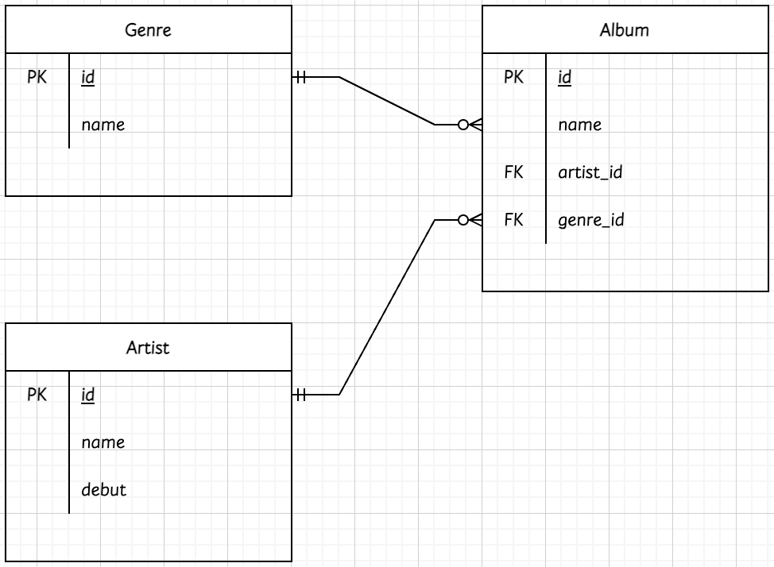
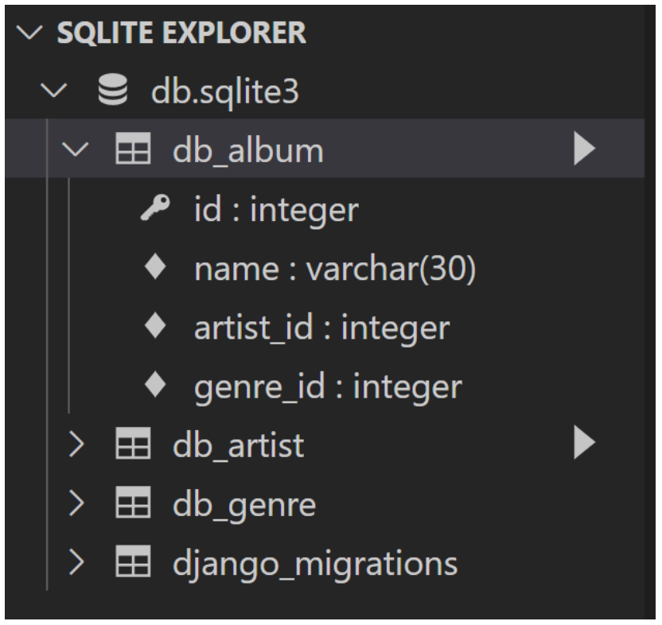

### `QuerySet API`

***

- `gt`

```sqlite
Entry.objects.filter(id__gt = 4)

SELECT ... WHERE id > 4;
```


- `gte`

```sqlite
Entry.objects.filter(id__gte = 4)

SELECT ... WHere id >= 4;
```


- `lt`, `lte`

```sqlite
Entry.objects.filter(id__lt = 4)
Entry.objects.filter(id__lte = 4)

SELECT ... WHERE id < 4;
SELECT ... WHERE id <= 4;
```


- `in`

```sqlite
Entry.objects.filter(id__in = [1, 3, 4])
Entry.objects.filter(headline__in = 'abc')

SELECT ... WHERE id IN (1, 3, 4);
SELECT ... WHERE headline IN ('a', 'b', 'c');
```


- `startswith`

```sqlite
Entry.objects.filter(headline__startswih = 'Lennon')

SELECT ... WHERE headline LIKE 'Lennon%';
```


- `istartswith`

```sqlite
Entry.objects.filter(headline__istartswih = 'Lennon')

SELECT ... WHERE headline ILIKE 'Lennon%';
```


- `endswith`

```sqlite
Entry.objects.filter(headline__endswih = 'Lennon')
Entry.objects.filter(headline__iendswih = 'Lennon')

SELECT ... WHERE headline LIKE '%Lennon';
SELECT ... WHERE headline ILIKE '%Lennon';
```


- `contains`

```sqlite
Entry.objects.filter(headline__contains = 'Lennon')
Entry.objects.filter(headline__icontains = 'Lennon')

SELECT ... WHERE headline LIKE '%Lennon%';
SELECT ... WHERE headline ILIKE '%Lennon%';
```


- `range`

```sqlite
import datetime
start_date = datetime.date(2006, 1, 1)
end_date = datetime.date(2006, 05, 30)
Entry.objects.filter(pub_date__range = (start_date, end_date))

SELECT ... WHERE pub_date BETWEEN '2006-01-01' and '2006-05-30;'
```


- `복합 활용`

```sqlite
inner_qs = Blog.objects.filter(name__contains = 'Cheddar')
entries = Entry.objects.filter(blog_in == inner_qs)

SELECT ... WHERE blog.id IN (SELECT id FROM ... WHERE name LIKE '%Cheddar%')
```


- `활용`

```sqlite
Entry.objects.all()[0]

SELECT ... LIMIT 1;
```

```sqlite
Entry.objects.order_by('id')

SELECT ... ORDER BY id;
```

```sqlite
Entry.objects.order_by('-id')

SELECT ... ORDER BY id DESC;
```


##### 📌 ORM 확장 (1 : N)

- `모델링 (ORM)`





```python
class Genre(models.Model):
  name = models.CharField(max_length = 30)
  
class Artist(models.Model):
  name = models.CharField(max_length = 30)
  debut = models.DateField()
  
class Album(models.Model):
  name = models.CharField(max_length = 30)
  genre = models.ForeignKey('Genre', on_delete = models.CASCADE)
  artist = models.ForeignKey('Artist', on_delete = models.CASCADE)
```


- `Foreign Key (외래키)`
  - 키를 사용하여 부모 테이블의 유일한 값을 참조 (참조 무결성)
    - 데이터베이스 관계 모델에서 관련된 2개의 테이블 간의 일관성
  - 외래 키의 값이 반드시 부모 테이블의 기본 키일 필요는 없지만 유일한 값이어야 함


- `models.ForeignKey 필드`
  - 2개의 필수 위치 인자
    - Model class : 참조하는 모델
    - on_delete : 외래 키가 참조하는 객체가 삭제 되었을 때 처리 방식
      - `CASCADE` : 부모 객체(참조 된 객체)가 삭제 됐을 때 이를 참조하는 객체도 삭제
      - `PROTECT` : 삭제되지 않음
      - `SET_NULL` : NULL 설정
      - `SET_DEFAULT` : 기본 값 설정


- `Create`

```sqlite
artist = Artist.objects.get(id = 1)
genre = Genre.objects.get(id = 1)

album = Album()
album.name = '앨범1'
-- 객체의 저장
album.artist = artist
album.genre = genre
album.save()
```


- `참조와 역참조`

```python
class Genre(models.Model):
  name = models.CharField(max_length = 30)
  
class Artist(models.Model):
  name = models.CharField(max_length = 30)
  debut = models.DateField()
  
class Album(models.Model):
  name = models.CharField(max_length = 30)
  genre = models.ForeignKey('Genre', on_delete = models.CASCADE)
  artist = models.ForeignKey('Artist', on_delete = models.CASCADE)
```

```sqlite
-- 참조
album = Album.objects.get(id = 1)
album.artist
-- <Artist: Artist object (1)>
album.genre
-- <Genre: Genre object (1)>

-- 역참조
genre = Genre.objects.get(id = 1)
genre.album_set.all()
-- <QuerySet [<Album: Album object (1), <Album: Album object (2)>]>
```

