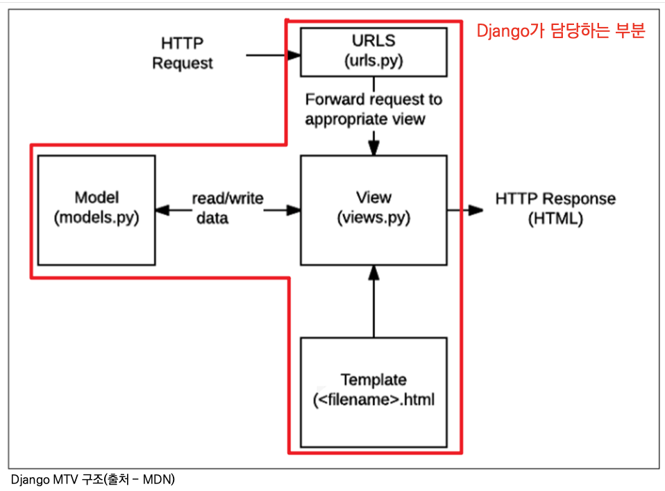

### `Django`

***

#### 🤜🏻 Framework 이해하기

- 전 세계의 수많은 개발자들이 수없이 많이 개발해보고, 그 과정에서 자주 사용되는 부분들을 재사용 할 수 있게 좋은 구조의 코드로 만들어 둔 것들을 모아 놓은 것
- 즉, 서비스 개발에 필요한 기능들을 미리 구현해 모아 놓은 것
- `Frame`(뼈대+틀) + `Work`(일하다)
  - 일정한 뼈대, 틀을 가지고 일함
  - 제공받은 도구들과 뼈대, 규약을 가지고 무언가를 만드는 일
  - 특정 프로그램을 개발하기 위한 여러 도구들과 규약을 제공하는 것
- Framework를 잘 사용하기만 하면 웹 서비스 개발에 있어서 모든 것들을 하나부터 열까지 직접 개발할 필요 없이 내가 만들고자 하는 로직에 집중해 개발할 수 있음

#### 💻 클라이언트와 서버

- 클라이언트-서버 구조
  - 대부분의 웹 서비스는 클라이언트-서버 구조를 기반으로 동작
  - 클라이언트와 서버 역시 하나의 컴퓨터
  - `클라이언트`
    - 웹 사용자의 인터넷에 연결된 장치(예 : wifi에 연결된 컴퓨터 또는 모바일)
    - 웹 브라우저
    - 서비스를 요청하는 주체
  - `서버`
    - 웹 페이지, 사이트 또는 앱을 저장하는 컴퓨터
    - 클라이언트가 웹 페이지에 접근하려고 할 때 서버에서 클라이언트 컴퓨터로 웹 페이지 데이터를 응답해 사용자의 웹 브라우저에 표시 됨
    - 요청에 대해 서비스를 응답하는 주체

#### 💻 Web browser와 Web page

- `웹 브라우저란?`
  - 웹에서 페이지를 찾아 보여주고, 사용자가 하이퍼링크를 통해 다른 페이지로 이동할 수 있게 하는 프로그램
  - 웹 페이지 파일을 우리가 보는 화면으로 바꿔주는(렌더링, rendering) 프로그램
- `웹 페이지란?`
  - 웹에 있는 문서
    - 우리가 보는 화면 각각 한 장, 한 장
  - 웹 페이지 종류
    - 정적 웹 페이지
      - Static Web page
      - 있는 그대로를 제공하는 것(served as-is)을 의미
      - 지금까지 작성한 웹 페이지미여 한 번 작성된 HTML 파일의 내용이 변하지 않고 모든 사용자에게 동일한 모습으로 전달 되는 것
    - 동적 웹 페이지
      - Dynamic Web page
      - 사용자의 요청에 따라 웹 페이지에 추가적인 수정이 되어 클라이언트에게 전달되는 웹 페이지
      - 웹 페이지의 내용을 바꿔주는 주체 == 서버
      - 다양한 서버 사이드 프로그래밍 언어*(python, java, c++ 등)* 사용 가능
      - 파일을 처리하고 데이터베이스와의 상호 작용이 이루어짐

#### 💡 Django 구조 이해하기 (MTV Design Pattern)

- `Design Pattern이란?`

  - 각기 다른 기능을 가진 다양한 응용 소프트웨어를 개발할 때 공통적인 설계 문제가 존재하며, 이를 처리하는 해결책 사이에도 공통점이 있다는 것을 발견
  - 이러한 유사점을 패턴이라 함
  - 자주 사용되는 소프트웨어의 구조를 일반적인 구조화를 해둔 것
  - 목적
    - 특정 문맥에서 공통적으로 발생하는 문제에 대해 재사용 가능한 해결책을 제시
    - 프로그래머가 어플리케이션이나 시스템을 디자인할 때 발생하는 공통된 문제들을 해결하는데 형식화 된 가장 좋은 관행
  - 장점
    - 서로 복잡한 커뮤니케이션이 매우 간단해짐
    - 다수의 엔지니어들이 일반화된 패턴으로 소프트웨어 개발을 할 수 있게 한 규칙
    - 커뮤니케이션의 효율성을 높임

- `MVC 소프트웨어 디자인 패턴`

  - MVC

    - Model - View - Controller의 준말

    - `Model`

      - MVC 패턴에서 Model의 역할에 해당
      - 데이터와 관련된 로직을 관리
      - 응용프로그램의 데이터 구조를 정의하고 데이터베이스의 기록을 관리

    - `templates`

      - 레이아웃과 화면을 처리
      - 화면상의 사용자 인터페이스 구조와 레이아웃을 정의
      - MVC 패턴에서 View의 역할에 해당

    - `View`

      - Model & Templates과 관련한 로직을 처리해서 응답을 반환

      - 클라이언트의 요청에 대해 처리를 분기하는 역할

      - 동작 예시

        - 데이터가 필요하다면 model에 접근해서 데이터를 가져오고

          가져온 데이터를 templates로 보내 화면을 구성하고

          구성된 화면을 응답으로 만들어 클라이언트에게 반환

      - MVC 패턴에서 Controller의 역할에 해당

  - 데이터 및 논리 제어를 구현하는데 널리 사용되는 소프트 디자인 패턴

  - 하나의 큰 프로그램을 세가지 역할로 구분한 개발 방법론

  - 목적

    - 더 나은 업무의 분리와 향상된 관리를 제공
    - 각 부분을 독립적으로 개발할 수 있어, 하나를 수정하고 싶을 때 모두 건들지 않아도 됨
    - 즉, 개발 효율성 및 유지보수가 쉬워지고 다수의 멤버로 개발하기 용이함

  - Django는 MVC 패턴을 기반으로 한 MTV 패턴을 사용. 두 패턴은 서로 크게 다른 점은 없으며 일부 역할에 대해 부르는 이름이 다름

|    MVC     |   MTV    |
| :--------: | :------: |
|   Model    |  Model   |
|    View    | Template |
| Controller |   View   |

