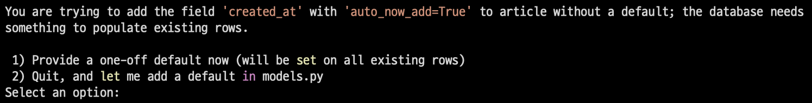
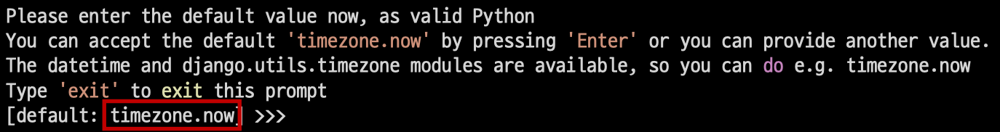

### `Django - Migrations`

***

#### 💡 makemigrations

- 모델의 변경사항에 대한 새로운 `migration`을 만들 때 사용

  ```zsh
  python manage.py makemigrations
  ```

- 명령어 실행 후 `migrations/0001_initial.py`가 생성된 것을 확인

- <span style='background-color: #f0f5ff'>파이썬으로 작성된 설계도</span>

  

***

#### 💡 migrate

- `makemigrations`로 만든 설계도를 실제 데이터베이스에 반영하는 과정 *(db.sqlite3 파일에 반영)*

- 결과적으로 모델의 변경사항과 데이터베이스를 동기화

  ```zsh
  python manage.py migrate
  ```

***

#### 💡 Migrations 기타 명령어

- `showmigrations`

  ```zsh
  python manage.py showmigrations
  ```

  - `migrations` 파일들이 `migrate` 됐는지 여부를 확인하는 용도
  - `[X]` 표시가 있으면 `migrate`가 완료 됨을 의미

- `sqlmigrate`

  ```zsh
  python manage.py sqlmigrate app1 0001
  ```

  - 해당 `migrations` 파일이 SQL문으로 어떻게 해석 될지 미리 확인 할 수 있음

***

#### 💡 추가 필드 정의

- Model 변경사항 반영하기

  - `models.py`에 변경사항이 생겼을 때 추가 모델 필드 작성 후 다시 한번 `makemigrations` 진행

  - 기존에 `id`, `title`, `content` 필드를 가진 테이블에 2개의 필드가 추가되는 상황

  - Django 입장에서는 이미 존재하는 테이블에 새로운 컬럼이 추가되는 요구 사항을 받았는데 이러한 컬럼들은 기본적으로 빈 값을 갖고 추가될 수 없음

    - 그래서 Django는 추가되는 컬럼에 대한 기본값을 설정해야 하니 어떤 값을 설정할 것인지를 물어보는 과정을 진행

    

    - 보기 번호의 의미
      1. 다음 화면으로 넘어가서 새 컬럼의 기본값을 직접 입력하는 방법
      2. 현재 과정에서 나가고 모델 필드에 `default` 속성을 직접 작성하는 방법
    - `1`을 입력 후 `Enter` *(created_at 필드에 대한 default 값 설정)*
    - 다음 화면에서 아무것도 입력하지 않고 `Enter`를 입력하면 Django에서 기본적으로 파이썬의 timezone 모듈의 now 메서드 반환값을 기본값으로 사용하게 함

    

  - 새로운 설계도(`마이그레이션 파일`)가 만들어진 것을 확인

  - 새로운 설계도를 생성했기 때문에 DB와 동기화를 진행해야 함 *(아직 DB에는 반영하지 않음)*

    ```zsh
    python manage.py migrate
    ```

- `DateTimeField()`

  - python의 `datetime.datetime` 인스턴스로 표시되는 날짜 및 시간을 값으로 사용하는 필드
  - `DateField`를 상속받는 클래스
  - 선택 인자
    - `auto_now_add`
      - 최초 생성 일자 (Useful for creation of timestamps)
      - 데이터가 실제로 만들어질 때 현재 날짜와 시간으로 자동으로 초기화 되게 함
    - `auto_now`
      - 최초 수정 일자(Useful for 'last-modified' timestamps)
      - 데이터가 수정될 때마다 현재 날짜와 시간으로 자동으로 갱신되게 함