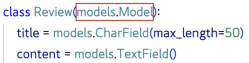
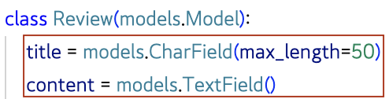

### `Django - Model`

***

#### ✏️ Model 작성하기

- 새 프로젝트(`PJT`), 앱(`app1`) 작성 및 앱 등록

  ```zsh
  django-admin startproject PJT .
  
  python manage.py startapp reviews
  ```

  ```python
  # PJT/settings.py
  
  INSTALLED_APPS = [
    'reviews',
    ...,
  ]
  ```

- models.py 작성

  - 모델 클래스를 작성하는 것은 데이터베이스 테이블의 스키마를 정의하는 것
  - 모델 클래스 == 테이블 스키마

  ```python
  # reviews/models.py
  
  class Review(models.Model):
    title = models.CharField(max_length=50)
    content = models.TextField()
  ```

***

#### ✏️ Model 이해하기

- 각 모델은 `django.modes.Model` 클래스의 서브 클래스

  - 각 모델은 `django.db.models` 모듈의 `Model` 클래스를 상속받아 구성됨

  - 클래스 상속 기반 형태의 Django 프레임워크 개발

    ➡︎ 프레임워크에서는 잘 만들어진 도구를 가져다가 잘 쓰는 것

  

- models 모듈을 통해 어떠한 타입의 DB 필드(컬럼)를 정의할 것인지 정의

  - `Review`에는 어떤 데이터 구조가 필요한지 정의
  - 클래스 변수 `title`과 `content`는 DB 필드를 나타냄

  

- 클래스 변수(속성)명

  1. DB 필드의 이름
  2. DB 필드의 데이터 타입

  

***

#### ✏️ Django Model Field

- 모델 필드를 통해 테이블의 필드(컬럼)에 저장할 데이터 유형(INT, TEXT 등)을 정의
- 데이터 유형에 따라 다양한 모델 필드를 제공
  - `DataField()`, `CharField()`, `IntegerField()` 등
- `CharField(max_length=None, **options)`
  - 길이의 제한이 있는 문자열을 넣을 때 사용
  - max_length
    - 필드의 최대 길이(문자)
    - CharField의 필수 인자
    - 데이터베이스와 Django의 유효성 검사(값을 검증하는 것)에서 활용됨
- `TextField(**options)`
  - 글자의 수가 많을 때 사용
  - max_length 옵션 작성 시 사용자 입력 단계에서는 반영되지만 모델과 데이터베이스 단계에는 적용되지 않음 *(CharField를 사용해야 함)*
    - 실제로 저장될 때 길이에 대한 유효성을 검증하지 않음

