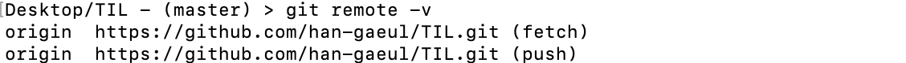

# Github


## 분산버전관리시스템(DVCS)

- 원격 저장소(Remote repository)를 통해 협업하고, 모든 히스토리를 클라이언트들이 공유
- Github 말고도 GitLab, Bitbuket 등 여러 저장소들이 있음


## 원격저장소 기본 흐름

1. `$ git push` 로컬 저장소의 버전을 원격저장소로 보냄 
2. `$ git pull` 원격저장소의 버전을 로컬 저장소로 가져옴


## GitHub 명령어

1. **경로 설정**

```tex
$ git remote add origin http://github.com/'Github Username'/'저장소'.git
```

- 원격 저장소 정보를 로컬 저장소에 추가

- 로컬 저장소에는 한 번만 설정

* 만약 저장소 주소를 변경하고 싶다면 `remove` 로 기존 연결을 끊고 새로 추가하기

```tex
$ git remote remove origin
$ git remote add origin '변경할 저장소 주소'
```

- `git remote -v` 로 주소가 잘 변경 되었는지 확인




2. **push**

```tex
$ git push origin master
```

- 지금까지의 변경 사항을 push 하는 것
- 로컬 폴더의 파일/폴더가 아닌 저장소의 버전(commit)이 올라감
- Working directory, Staging area의 변경 사항은 push 되지 않음
- `git status` 와 `git log` 를 통해 확인하는 습관을 가지는게 좋음
- 내가 작업한 로컬 프로젝트 개발을 공유할 때 사용


3. **pull**

```tex
$ git pull origin master
```

- 원격 저장소로부터 변경 사항을 받아와서 이력을 병합
- 변경된 **커밋**을 가져옴
- 프로젝트 개발 중에 다른 사람의 커밋을 받아올 때 사용


4. **clone**

```tex
$ git clone '원격저장소 주소'
```

- **원격저장소(Git)**를 복제해 가져옴
- 원격저장소 이름의 폴더가 생성됨
- 원격에 있는 프로젝트를 시작할 때 사용


✋🏻❗️ **주의사항**

- Git 저장소 안에 다른 Git 저장소는 저장/생성할 수 없음
- `pull` 이나 `clone` 이 아닌 압축 파일로 다운로드 하게 되면 가장 최신 버전의 파일/폴더만 가져옴


## .gitignore

- 일반적인 개발 프로젝트에서 버전 관리를 별도로 하지 않는 파일/디렉토리가 발생
- Git 저장소에 `.gitignore` 파일을 생성하고 해당 내용 관리
- 이미 커밋된 파일은 반드시 삭제해야 적용됨