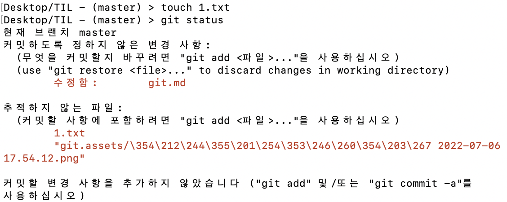
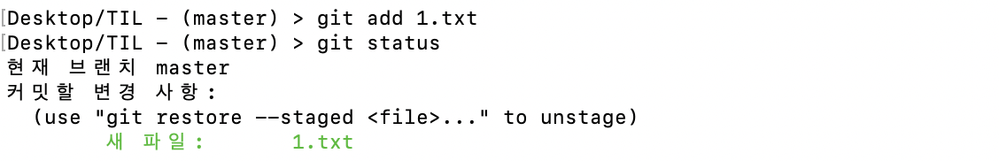
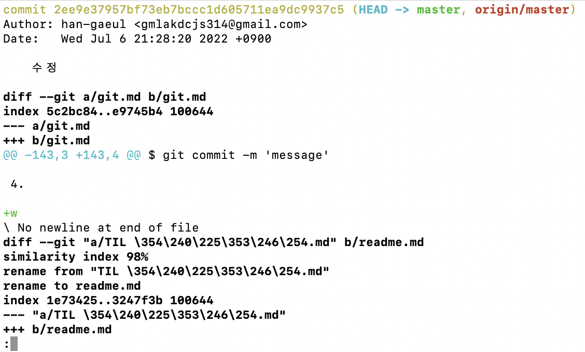
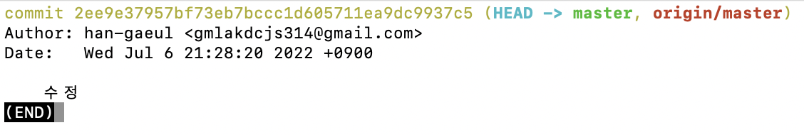
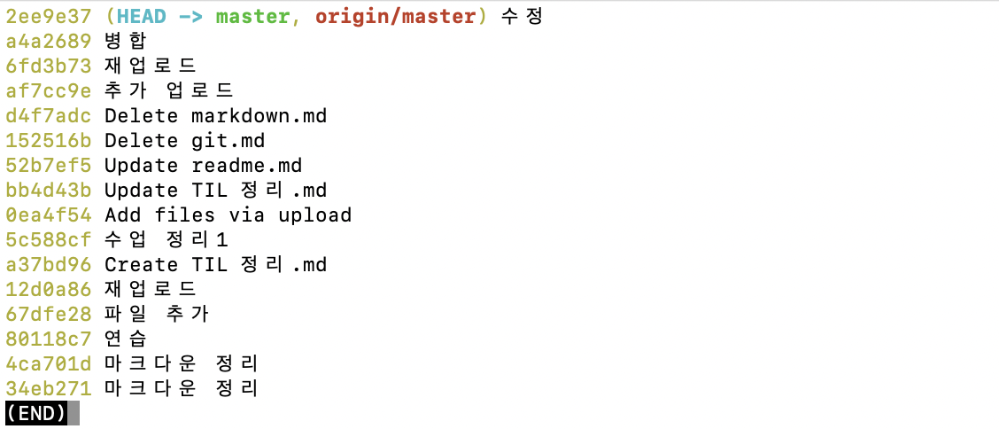
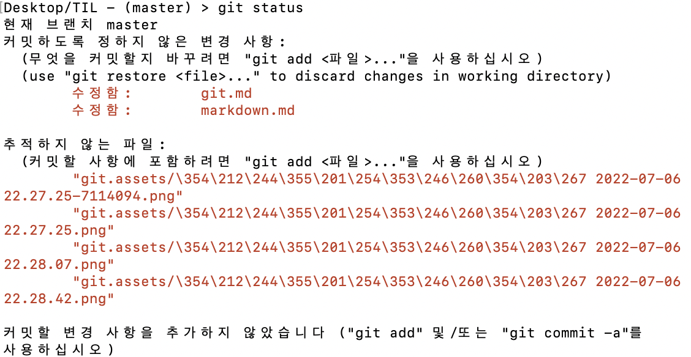

# Git


## Git이란?

- **분산 버전 관리 시스템이다.**

​		- 버전(commit) : 컴퓨터 소프트웨어의 특정 상태

​		- 소스 코드의 버전 관리와 다른 개발자와 협업하기 위해 사용하는 프로그램

​		*commit은 행위에 대한 기록. 파일 저장이 아님!*

- **Git 흐름**

​		- Working directory, modified : 내가 작업하고 있는 프로젝트의 디렉토리

​		- Staging area : 커밋을 하기 위해 add 명령어로 추가한 파일들이 모여있는 공간

​		- Repository : 커밋들이 모여있는 저장소

- **File lifecycle**

​		- Untracked : Working directory에 있는 파일이지만 버전으로 관리된 적 없는 파일

​		- Unmodified : 신규로 파일이 추가 되었을 때, new file 상태와 같음

​		- Modified : 파일이 추가된 이후 해당 파일이 수정 되었을 때의 상태

​		- Staged : Staging area에 반영된 상태


✋🏻❗️ **Staging area를 거쳐야 하는 이유?** [참고](https://blog.npcode.com/2012/10/23/git%EC%9D%98-staging-area%EB%8A%94-%EC%96%B4%EB%96%A4-%EC%A0%90%EC%9D%B4-%EC%9C%A0%EC%9A%A9%ED%95%9C%EA%B0%80/)

1. 전체가 아닌 일부분만 커밋할 때
2. 충돌을 해결할 때
3. 커밋 다시하기


## 여러가지 상황에서 자주 사용하는 Git 명령어

- **작업 공간 시작** (참고 : git help tutorial)

​		- `clone` : 저장소를 복제해 새 디렉토리로 가져옴

​		- `init` : 비어있는 Git 저장소를 만들거나 기존 저장소를 다시 초기화함


- **변경 사항에 대한 작업** (참고 : git help everyday)

​		- `add` : 파일 내용을 인덱스에 추가

​		- `mv` : 파일, 디렉토리, 심볼릭 링크를 옮기거나 이름을 바꿈

​		- `restore` : 작업 트리 파일 복원

​		- `rm` : 파일을 작업 폴더에서 제거하고 인덱스에서도 제거함

​		- `rm -r` : 폴더 삭제

​		- `rm -fr .git` : git 삭제


- **커밋 내역과 상태 보기** (참고 : git help revisions)

​		- `bisect` : 이진 탐색으로 버그를 만들어낸 커밋을 찾음

​		- `diff` : 커밋과 커밋 사이, 커밋과 작업 내용 사이 등의 바뀐 점을 봄

​		- `grep` : 패턴과 일치하는 줄 표시

​		- `log` : 커밋 기록 표시

​		- `show` : 여러가지 종류의 오브젝트를 표시

​		- `status` : 작업 폴더 상태 표시


- **커밋 내역을 키우고, 표시하고, 조작하기**

​		- `branch` : 브랜치를 만들거나, 삭제하거나, 목록을 출력

​		- `commit` : 바뀐 사항을 저장소에 기록

​		- `merge` : 여러 개의 개발 내역을 하나로 합침

​		- `rebase` : 커밋을 다른 베이스 끝의 최상위에서 적용

​		- `switch` : 브랜치 전환

​		- `tag` : 태그를 만들거나, 표시하거나, 삭제하거나, GPG 서명 검증


- **협동 작업** (참고 : git help workflows)

​		- `fetch` : 다른 저장소에서 오브젝트와 레퍼런스를 다운로드

​		- `pull` : 다른 저장소 또는 다른 로컬 브랜치에서 가져오거나 통합

​		- `push` : 원격 레퍼런스 및 그와 관련된 오브젝트를 업데이트


- **이 외 자주 사용하는 명령어**

​		- `pwd` (print working directory) : 현재 디렉토리(폴더/파일) 출력

​		- `cd` (change directory) : 디렉토리 하위 이동

​		- `cd ..` : 디렉토리 상위 이동(띄어쓰기 필수)

​		- `ls` (list) : 목록 확인

​		- `ls -al` : 폴더 안에 있는 파일, 폴더 목록

​		- `mkdir` (make directory) : 디렉토리 생성

​		- `touch` : 파일의 날짜와 시간 수정(0바이트 빈 파일 생성)

​		- `rm` : 파일 삭제

​		- 단축키 `control + l` 또는 명령어 `clear` : 터미널 내용 지우기


## Git 정보 설정

```tex
$ git config --global user.name '이름'
$ git config --global user.email '이메일'
```

- Commit을 작성한 사람(author)으로 저장됨.
- 이름과 이메일 정보는 Github에서 사용하고 있는 것과 동일하게 설정


​	i. 설정 확인

```tex
$ git config -l
$ git config --global -l
$ git config user.name
$ git config user.email
```


## Git 사용

1. **저장소 생성**

```tex
$ git init
```

- git 저장소를 만들면 해당 디렉토리 안에 `.git` 폴더가 생성
- 터미널에서는 `(master)` 라는 표기가 생김
- git 설정 또는 명령어를 작성할 때 현재 경로를 꼭 확인해야 함

- `Desktop` 에 저장소 만드는 건 추천하지 않음. 되도록 폴더를 만들어서 폴더 안에 저장소 생성.


- 로컬에서 새로운 프로젝트를 시작할 때 사용


2. **add**

```tex
$ git add . #현재 폴더에 대한 모든 파일의 변경사항을 add
$ git add <파일명>
```

- 작업 위치(Working Directory) 안에 있는 파일을 Staging Area로 옮기기 위해 사용

  Staging Area는 commit을 진행하기 전에 임시 저장된 상태

- `1.txt` 라는 파일을 생성 후 `git status` 명령어를 입력하면 '변경 사항을 추가하지 않았음 (git add를 사용)' 하라는 문구가 나옴



- `git add 1.txt` 입력 후 다시 `git status` 명령어를 입력하면 Staging Area에 추가 완료




3. **commit**

```tex
$ git commit -m 'message'
```

- 버전(커밋) 기록을 할 때 알아보기 쉬운 내용으로 작성

- 영어로 작성하는 것이 보편적

  - 참고자료 

    [좋은 커밋 메시지를 작성하기 위한 7가지 약속](https://meetup.toast.com/posts/106) / [좋은 커밋 메시지를 위한 영어 사전](https://blog.ull.im/engineering/2019/03/10/logs-on-git.html)

- 커밋 기록을 확인하기 위해서 `git log` 명령어 사용


- 커밋한 모든 내용은 다시 되돌릴 수 있음. 삭제한 파일도 복구 가능.

​		but, 커밋하지 않은 내용은 방법이 없음.


4. **log**

```tex
$ git log
$ git log -p
$ git log -1
$ git log --oneline
$ git log -1 --oneline
```

- 현재 저장소에 기록된 버전(커밋)을 조회

  - `git log` : 버전(커밋) 기록 확인

  - `git log -p` : 자세한 기록 확인

  

  

  - `git log -1` : 가장 최근 기록된 커밋 확인

  

  

  - `git log --oneline` : 한 줄로 기록 확인

  


5. **status**

```tex
$ git stauts
```

- Git 저장소에 있는 파일의 상태를 확인하기 위해 사용
- 파일의 상태를 알 수 있음




---


#### 참고

​	i. [git 완전 기초 사용 방법](https://chancoding.tistory.com/76)

