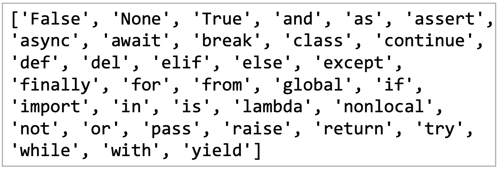

## 본격적으로 들어가기 전에..

- **컴퓨터(Computer)** *compute 계산하다*
  - Caculation + Remember 계산하고 기억한다

- **프로그래밍(progreomming)**
  - 명령어의 모음(집합)

- **언어란?**
  - 자신의 생각을 나타내고 전달하기 위해 사용하는 체계
  - 문법적으로 맞는 말의 집합

- **프로그래밍 언어란?**
  - 컴퓨터에게 명령하는 말(약속)

- **프로그래밍 언어를 공부할 때**

  - 선언적 지식(declarative knowledge) : 사실에 대한 내용

  - 명령적지식(imperative kcowledge) : How-to

    내가 지금 어떤 명령을 내리고 싶은지 생각하고 명확하게 해야 한다!


## 파이썬 개발 환경

**파이썬이란?**

- east to learn : 변수에 별도의 타입 지정이 필요 없음 -> 동적 타이밍 언어

​		다른 프로그래밍 언어보다 문법이 간단하고 엄격하지 않음

- 문법 표현이 매우 간결. 프로그래밍 경험이 없어도 짧은 시간 내에 마스터할 수 있음

​		문장을 구분할 때 중괄호 대신 들여쓰기 활용

- Expressive language : 같은 작업에 대해서도 C나 자바로 작성할 때보다 더 간결하게 작성 가능

```java
public class HelloWorld {
		public static void main(String[] args) {
				System.out.println("Hello World!");
		}
}
```

```python
print('Hello World!')
```

- 크로스 플랫폼 언어 : Windows, macOS, Linux, Unix 등 다양한 운영체제에서 실행 가능
- 인터프리터 언어(interpreter) : 소스코드를 기계어로 변환하는 컴파일 과정 없이 바로 실행 가능

​		코드를 한 줄 입력하고 실행한 후 바로 확인할 수 있음

```python
3 + 2 # 사용자가 입력(input)
5			# 컴퓨터가 출력(output)
```

- ⭐️객체 지향 프로그래밍(object oriented programming)⭐️ : 파이썬은 객체지향 언어. 모든 것이 객체로 구현되어 있음

  *객체(object)란 숫자, 문자, 클래스 등 값을 가지고 있는 모든 것*

​		*object : 물건, 대상*


- space sensitive
  - 문장을 구분할 때 들여쓰기(indentation)를 사용
  - 들여쓰기를 할 때 4칸(space) 혹은 1탭


## 기초 문법

#### 1. 코드 스타일 가이드

- 코드를 어떻게 작성할지에 대한 가이드 라인

❗️*코드 스타일 가이드가 필요한 이유! ➡️ 코드를 일관적으로 작성하기 위해*


#### 2. 들여쓰기(Identation)

- Space Sensitive
  - 문장을 구분할 때, 들여쓰기를 사용
  - 들여쓰기를 할 때 4칸(space키 4번) 또는 1탭(Tab키 1번) 입력

❗️*주의 사항*

​	- 한 코드 안에서는 반드시 한 종류의 들여쓰기 사용. 혼용✖️

​	- 원칙적으로는 공백(빈칸, space) 사용 권장


#### 3. 변수(variable)

- **변수란?**

  - 컴퓨터 메모리 어딘가에 저장되어 있는 객체를 참조하기 위해 사용되는 이름


  - 동일 변수에 다른 객체를 언제든 할당할 수 있음

    즉, 참조하는 객체가 바뀔 수 있기 때문에 '변수' 라고 함


  - 할당 연산자(`=`)를 통해 값을 할당(assignment)

    - 같은 값을 동시에 할당할 수 있다.

    ```python
    x = y = 3
    print(x, y)
    ```

    - 다른 값을 동시에 할당 할 수 있다.(multiple assignment)

    ```python
    x, y = 1, 2
    print(x, y)
    ```

    *`=` '같다'의 의미가 아님✖️*

  - Type()

    변수에 할당된 값의 타입


  - id()

    변수에 할당된 값(객체)의 고유한 아이덴티티 값이며 메모리주소


```python
2 + 3
print(2 + 3)

# 위 두 줄의 명령어를 파이썬에 입력하면 모두 5를 출력하지만
# 터미널에서 `$ python` 파일명을 입력했을 때는
# 터미널에 5가 출력되는 것은 `print(2 + 3)` 뿐이다.
```

```python
print(2 + 3)
print(2 + 3)
print(2 + 3)
print(2 + 3)
print(2 + 3)

# 이렇게 연속 5회 명령어를 입력하면
# `$ python` 파일명을 입력해서 터미널에서 실행할 때
# 5가 5회 연속 출력된다.
```

```python
# `hello` 라는 이름의 변수에 `Happy Coding` 이라는 값을 할당

hello = 'Happy Coding'
print(hello)
print(hello)
print(hello)
print(hello)
print(hello)

# 이 때에도 `$ python` 파일명을 입력해서 터미널에서 실행하면
# 'Happy Coding'이 5회 연속 출력된다.
```


💡프로그래밍 규칙

```python
# (기본 규칙) 코드는 위에서부터 아래로 실행

a = 5
a = 'hello'
print(a) #hello

# (기본 규칙2) 코드는 오른쪽에서 왼쪽으로
a = 5
a = a + 1
print(a) #6
```


💻 실습 문제

​	x = 10, y = 20 일 때, 각각 값을 바꿔서 저장하는 코드를 작성하시오.

```python
# 풀이
# 임시적인 변수(값을 담을 곳)가 필요하다
tmp = x
x = y
y = tmp
print(x, y)

# 다른 풀이(Pythonic)
y, x = x, y
print(x, y)
```


#### 4. 식별자(Identifiers)

- 파이썬 객체(변수, 함수, 모듈, 클래스 등)를 식별하는데 사용하는 이름(name)
- 규칙
  - 식별자의 이름은 영문 알파벳, 언더스코어(`_`), 숫자로 구성
  - 첫 글자에 숫자가 올 수 없음
  - 길이 제한이 없고, 대소문자 구별
  - 예약어로 사용할 수 없는 키워드가 있음
    - 내장함수나 모듈 등의 이름도 만들면 안 됨 *예) print*



- 사용자 입력

  - Input([prompt])

    - 사용자로부터 값을 즉시 입력 받을 수 있는 내장함수

    - 대괄호 부분에 문자열을 넣으면 입력 시에 해당 문자열을 출력할 수 있음

    - ⭐️**반환값은 항상 문자열의 형태로 반환**⭐️

      ```python
      name = input('이름을 입력해주세요 : ')
      print(name)
      # 이름을 입력해주세요 : 파이썬
      type(name)
      # str
      ```

      

- 주석(Comment)

  - 코드에 대한 설명

    - 중요한 점이나 다시 확인해야 하는 부분 표시
    - 컴퓨터는 주석을 인식하지 않음. 사용자만을 위한 것

  - 가장 중요한 습관

    - 개발자에게 주석을 작성하는 습관은 매우 중요!
    - 쉬운 이해와 코드의 분석 및 수정이 용이함

  - 한 줄 주석

    - 주석 처리할 내용 앞에 `#` 을 입력

      ```python
      # 주석(comment)
      # 이렇게 한 줄을 온전히 사용할 수도 있고
      print('Hello') # 코드 뒷 부분에도 작성 할 수 있음
      ```

      


## 파이썬 기본 자료형(Python Datatype)

### 자료형 분류

- 불린형(Boolean Type)

- 수치형(Numeric Type)
  - int : 정수, integer
  - float : 실수, floating point number
  - complex : 복소수, complex number

- 문자열(String Type)

- None

  - 파이썬 자료형 중 하나
  - 파이썬에서는 값이 없음을 표현하기 위해 존재
  - 일반적으로 반환값이 없는 함수에서 사용하기도 함

  ```python
  print(type(None))
  # class 'NoneType'
  a = None
  print(a)
  # None
  ```
  


### 불린형 (Boolean Type)

- True / False 값을 가진 타입은 bool
- 비교 / 논리 연산을 수행함에 있어 활용
- 다음은 모두 False로 변환
  - 0, 0.0, (), [], {}, '', None

- Bool() 함수

  - 특정 데이터가 `True` 인지 `False` 인지 검증

  ```python
  bool(0) # False
  bool(1) # True
  bool(-1) # True
  bool('') # False
  bool([]) # False
  bool([1, 2, 3]) # True
  ```


### 논리 연산자 (Logical Operator)

- 논리식을 판단하여 참(True), 거짓(False)를 반환

| 연산자  |              내용              |
| :-----: | :----------------------------: |
| A and B |    A와 B 모두 True이면 True    |
| A or B  |   A와 B 모두 False이면 False   |
|   Not   | True를 False로, False를 True로 |

- and : 모두 참인 경우 참, 그렇지 않으면 거짓

| 논리연산자 and  | 내용  |
| :-------------: | :---: |
|  True and True  | True  |
| True and False  | False |
| False and True  | False |
| False and False | False |

- Or : 둘 중 하나만 참이라도 참, 그렇지 않으면 거짓

|  논리연산자 or  | 내용  |
| :-------------: | :---: |
|  True and True  | True  |
| True and False  | True  |
| False and True  | True  |
| False and False | False |

- not : 참, 거짓의 반대의 결과

| 논리연산자 not | 내용  |
| :------------: | :---: |
|    not True    | False |
|   Not False    | True  |

- 예시

```python
num = 100
num >= 100 and num % 3 == 1
# True
```


### 수치형 (Numeric Type)

- 정수(int)

  - 모든 정수의 타입
    - python3부터 `long` 타입은 ✖️, 모두 `int` 로 표기
  - 매우 큰 수를 나타낼 때 오버플로우가 발생하지 않음
    - 오버플로우(overflow) : 데이터 타입별로 사용할 수 있는 메모리의 크기를 넘어서는 상황
    - 임의 정밀도 산술(Arbitrary precision arithmetic)을 통해 고정된 형태의 메모리가 아닌 가용 메모리들을 활용하여 모든 수 표현에 활용

  ```
  
  ```

- 실수(Float)

  - 정수가 아닌 모든 실수는 `float` 타입

  - Floating point rounding error

    - 부동소수점에서 실수 연산 과정에서 발생 가능
    - 값 비교하는 과정에서 정수가 아닌 실수인 경우 주의!

    ```python
    # 아래 예시는 참? 거짓?
    3.14 - 3.02 == 0.12 # 0.1200000000000001
    
    # 거짓
    ```

    - 매우 작은 수보다 작은지를 확인하거나 `math` 모듈 활용

    ```python
    # 1. 임의의 작은 수
    abs(x - y) <= 1e-10
    
    # 2. `math` 모듈 활용
    import math
    math.isclose(x, y)
    ```

- 산술 연산자(Arithmetic Operator)

  - 기본적인 사칙연산 및 수식 계산

  | 연산자 |   내용   |
  | :----: | :------: |
  |   +    |   덧셈   |
  |   -    |   뺄셈   |
  |   *    |   곱셈   |
  |   %    |  나머지  |
  |   /    |  나눗셈  |
  |   //   |    몫    |
  |   **   | 거듭제곱 |

- 복합 연산자(In-place Operator)

  - 연산과 할당이 함께 이루어짐

  | 연산자  |    내용    |
  | :-----: | :--------: |
  | a += b  | a = a + b  |
  | a -= b  | a = a - b  |
  | a *= b  | a = a * b  |
  | a /= b  | a = a / b  |
  | a //= b | a = a // b |
  | a %= b  | a = a % b  |
  | a **= b | a = a ** b |

- 비교 연산자(Comparison Operator)

  - 값을 비교하며, `True` / ` False` 값을 리턴함

  | 연산자 |            내용             |
  | :----: | :-------------------------: |
  |   <    |            미만             |
  |   <=   |            이하             |
  |   >    |            초과             |
  |   >=   |            이상             |
  |   ==   |            같음             |
  |   !=   |          같지 않음          |
  |   is   |    객체 아이덴티티(OOP)     |
  | is not | 객체 아이덴티티가 아닌 경우 |

  


### 문자열(String Type)

- 모든 문자는 `str` 타입

- 문자열은 작은 따옴표나 큰 따옴표를 활용하여 표기

  - 문자열을 묶을 때는 동일한 문장부호 사용
  - 'PEP8' 에서는 소스코드 내에서 하나의 문장부호를 선택해 유지하도록 함

  ```python
  print('hello') # hello
  print(type('hello')) # class 'str'
  ```

- 중첩따옴표(Nested Quotes)

  - 따옴표 안에 따옴표를 표현할 경우

  ```python
  print("문자열 안에 '작은 따옴표'를 사용하려면 큰 따옴표로 묶음")
  print('문자열 안에 "큰 따옴표"를 사용하려면 작은 따옴표로 묶음')
  ```

- 삼중따옴표(Triple Quotes)

  - 작은 따옴표나 큰 따옴표를 삼중으로 사용

  ```python
  print('''문자열 안에 '작은 따옴표'나 "큰 따옴표"를
  사용할 수 있고 여러 줄을 사용할 때도 편리''')
  ```

- 인덱싱

  - 인덱스를 통해 특정 값에 접근 가능
  - s[1] ➡️ 'b'

|     " | a    | b    | c    | d    | e    | f    | g    | h    | i "  |
| ----: | ---- | ---- | ---- | ---- | ---- | ---- | ---- | ---- | ---- |
| index | 0    | 1    | 2    | 3    | 4    | 5    | 6    | 7    | 8    |

- 문자열 슬라이싱(Slicing) 예시

  - s[2:5] ➡️ 'cde'
  - s[2:5:2] ➡️ 'ce'
  - s[5:2:-1] ➡️ 'fed'
  - s[:3] ➡️ 'abc' 처음부터 3미만까지
  - s[5:] ➡️ 'fghi' 5부터 마지막까지
  - s[::] ➡️ 'abcdrfghi' 처음부터 끝까지. `s[0:len(s):1]` 과 동일
  - s[::-1] ➡️ 'ihgfedcba' 끝부터 처음까지. `s[-1:(len(s)+1)]` 과 동일

  |     " | a    | b    | c    | d    | e    | f    | g    | h    | i "  |
  | ----: | ---- | ---- | ---- | ---- | ---- | ---- | ---- | ---- | ---- |
  | index | 0    | 1    | 2    | 3    | 4    | 5    | 6    | 7    | 8    |
  | index | -9   | -8   | -7   | -6   | -5   | -4   | -3   | -2   | -1   |

- 기타

  - 결합(Concatenation)

  ```python
  'Hello' + 'World' # 'Hello World'
  ```

  - 반복(Repetition)

  ```python
  'Hello' * 3 # 'HelloHelloHello'
  ```

  - 포함(Membership)

  ```python
  'c' in 'cat' # True
  'at' in 'cat' # True
  'r' in 'cat' # False
  ```

- Escape sequence

  - 문자열 내에서 특정 문자나 조작을 위해서 역슬래시(`\`)를 활용해 구분

  | 예약문자 |    내용(의미)    |
  | :------: | :--------------: |
  |    \n    |     줄 바꿈      |
  |    \t    |        탭        |
  |    \r    |    캐리지리턴    |
  |    \o    |     널(Null)     |
  |    \\    |       `\`        |
  |   `\'`   | 단일인용부호('') |
  |   `\"`   | 이중인용부호("") |

  ```python
  print('영희 \'안녕\'') # 영희 '안녕'
  print('이 다음은 줄 바꿈. \n그리고 탭\t탭')
  # 이 다음은 줄 바꿈.
  # 그리고 탭		탭
  ```

- String Interpolation

  - 문자열을 변수를 활용해 만드는 법

    - %-formatting

    ```python
    name = 'Han'
    score = 4.5
    
    print('안녕, %s' % name)
    print('내 성적은 %d' % score)
    print('내 성적은 %f' % score)
    
    # 안녕, Han
    # 내 성적은 4
    # 내 성적은 4.50000
    ```

    - f-string

    ```python
    name = 'Han'
    score = 4.5
    pritn(f'안녕, {name}. 성적은 {score}')
    # 안녕, Han. 성적은 4.5
    
    pi = 3.141592
    print(f'원주율은 {pi:.3}. 반지름이 2일때 원의 넓이는 {pi*2*2}')
    # '원주율은 3.14. 반지름이 2일때 원의 넓이는 12.566368'
    ```

    - Immutable : 변경 불가

    ```python
    x = 'my string!'
    a[-1] = '?'
    # Error
    ```

    - Iterable : 반복 가능

    ````python
    x = 'abc'
    for char in a:
    		print(char)
    ````


### 형 변환 (Typecasting)

- 자료형 변환

  - 파이썬에서 데이터 형태는 서로 변환할 수 있음

    - 암시적 형 변환(Implicit) : 사용자가 의도하지 않고 내부적으로 자료형을 변환

    ```python
    True + 3 # 4
    3 + 5.0 # 8.0
    3 + 4j + 5 # (8+4j)
    ```

    - 명시적 형 변환(Explicit) : 사용자가 특정 함수를 활용해 의도적으로 자료형을 변환

      - str, float ➡️ int
      - str, int ➡️ float
      - int, float, list, tuple, dict ➡️ str

      ❗️*형식에 맞는 문자열만 가능*

    ```python
    # 문자열은 암시적 타입 변환X
    '3' + 2 # TpyeError
    
    # 명시적 타입 변환이 필요
    int('3') + 2 # 5
    
    # 정수 형식이 아닌 경우 타입 변환X
    int('1.5') + 2 # ValueError
    
    float('1.5') + 2 # 8.5
    ```


### 컨테이너(Container)

- 컨테이너란?

  - 여러 개의 값을 담을 수 있는 것(객체). 서로 다른 자료형을 저장할 수 있음

    *예) List, tuple*

  - 분류

    - 순서가 있는 데이터(Ordered)

      ❗️*순서가 있다 != 정렬되어 있다*

    - 순서가 없는 데이터(Unordered)

    - 시퀀스

      - 문자열(immutable) : 문자들의 나열
      - 리스트(mutable) : 변경 가능한 값들의 나열
      - 튜플(immutable) : 변경 불가능한 값들의 나열
      - 레인지(immutable) : 숫자의 나열

    - 컬렉션/비시퀀스

      - 세트(mutable) : 유일한 값들의 모음
      - 딕셔너리(mutable) : 키-값들의 모음

- 시퀀스형 주요 공통 연산자

|       연산       |                          결과                           |
| :--------------: | :-----------------------------------------------------: |
|       s[i]       |               s의 i번째 항목, 0에서 시작                |
|      s[i:j]      |               s의 i에서 j까지의 슬라이스                |
|     s[i:j:k]     |            s의 i에서 j까지 스텝 k의 슬라이스            |
|      s + t       |                   s와 t의 이어 붙이기                   |
| s * n 또는 n * s |               s를 그 자신에 n번 더하는 것               |
|      x in s      | s의 항목 중 하나가 x와 같으면 Trur, 그렇지 않으면 False |
|    x not in s    | s의 항목 중 하나가 x와 같으면 False, 그렇지 않으면 True |
|      len(s)      |                        s의 길이                         |
|      min(s)      |                   s의 가장 작은 항목                    |
|      max(s)      |                    s의 가장 큰 항목                     |


### 리스트(List)

- 리스트란?

  - 변경 가능한 값들의 나열된 자료형

  - 순서를 가지며, 서로 다른 타입의 요소를 가질 수 있음

  - 변경 가능(mutable), 반복 가능(iterable)

  - 항상 대괄호 형태로 정의. 요소는 콤마로 구분

    *[0, 1, 2, 3, 4, 5, 6, 7, 8, 9]*

- 생성과 접근

  - 대괄호 혹은 `list()` 를 통해 생성

  ```
  # 생성
  my_list = []
  your_list = list()
  type(my_list) # class 'list'
  type(your_list) # class 'list'
  ```

  - 순서가 있는 시퀀스로 인덱스를 통해 접근 가능

    *값에 대한 접근은 list[i]*

  |                  | 객체 1 | 객체 2 | 객체 3 | 객체 4 | 객체 5 | 객체 6 | 객체 7 |
  | ---------------- | ------ | ------ | ------ | ------ | ------ | ------ | ------ |
  | Positive index : | 0      | 1      | 2      | 3      | 4      | 5      | 6      |
  | Negative index : | -7     | -6     | -5     | -4     | -3     | -2     | -1     |

  ```python
  # 접근
  x = [a, b, c]
  print(x[0]) # b
  
  # 변경
  x[0] = 'a'
  print(x) # ['a', b, c]
  ```

  - 값 추가는 `.append()` 를 활용해 추가하고자 하는 값 전달

  ```python
  numbers = [1, 2, 3, 4, 5]
  numbers.append(6)
  numbers # -> [1, 2, 3, 4, 5, 6]
  ```

  - 값 삭제는 `.pop` 를 활용해 삭제하고자 하는 인덱스 전달

  ```python
  numbers = [1, 2, 3, 4, 5]
  numbers.pop(1)
  numbers # -> [1, 3, 4, 5]
  ```

- 예시

```python
music = ['abc', 'bcd', 'cde']
len(music) # 3
music[1] # 'bcd'
music[2][1] # 'd'
```


### 튜플(Tuple)

- 튜플이란?

  - 불변한 값들의 나열

  - 순서를 가지며, 서로 다른 타입의 요소를 가질 수 있음

  - 변경 불가능(immutable), 반복 가능(iterable)

  - 항상 소괄호 형태로 정의. 요소는 콤마로 구분

    *(1, 3, 5)*

- 생성과 접근

  - 소괄호 혹은 `tuple()` 을 통해 생성

  - 값에 대한 접근은 리스트와 동일하게 인덱스로 접근

    ❗️*값 변경이 불가 ➡️ 값 추가/값 삭제도 불가능*

  ```python
  # 값 접근
  x = (a, b, c, d)
  x[1]
  
  # 값 변경 -> 불가능
  x[1] = '2' #TypeError
  ```

  


### 레인지(Range)

- Range(n=0, m, s=1)

  - 숫자의 시퀀스를 나타내기 위해 사용
    - 기본형 : range(n) 0부터 n~1까지의 숫자의 시퀀스
    - 범위 지정 : range(n, m) n부터 m-1까지의 숫자의 시퀀스
    - 범위 및 스텝 지정 : range(n, m, s) n부터 m-1까지 s만큼 증가시키며 숫자의 시퀀스
  - 변경 불가능(immutable), 반복 가능(iterable)
  - `range` 는 숫자의 시퀀스를 나타내기 위해 사용

  ```python
  range(4) # range(0,4)
  list(range(4)) # [0, 1, 2, 3]
  type(range(4)) # class 'range'
  ```

- 예시

```python
# 0부터 특정 숫자까지
list(range(3)) # [0, 1, 2]

# 숫자의 범위
list(range(1, 6)) # [1, 2, 3, 4, 5]

# step 활용
list(range(1, 6, 2)) # [1, 3, 5]

# 역순
list(range(4, 1, -1)) # [4, 3, 2]

list(range(4, 1, 1)) # []
```


### 비시퀀스형 컨테이너(Associative Container)

- 세트(Set)

  - 유일한 값들의 모음(collection)

  - 순서가 없고 중복된 값이 없음

    *수학에서의 집합과 동일한 구조. 집합 연산도 가능*

  - 변경 가능(mutable), 반복 가능(iterable)

    *단, 순서가 없어 반복의 결과가 정의한 순서와 다를 수 있음*

- 생성

  - 중괄호 혹은 `set()` 을 통해 생성

    *빈 `Set`를 만들기 위해서는 `set()` 을 반드시 활용해야 함*

  ```python
  {a, b, c, b, a} # {a, b, c} <- 중복값 제거
  type({1, 2, 3}) # class 'set'
  blank_set = set()
  
  {'hello', 1, 2} # -> {1, 2, 'hello'}
  ```

  - 순서가 없어 별도의 값에 접근할 수 없음

  ```python
  {1, 2, 3}[0] # TypeError
  # 순서가 없어 인덱스 접근 등 특정 값에 접근 불가
  ```

- 추가/삭제

  - 값 추가는 `.add()` 를 활용하여 추가하고자 하는 값 전달

  ```python
  numbers = {1, 2, 3}
  numbers.add(4)
  numbers # -> {1, 2, 3, 4}
  
  numbers.add(1)
  numbers # -> {1, 2, 3}
  ```

  - 값 삭제는 `.remove()` 를 활용하여 삭제하고자 하는 값 전달

  ```python
  numbers = {1, 2, 3}
  numbers.remove(1)
  numbers # -> {2, 3}
  
  numbers.remove(4) #KeyError
  ```

- 활용

  - 세트를 활용하면 다른 컨테이너에서 중복된 값을 쉽게 제거할 수 있음

    *단, 이후 순서가 무시됨 ➡️ 순서가 중요한 경우 사용할 수 없음

  - 예시) 아래의 리스트에서 고유한 지역의 개수는?

  ```python
  list =['서울', '서울', '부산', '대전', '부산', '울산', '원주']
  len(set(list)) # 5
  
  set(list) # {'서울', '부산', '대전', '울산', '원주'}
  ```

  


### 딕셔너리(Dictionary)

- 키-값(Key-value) 쌍으로 이루어진 모음(collection)

  - 키(key) : 불변 자료형만 가능(리스트, 딕셔너리 등은 불가능)
  - 값(values) : 어떠한 형태든 관계 없음

- 키와 값은 `:` 으로 구분. 개별 요소는 `,` 로 구분.

- 변경 가능(mutable), 반복 가능(iterable)

  - 반복하게 되면 키가 반환됨

  ```python
  students = {'김철수':25, '박영희':25}
  students['김철수'] # 25
  ```

- 생성

  - key와 value가 쌍으로 이루어진 자료 구조

    - key는 변경 불가능한 데이터(Immutable)만 활용 가능

      String, integer, float, boolean, tuple, range

    - value는 모든 값으로 설정 가능 (list, dictionary 등)

    ```python
    x = {[1, 2, 3]:'hello'} # TypeError
    ```

- 접근

  ```python
  movie = {
  		'title': '토르-러브 앤 썬더',
  		'genres': ['액션', '어드벤처', '판타지'],
  		'open_date': '2022-07-06',
  		'time': 119,
  		'adult': False,
  }
  
  movie[title] # ['토르-러브 앤 썬더']
  
  movie['actors'] # KeyError
  ```

- 키-값 추가 및 변경

  - 키와 값의 쌍을 추가할 수 있음.
  - 이미 해당하는 키가 있다면 기존 값이 변경됨

  ```python
  students = {'김철수': 90, '박영희': 98}
  students['박영희'] = 95
  # {'김철수': 90, '박영희': 95}
  
  students['이동수'] = 85
  # {'김철수': 90, '박영희': 95, '이동수': 85}
  ```

- 키-값 삭제

  - `.pop` 을 활용하여 삭제하고자 하는 키 전달

  ```python
  students = {'김철수': 10, '박영희': 20}
  students.pop('김철수')
  students # ('박영희': 20)
  ```

  - 키가 없으면 KeyError 발생

  ```python
  students = {'김철수': 10, '박영희': 20}
  students.pop('이동수')
  # KeyError
  ```

  

