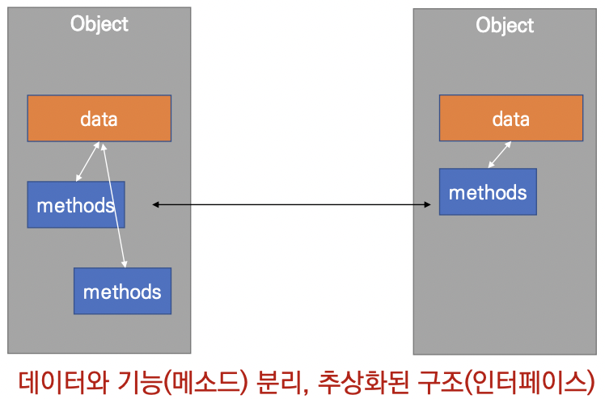

### ```객체지향 프로그래밍```

---------------------

#### 📝 객체

- 객체의 특징

  - `타입(type)` 어떤 연산자(operator)와 조작(method)이 가능한가?
  - `속성(attribute)` 어떤 상태(데이터)를 가지는가?
  - `조작법(method)` 어떤 행위(함수)를 할 수 있는가?

- 객체지향 프로그래밍이란?

  - 프로그램을 여러 개의 독립된 객체들과 그 객체들 간의 상호작용으로 파악하는 프로그래밍 방법

    

  - 현실 세계를 프로그램 설계에 반영**(추상화)**

    ```python
    class Person:
      def __init(self, name, gender):
        self.name = name
        self.gender = gender
        
      def greeting_message(self):
        return f'안녕하세요. {self.name}입니다.'
    ```

    ```python
    wendy = Person('웬디', '여')
    print(wendy.greeting_message())
    # 안녕하세요, 웬디입니다.
    
    luna = Person('루나', '여')
    print(luna.greeting_message())
    # 안녕하세요, 루나입니다.
    ```

    

#### 🔎 OOP 기초

##### `기본 문법`

```python
# 클래스 정의
class MyClass:
  pass
# 인스턴스 생성
my_instance = MyClass()
# 메서드 호출
my_instance.my_mehtod()
# 속성
my_instance.my_aattribute
```

- 객체의 틀(클래스)를 가지고, 객체(인스턴스)를 생성

  - 👤Person(클래스) ➡︎ 👮🏻경찰 김가가(인스턴스) 👩🏻‍💻개발자 이나나(인스턴스) 👩🏻‍🔧정비공 박다다(인스턴스)

- 클래스와 인스턴스

  - 클래스 : 객체들의 분류(class)

  - 인스턴스 : 하나하나의 실체/예(instance)

    ```python
    class Person:
      pass
    
    print(type(Person))
    # type
    p1 = Person()
    type(p1)
    # __main__.Person
    isinstance(person1, Person)
    # True
    ```

    ❗️ 파이썬은 모든 것이 객체, 모든 객체는 특정 타입의 인스턴스

- 속성

  - 특정 데이터 타입/클래스의 객체들이 가지게 될 상태/데이터를 의미

    ☑️ In [1] :

    ```python
    class Person:
      
      def __init__(self, name):
        self.name = name
    ```

    ☑️ In [2] :

    ```python
    person1 = Person('은우')
    ```

    ☑️ In [3] :

    ```python
    person1.name
    ```

    ✔ Out[3] : '은우'

- 메소드

  - 특정 데이터 타입/클래스의 객체에 공통적으로 적용 가능한 행위(함수)

    ☑️ In [1]:

    ```python
    class Person:
      
      def talk(self):
        print('안녕')
        
      def eat(self, food):
        print(f'{food}를 냠냠')
    ```

    ☑️ In [3] :

    ```python
    person1 = Person()
    ```

    ☑️ In [4] :

    ```python
    person1.talk()
    ```

    `안녕`

    ☑️ In [5] :

    ```python
    person1.eat('피자')
    ```

    `피자를 냠냠`

    ☑️ In [6] :

    ```python
    person1.eat('치킨')
    ```

    `치킨를 냠냠`

- 객체 비교하기

  - ==

    - 동등한(equal)
    - 변수가 참조하는 객체가 동등한(내용이 같은) 경우 True
    - 두 객체가 같아 보이지만 실제로 동일한 대상을 가리키고 있다고 확인해 준 것은 아님

  - is

    - 동일한(identical)
    - 두 변수가 동일한 객체를 가리키는 경우 True

    ```python
    a = [1, 2, 3]
    b = [1, 2, 3]
    
    print(a == b, a is b)
    # True False
    ```

    ```python
    a = [1, 2, 3]
    b = a
    
    print(a == b, a is b)
    # True True
    ```

- 인스턴스 변수

  - 인스턴스가 개인적으로 가지고 있는 속성(attribute)
  - 각 인스턴스들의 고유한 변수

- 생성자 메소드에서 self.name으로 정의

- 인스턴스가 생성된 이후 instance.name으로 접근 및 할당

  ☑️ In [1] :

  ```python
  class Person:
    
    def __init__(self, name):
      self.name = name # 인스턴스 변수 정의
  ```

  ☑️ In [2] :

  ```python
  john = Person('john')
  ```

  ☑️ In [4] :

  ```python
  print(john.name) # 인스턴스 변수 접근 및 할당
  ```

  `john`

  ☑️ In [5] :

  ```python
  john.name = 'John Kim' # 인스턴스 변수 접근 및 할당
  ```

  ☑️ In [6] :

  ```python
  Print(john.name)
  ```

  `John Kim`

- 인스턴스 메소드

  - 인스턴스 변수를 사용하거나, 인스턴스 변수에 값을 설정하는 메소드

  - 클래스 내부에 정의되는 메소드의 기본

  - 호출 시, 첫번째 인자로 인스턴스 자기자신(self)이 전달 됨

    ```python
    class MyClass
    
    	def instance_method(self, arg1, ...)
    ```

    > my_instance = MyClass()
    >
    > my_instance.instance_method(...)

- self

  - 인스턴스 자기자신
  - 파이썬에서 인스턴스 메소드는 호출 시 첫번째 인자로 인스턴스 자신이 전달되게 설계
    - 매개변수 이름으로 self를 첫번째 인자로 정의
    - 다른 단어로 써도 작동하지만, 파이썬의 암묵적인 규칙

- 생성자(constructor) 메소드

  - 인스턴스 객체가 생성될 때 자동으로 호출되는 메소드

  - 인스턴스 변수들이 초기값을 설정

    - 인스턴스 생성
    - `__init__` 메소드 자동 호출

    ```python
    class Person:
      
      def __init__(self):
        print('인스턴스가 생성되었습니다.')
    ```

    ```python
    person1 = Person()
    ```

    `인스턴스가 생성되었습니다.`

    ```python
    class Person:
      
      def __init__(self, name):
        print(f'인스턴스가 생성되었습니다. {name}')
    ```

    ```python
    person1 = Person('구름')
    ```

    `인스턴스가 생성되었습니다. 구름`

- 소멸자(destructor) 메소드

  - 인스턴스 객체가 소멸(파괴)되기 직전에 호출되는 메소드

    ☑️ In [3] :

    ```python
    class Person:
      
      def __del__(self):
        print('인스턴스가 사라졌습니다.')
    ```

    ☑️ In [4] :

    ```python
    person1 = Person()
    del person1
    ```

    `인스턴스가 사라졌습니다.`