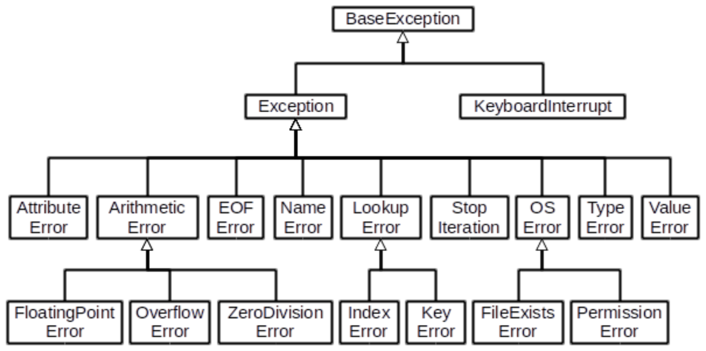
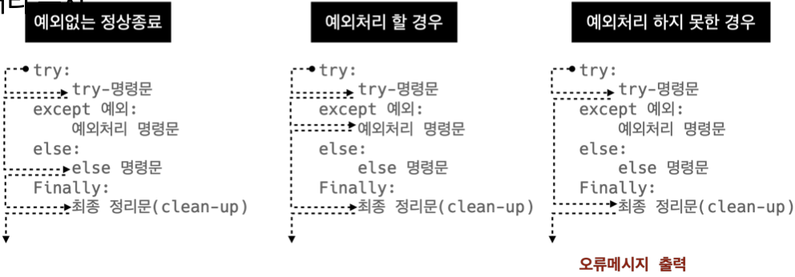

### ```에러/예외처리 (Error/Exception Handling)```

------------

#### 📝 디버깅

- `branches` 모든 조건이 원하는대로 동작하는지
- `for loops` 반복문에 진입하는지, 원하는 횟수만큼 실행 되는지
- `while loops` for loops와 동일, 종료 조건이 제대로 동작하는지
- `function` 함수 호출시, 함수 파라미터, 함수 결과
- `print 함수 활용` 특정 함수 결과, 반복/조건 결과 등 나눠서 생각, 코드를 bisection으로 나눠서 생각
- `개발 환경(text editor, IDE) 등에서 제공하는 기능 활용` breakpoint, 변수 조회 등
- `Python tutor 활용(단순 파이썬 코드인 경우)`
- `뇌컴파일, 눈디버깅`


#### 🔎 에러와 예외

##### `문법 에러(Syntax Error)`

- SyntaxError가 발생하면 아피썬 프로그램은 실행되지 않음

- 파일 이름, 줄번호, ^ 문자를 통해 파이썬이 코드를 읽어 나갈 때(parser) 문제가 발생한 위치 표현

- 줄에서 에러가 감지된 가장 앞의 위치를 가리키는 캐럿(caret) 기호(^) 표시

  ```python
  File "<ipython-input-1-f8a097d0a685>", line 1
  if else ^
  SyntaxError: invalid syntax
  ```

- EOL (End of Line)

  ```python
  print('hello'
  # File "<ipython-input-6-2a5f5c6b1414>", line 1
  # print('hello
  # 						^
  # SyntaxError: EOL while scanning string literal
  ```

- EOF (End of File)

  ```python
  print(
  # File "<ipython-input-4-424fbb3a34c5>", line 1
  # print(
  # 			^
  # SyntaxError: unexpected 
  ```

- Invalid syntax *파이썬 문법에 맞지 않는 경우*

  ```python
  while
  # File "<ipython-input-7-ae84bbebe3ce>", line 1
  # while
  # 			^
  # SyntaxError: invalid syntax
  ```

- assign to literal *변수의 이름은 숫자로 시작할 수 없음*

  ```python
  5 = 3
  # File "<ipython-input-28-9a762f2c796b>", line 1
  # 5 = 3
  # ^
  # SyntaxError: cannot assign to literal
  ```


##### `예외 (Exception)`

- 실행 도중 예상치 못한 상황을 맞이하면 프로그램 실행을 멈춤
  - 문장이나 표현식이 문법적으로 올바르더라도 발생하는 에러
- 실행 중에 감지되는 에러들을 예외라고 부름
- 예외는 여러 타입으로 나타나고 타입이 메시지의 일부로 출력
  - NameError, TypeError 등은 발생한 예외 타입의 종류(이름)
- 모든 내장 예외는 Exception Class를 상속받아 이루어짐
- 사용자 정의 예외를 만들어 관리할 수 있음

ZeroDivisionError *0으로 나눌 수 없음*

```python
10/0
# ---------------
# ZeroDivisionError Traceback (most recent call last)
# ----> 1 10/0
# ZeroDivisionError: division by zero
```

NameError *namespace 상에 이름이 없는 경우*

```python
print(name_error)
# ---------------------------
# NameError Traceback (most recent call last)
# ----> 1 print(name_error)
# NameError: name 'name_error' is not defined
```

TypeError *타입 불일치*

```python
# example 1
1 + '1'
# --------------
# TypeError Traceback (most recent call last)
# ----> 1 1 + '1'
# TypeError: unsupported operand type(s) for +: 'int' and 'str'

# example 2
round('3.5')
# ---------------
# TypeError Traceback (most recent call last)
# ----> 1 round('3.5')
# TypeError: type str doesn't define __round__ 
```

TypeError *arguments 부족*

```python
# example 1
divmod() ====> divmod는 2개의 argument를 필요로하는데 0개 입려됨
# ------------
# TypeError Traceback (most recent call last)
# ----> 1 divmod()
# TypeError: divmod expected 2 arguments, got 0

# example 2
import random
random.sample()
# ---------
# TypeError Traceback (most recent call last)
# 1 import random
# ----> 2 random.sample()
# TypeError: sample() missing 2 required positional arguments:
# 'population' and 'k'
```

TypeError *arguments 개수 초과*

```python
# example 1
divmod(1, 2, 3)
# ---------
# TypeError Traceback (most recent call last)
# ----> 1 divmod(1, 2, 3)
# TypeError: divmod expected 2 arguments, got 3

# example 2
import random
random.sample(range(3), 1, 2)
# --------
# TypeError Traceback (most recent call last)
# 1 import random
# ----> 2 random.sample(range(3), 1, 2)
# TypeError: sample() takes 3 positional arguments but 4 were given
```

ValueError *타입은 올바르나 값이 적절하지 않거나 없는 경우*

```python
# example 1
int('3.5')
# ---------
# TypeError Traceback (most recent call last)
# ----> 1 int('3.5')
# ValueError: invalid literal for int() with base 10:
# '3.5'

# example 2
range(3).index(5)
# ---------
# TypeError Traceback (most recent call last)
# ----> 1 range(3).index(5)
# ValueError: 6 is not in range
```

IndexError

```python
empty_list = []
empty_list[2]
# ---------
# IndexError Traceback (most recent call last)
# 			1 empty_list = []
# ----> 2 empty_list[2]
# IndexError: list index out of rnage
```

KeyError

```python
song = {'RedVelvet':'Fell My Rhythm'}
song['F(x)']
# ---------
# KeyError Traceback (most recent call last)
# 			1 song = {'RedVelvet':'Fell My Rhythm'}
# ----> 2 song['F(x)']
# KeyError: 'F(x)'
```

ModuleNotFoundError *존재하지 않는 모듈을 import 하는 경우*

```python
import nonamed
# ---------
# ModuleNotFoundError Traceback (most recent call last)
# ----> 1 import nonamed
# ModuleNotFoundError: No module named 'nonamed'
```

ImportError *Module은 있으나 존재하지 않는 클래스/함수를 가져오는 경우*

```python
from random import samp
# ---------
# ImportError Traceback (most recent call last)
# ----> 1 from random import samp
# ImportError: cannot import name 'samp' from 'random'
```

IndentationError *Indentation이 적절하지 않는 경우. 들여쓰기 에러*

```python
for i in range(3):
print(i)
# File "<ipython-input-56-78291925d94f>", line 2
# print(i)
# ^
# IndentationError: expected an indented block
```

KeyboardInterrupt *임의로 프로그램을 종료했을 때*

```python
while True:
  continue
# ---------
# KeyboardInterrupt Traceback (most recent call last)
# <ipython-input=55=6a65cf439648> in <module>
# 			1 while True:
# ----> 2   continue
# KeyboardInterrupt:
```

파이썬 내장 예외 (built-in-exceptions)




##### `예외처리`

- `try` 코드를 실행
- `except` try문에서 예외가 발생 시 실행
- `else` try문에서 예외가 발생하지 않으면 실행
- `finally` 예외 발생 여부와 관계없이 항상 실행

- try문(statement) / except절(clause)을 이용해 예외 처리를 할 수 있음

try문

- 오류가 발생할 가능성이 있는 코드 실행
- 예외가 발생되지 않으면 except 없이 실행 종료

except문

- 예외가 발생하면 except절이 실행
- 예외 상황을 처리하는 코드를 받아서 적절한 조치를 취함

처리 순서



작성 방법

```python
try:
	try 명령문
except 예외그룹-1 as 변수-1:
	예외처리 명령문 1
except 예외그룹-2 as 변수-2:
	예외처리 명령문 2
finally: # 선택사항
	finally 명령문
```

❗️ try문은 반드시 한 개 이상의 except문이 필요함


예외 처리 예시

```python
num = input('숫자입력 : ')
print(int(num))
# 숫자입력 : 3
# 3

num = input('숫자입력 : ')
print(int(num))
# 숫자입력 : 안녕
# ------
# ValueError Traceback (most recent call last)
# 			1 num = input('숫자입력 : ')
# ----> 2 print(int(num))
# ValueError: invalid literal for int() with base 10: '안녕'
```

```python
try:
  num = input('숫자입력 : ')
  print(int(num))
except:
  print('숫자가 아닙니다.')
  
try:
  num = input('숫자입력 : ')
  print(int(num))
except ValueError:
  print('숫자가 아닙니다.')
```

- 파일을 열고 읽는 코드를 작성하는 경우

  ```python
  # 파일이 없는 경우
  try:
    f = open('nooofile.txt')
  except FileNotFoundError:
    print('해당 파일이 없습니다.')
  else:
    print('파일을 읽기 시작합니다.')
    print(f.read())
    print('파일을 모두 읽었습니다.')
    f.close()
  finally:
    print('파일 읽기를 종료합니다.')
    
  # 파일이 없는 경우
  try:
    f = open('file.txt')
  except FileNotFoundError:
    print('해당 파일이 없습니다.')
  else:
    print('파일을 읽기 시작합니다.')
    print(f.read())
    print('파일을 모두 읽었습니다.')
    f.close()
  finally:
    print('파일 읽기를 종료합니다.')
  ```

  - 파일 열기 시도
    - 파일이 없는 경우 ➡️ '해당 파일이 없습니다.' 출력 (except)
    - 파일이 있는 경우 ➡️ 파일 내용을 출력 (else)
  - 해당 파일 읽기 작업 종료 메시지 출력(finally)


##### `예외 발생 시키기`

raise statement

- raise를 통해 예외를 강제로 발생

  ```python
  raise <표현식> (메시지)
          ⬆️
    	예외 타입 지정
  (주어지지 않을 경우 현재 스코프에서
  활성화된 마지막 예외를 다시 일으킴)
  ```

  ```python
  raise
  # ------
  # RuntimeError Traceback (most recent call last)
  # ----> 1 raise
  # RuntimeError: No active exception to reraise
  ```

  

