### `JavaScript - Event`

***

#### 👩🏻‍💻 Event 개념

- 네트워크 활동이나 사용자와의 상호작용 같은 사건의 발생을 알리기 위한 객체
- 이벤트 발생
  - 마우스를 클릭하거나 키보드를 누르는 등 사용자 행동으로 발생할 수도 있음
  - 특정 메서드를 호출(Element.click())하여 프로그래밍적으로도 만들어 낼 수 있음


#### 👩🏻‍💻 Event handler

- `addEventListener()`

  - EventTarget.addEventListener()

    - 지정한 이벤트가 대상에 전달될 때마다 호출할 함수를 설정
    - 이벤트를 지원하는 모든 객체(Element, Document, Window 등)를 대상으로 지정 가능

  - target.addEvnetListener(type, listener[, obtions])

    - type
      - 반응 할 이벤트 유형 (대소문자 구분 문자열)
    - listener
      - 지정된 타입의 이벤트가 발생했을 때 알림을 받는 객체
      - EventListener 인터페이스 혹은 JS function 객체(콜백 함수)여야 함

  - <span style='color: #A92727'>EventTarget</span>.addEventLIstener(<span style='color: #3ADF00'>type</span>, <span style='color: #0080FF'>listener</span>)

    - <span style='color: #A92727'>대상</span>에 <span style='color: #3ADF00'>특정 이벤트</span>가 발생하면, <span style='color: #0080FF'>할 일</span>을 등록하자

  - 실습

    ```html
    <button onclick="alertMessage()">나를 눌러봐</button>
    ```

    ```js
    function alertMessage() {
        alert('메롱') 
    }
    ```

    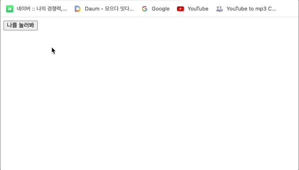

    ```html
    <button id="myBtn">나를 눌러봐</button>
    ```

    ```js
    const myBtn = document.querySelector('#myBtn')
    myBtn.addEventListener('click', alertMessage)
    ```

    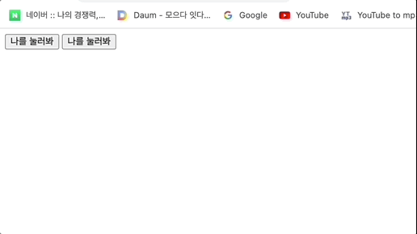

    ```html
    <p id="myParagraph"></p>
    <form action="#">
          <label for="myTextInput">내용을 입력하세요.</label>
          <input type="text" id="myTextInput">
    </form>
    ```

    ```js
    const myTextInput = document.querySelector('#myTextInput')
    
    myTextInput.addEventListener('input', function(event) {
      const myPtag = document.querySelector('#myParagraph')
      myPtag.innerText = event.target.value
    })
    ```

    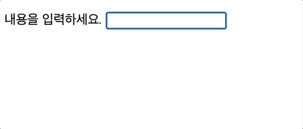

    ```html
    <h2>Change My color</h2>
    <label for="changeColorInput">원하는 색상을 영어로 입력하세요.</label>
    <input id="changeColorInput">
    <hr>
    ```

    ```js
    const colorInput = document.querySelector('#changeColorInput')
    
    const changeColor = function(evnet) {
      const h2Tag = document.querySelector('h2')
      h2Tag.style.color = evnet.target.value
    }
    
    colorInput.addEventListener('input', changeColor)
    ```

    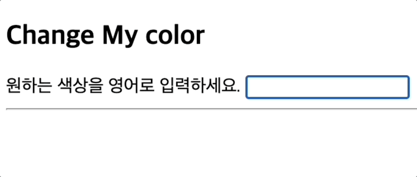

    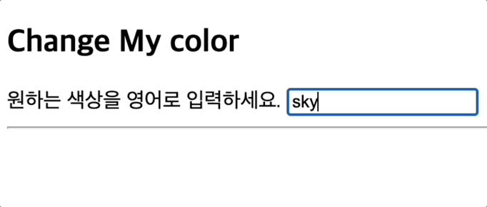

    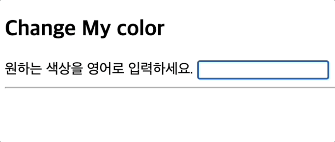

    

    

#### 👩🏻‍💻 Event 취소

- `event.preventDefault()`

  - 현재 이벤트의 기본 동작을 중단
  - HTML 요소의 기본 동작을 작동하지 않게 막음
    - 예) a 태그의 기본 동작은 클릭 시 링크 이동 / form 태그의 기본 동작은 form 데이터 전송
  - 이벤트를 취소할 수 있는 경우 이벤트의 전파를 막지 않고 그 이벤트를 취소

- `실습`

  ```html
  <input type="checkbox" id="myCheckbox">
  ```

  ```js
  const checkBox = document.querySelector('#myCheckbox')
  
  checkBox.addEventListener('click', function(event) {
    event.preventDefault()
    console.log(event)
  })
  ```

  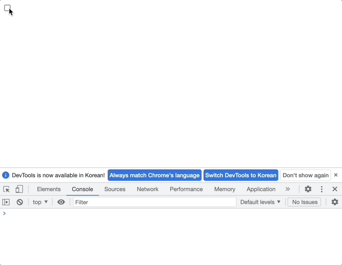

  ```html
  <form action="/artivcles" id="myForm">
    <input type="text">
    <input type="submit" value="제출">
  </form>
  ```

  ```js
  const formTag = document.querySelector('#myForm')
  
  formTag.addEventListener('submit', function() {
    console.log(event)
    event.preventDefault()
    event.target.reset()
  })
  ```

  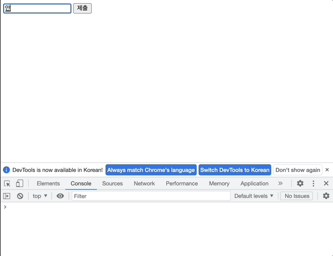

  ```html
  <a href="https://google.com" target="_blank" id="myLink">GoToGoogle</a>
  ```

  ```js
  const aTag = document.querySelector('#myLink')
  
  aTag.addEventListener('click', function() {
    console.log(event)
    event.preventDefault()
  })
  ```

  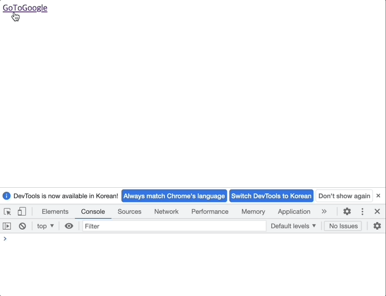

  ```js
  document.addEventListener('scroll', function(event) {
    console.log(event)
    event.preventDefault()
  })
  ```

  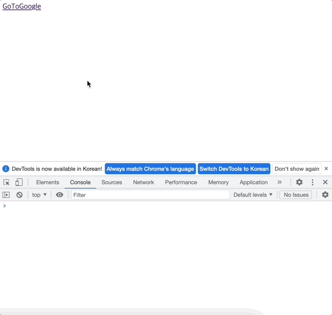

  - 취소할 수 없는 이벤트도 존재
    - 이벤트의 취소 가능 여부는 `event.cancelable`을 사용해 확인 할 수 있음

  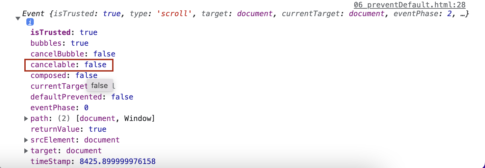

  