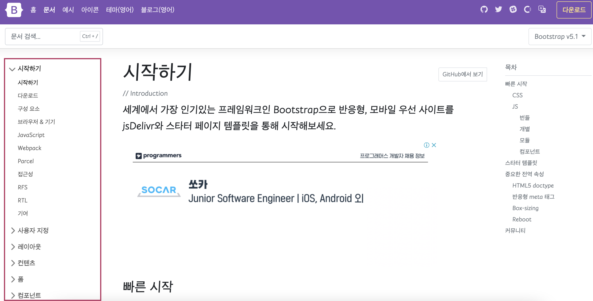
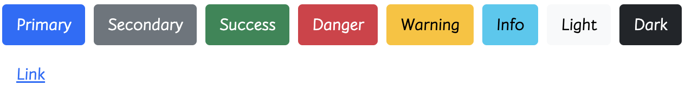
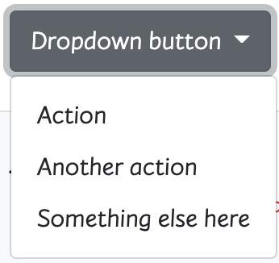
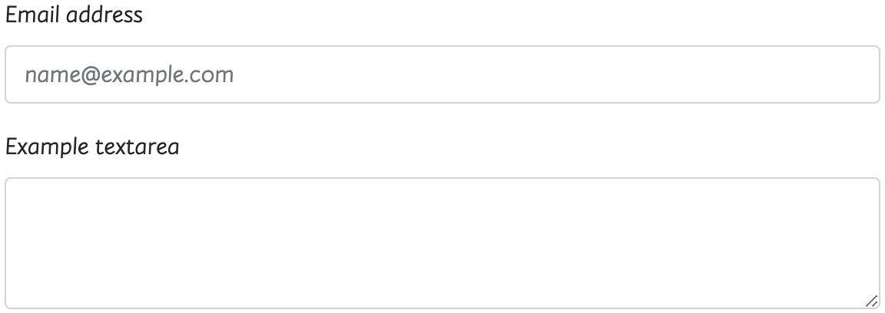
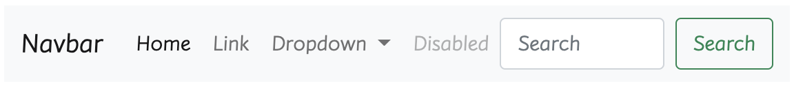
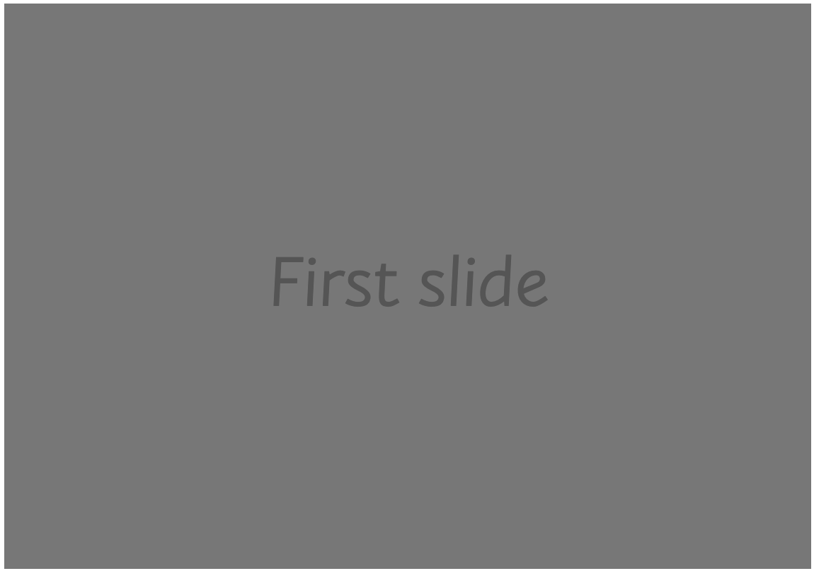
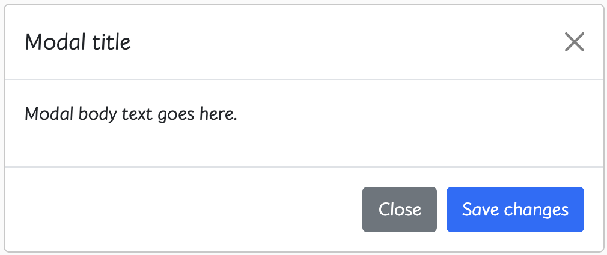

### `Bootstrap - Components`

***

##### 💡 Components

- Bootstrap의 다양한 UI 요소를 활용할 수 있음

- 아래 Components 탭 및 검색으로 원하는 UI 요소를 찾을 수 있음

- 기본 제공된 Components를 변환해서 활용

  


##### ✏️ 요소

- `Buttons`

  - 클릭 했을 때 어떤 동작이 일어나게 하는 요소

    ```html
    <button type="button" class="btn btn-primary">Primary</button>
    <button type="button" class="btn btn-secondary">Secondary</button>
    <button type="button" class="btn btn-success">Success</button>
    <button type="button" class="btn btn-danger">Danger</button>
    <button type="button" class="btn btn-warning">Warning</button>
    <button type="button" class="btn btn-info">Info</button>
    <button type="button" class="btn btn-light">Light</button>
    <button type="button" class="btn btn-dark">Dark</button>
    
    <button type="button" class="btn btn-link">Link</button>
    ```

    

- `Dropdowns`

  - Dropdown, dropdown-menu, dropdown-item 클래스를 활용해 옵션 메뉴를 만들 수 있음

    ```html
    <div class="dropdown">
      <button class="btn btn-secondary dropdown-toggle" type="button" id="dropdownMenuButton1" data-bs-toggle="dropdown" aria-expanded="false">
        Dropdown button
      </button>
      <ul class="dropdown-menu" aria-labelledby="dropdownMenuButton1">
        <li><a class="dropdown-item" href="#">Action</a></li>
        <li><a class="dropdown-item" href="#">Another action</a></li>
        <li><a class="dropdown-item" href="#">Something else here</a></li>
      </ul>
    </div>
    ```

    

- `Forms` > `Form controls`

  - form-control 클래스를 사용해 `<input>` 및 `<form>` 태그를 스타일링 할 수 있음

    ```html
    <div class="mb-3">
      <label for="exampleFormControlInput1" class="form-label">Email address</label>
      <input type="email" class="form-control" id="exampleFormControlInput1" placeholder="name@example.com">
    </div>
    <div class="mb-3">
      <label for="exampleFormControlTextarea1" class="form-label">Example textarea</label>
      <textarea class="form-control" id="exampleFormControlTextarea1" rows="3"></textarea>
    </div>
    ```

    

- `Navbar`

  - navbar 클래스를 활용하면 네비게이션 바를 제작할 수 있음

    ```html
    <nav class="navbar navbar-expand-lg navbar-light bg-light">
      <div class="container-fluid">
        <a class="navbar-brand" href="#">Navbar</a>
        <button class="navbar-toggler" type="button" data-bs-toggle="collapse" data-bs-target="#navbarSupportedContent" aria-controls="navbarSupportedContent" aria-expanded="false" aria-label="Toggle navigation">
          <span class="navbar-toggler-icon"></span>
        </button>
        <div class="collapse navbar-collapse" id="navbarSupportedContent">
          <ul class="navbar-nav me-auto mb-2 mb-lg-0">
            <li class="nav-item">
              <a class="nav-link active" aria-current="page" href="#">Home</a>
            </li>
            <li class="nav-item">
              <a class="nav-link" href="#">Link</a>
            </li>
            <li class="nav-item dropdown">
              <a class="nav-link dropdown-toggle" href="#" id="navbarDropdown" role="button" data-bs-toggle="dropdown" aria-expanded="false">
                Dropdown
              </a>
              <ul class="dropdown-menu" aria-labelledby="navbarDropdown">
                <li><a class="dropdown-item" href="#">Action</a></li>
                <li><a class="dropdown-item" href="#">Another action</a></li>
                <li><hr class="dropdown-divider"></li>
                <li><a class="dropdown-item" href="#">Something else here</a></li>
              </ul>
            </li>
            <li class="nav-item">
              <a class="nav-link disabled">Disabled</a>
            </li>
          </ul>
          <form class="d-flex">
            <input class="form-control me-2" type="search" placeholder="Search" aria-label="Search">
            <button class="btn btn-outline-success" type="submit">Search</button>
          </form>
        </div>
      </div>
    </nav>
    ```

    

- `Carousel`

  - 콘텐츠(사진)을 순환시키기 위한 슬라이드쇼

    ```html
    <div id="carouselExampleSlidesOnly" class="carousel slide" data-bs-ride="carousel">
      <div class="carousel-inner">
        <div class="carousel-item active">
          
        </div>
        <div class="carousel-item">
          
        </div>
        <div class="carousel-item">
          
        </div>
      </div>
    </div>
    ```

    

- `Modal`

  - 사용자와 상호 작용 하기 위해 사용하며 긴급 상황을 알리는데 주로 사용
  - 현재 열려 있는 페이지 위에 또 다른 레이어를 띄움
  - 페이지를 이동하면 자연스럽게 사라짐(옵션에 따라 제거를 하지 않고도 배경 클릭시 사라질 수 있음)
  - `Modal`은 자바스크립트를 활용하며 반드시 `target`과 `id`가 일치해야 함

  ```html
  <div class="modal" tabindex="-1">
    <div class="modal-dialog">
      <div class="modal-content">
        <div class="modal-header">
          <h5 class="modal-title">Modal title</h5>
          <button type="button" class="btn-close" data-bs-dismiss="modal" aria-label="Close"></button>
        </div>
        <div class="modal-body">
          <p>Modal body text goes here.</p>
        </div>
        <div class="modal-footer">
          <button type="button" class="btn btn-secondary" data-bs-dismiss="modal">Close</button>
          <button type="button" class="btn btn-primary">Save changes</button>
        </div>
      </div>
    </div>
  </div>
  ```

  

  

