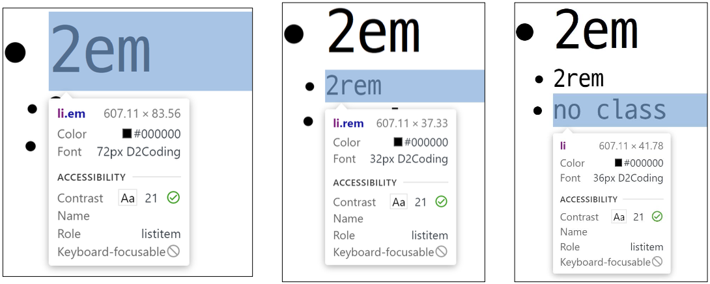

### `CSS 기본 스타일`

***

##### 📘 크기 단위 (viewport)

- 웹 페이지를 방문한 유저에게 바로 보이게 되는 웹 컨텐츠의 영역 (디바이스 화면)
- 디바이스의 viewport를 기준으로 상대적인 사이즈가 결정됨
  - 예) vw, vh, vmin, vmax

- `px (픽셀)`

  - 모니터 해상도의 한 화소인 '픽셀' 기준
  - 픽셀의 크기는 변하지 않기 때문에 고정적인 단위

- `%`

  - 백분율 단위
  - 가변적인 레이아웃에서 자주 사용

- `em`

  - (바로 위, 부모 요소에 대한) 상속의 영향을 받음
  - 배수 단위, 요소에 지정된 사이즈에 상대적인 사이즈를 가짐

- `rem`

  - (바로 위, 부모 요소에 대한) 상속의 영향을 받지 않음
  - 최상위 요소(html)의 사이즈를 기준으로 배수 단위를 가짐

  ```html
  <body>
    <ul class="font-big">
      <li class="em">2em</li>
      <li class="rem">2rem</li>
      <li>na class</li>
    </ul>
  </body>
  ```

  ```css
  .font-big {
    font-size: 36px;
  }
  .em {
    font-size: 2em;
  }
  .2rem {
    font-size: 2rem;
  }
  ```

  


##### 📗 색상 단위

- 색상 키워드(<span style='color: gray'>background-color: red;</span>)

  - 대소문자를 구분하지 않음
  - `red`, `blue`, `black`과 같은 특정 색을 직접 글자로 나타냄

- RGB 색상(<span style='color: gray'>background-color: rgb(0, 255, 0); / background-color: #0000FF;</span>)

  - 16진수 표기법 혹은 함수형 표기법을 사용해서 특정 색을 표현하는 방식
  - `#0000FF`, `#6A5ACD`과 같이 코드로도 표현 가능
    - [참고 - 웹 컬러 색상표](https://at-corner.tistory.com/17)

- HSL 색상(<span style='color: gray'>background-color: hsl(0, 100%, 50%);</span>)

  - 색상, 채도, 명도를 통해 특정 색을 표현하는 방식

  ```css
  p { color: black; }
  p { color: #000; }
  p { color: #000000;}
  p { color: rgb(0, 0, 0); }
  p { color: hsl(120, 100%, 0); }
  
  p { color: rgba(0, 0, 0, 0.5); }
  p { color: hsla(120, 100%, 0.5); }
  ```

  > 모두 black 색상
  >
  > a는 alpha(투명도)


##### 📙 CSS 문서 표현

- 텍스트
  - 서체(font-family), 서체 스타일(font-style, font-weight 등)
  - 자간(letter-spacing), 단어 간격(word-spacing), 행간(line-height) 등
- 컬러(color), 배경(background-image, background-color)
- 기타 HTML 태그별 스타일링
  - 목록(li), 표(table)
