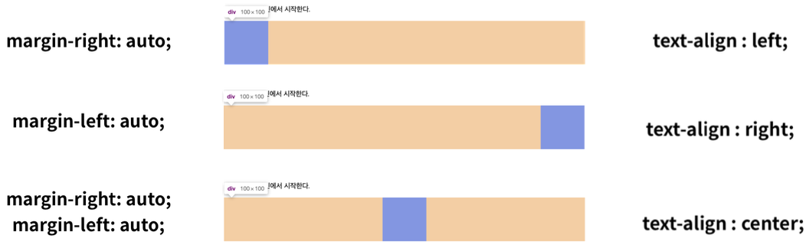

### `CSS Display`

***

💡  CSS 원칙 2

- 모든 요소는 네모(박스 모델)이고, 좌측 상단에 배치
- display에 따라 크기와 배치가 달라짐

##### 🔎 대표적으로 활용되는 display

- `display: block`
  - 줄 바꿈이 일어나는 요소
  - 화면 크기 전체의 가로 폭을 차지함
  - 블록 레벨 요소 안에 인라인 레벨 요소가 들어갈 수 있음
- `display: inline`
  - 줄 바꿈이 일어나지 않는 행의 일부 요소
  - content 너비만큼 가로 폭을 차지함
  - width, height, margin-top, margin-bottom을 지정할 수 없음
  - 상하 여백은 line-height로 지정

##### 🔎 block / inline

- `block`

  - `div` / `ul`, `ol`, `li` / `p` / `hr` / `form`

  - 기본 너비는 가질 수 있는 너비의 100%
    - 너비를 가질 수 없다면 margin이 자동으로 부여 됨

- `inline`
  - `span` / `a` / `img` / `input`, `label` / `b`, `em`, `i`, `strong` 등
  - 기본 너비는 컨텐츠 영역만큼 가짐

##### 🔎 이외 display 속성

- `display: inline-block`
  - block과 inline 레벨 요소의 특징을 모두 가짐
  - inline처럼 한 줄에 표시할 수 있고, block처럼 width, height, margin 속성을 모두 지정할 수 있음
- `display: none`
  - 해당 요소를 화면에 표시하지 않고 공간조차 부여되지 않음
  - 이와 비슷한 `visibility: hidden`은 해당 요소가 공간을 차지하나 화면에 표시만 하지 않음
- [참고 - 다양한 display 속성](https://developer.mozilla.org/ko/docs/Web/CSS/display)

💡 속성에 따른 수평 정렬

