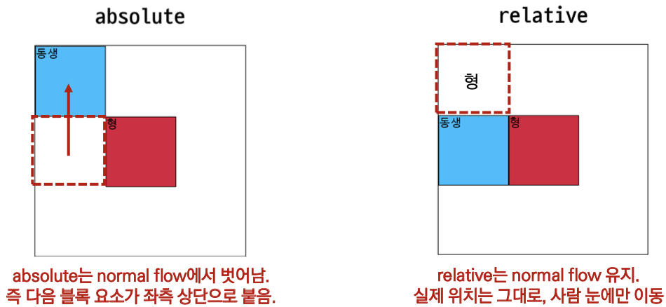

### `CSS position`

***

💡 CSS 원칙 3

- <span style='background-color: #f1f8ff'>position으로 위치의 기준을 변경</span>


##### 📝 position

- 문서 상에서 요소의 위치를 지정
- `static` : 모든 태그의 기본 값(기준 위치)
  - 일반적인 요소의 배치 순서에 따름(좌측 상단)
  - 부모 요소 내에서 배치될 때는 부모 요소의 위치를 기준으로 배치 됨
- 아래는 좌표 프로퍼티(top, bottom, left, right)를 사용하여 이동 가능
  - `relative` : 상대 위치 *(본인의 원래 위치)*
    - 자기 자신의 static 위치를 기준으로 이동 (normal flow 유지)
    - 레이아웃에서 요소가 차지하는 공간은 static일 때와 같음 (normal position 대비 offset)
  - `absoulte` : 절대 위치 *(특정 부모의 위치)*
    - 요소를 일반적인 문서 흐름에서 제거 후 레이아웃에 공간을 차지하지 않음 (normal flow에서 벗어남)
    - static이 아닌 가장 가까이 있는 부모/조상 요소를 기준으로 이동 (없는 경우 브라우저 화면 기준으로 이동)
  - `fixed` : 고정 위치 *(화면의 위치)*
    - 요소를 일반적인 문서 흐름에서 제거 후 레이아웃에 공간을 차지하지 않음 (normal flow에서 벗어남)
    - 부모 요소와 관계없이 viewport를 기준으로 이동
      - 스크롤 시에도 항상 같은 곳에 위치함
  - `sticky` : 스크롤에 따라 static ➡︎ fixed로 변경
    - 속성을 적용한 박스는 평소에 문서 안에서 `position: static` 상태와 같이 일반적인 흐름에 따르지만 스크롤 위치가 임계점에 이르면 `position: fixed`와 같이 박스를 화면에 고정할 수 있는 속성
    - 일반적으로 상단바(Navigation Bar)에 사용 함


##### 🔎 absolute VS relative

- 형에게 `top: 100px;`을 적용했을 때 `absolute`와 `relative`의 차이

  ```html
  <body>
    <div class="parent">
      <div class="absolute">형</div>
      <div class="sibling">동생</div>
    </div>
      <div class="parent">
      <div class="relative">형</div>
      <div class="sibling">동생</div>
    </div>
  </body>
  ```

  ```css
  /* 공통 스타일링 */
  div {
    box-sizing: border-box;
    width: 100px;
    height: 100px;
    border: 1px solid black;
  }
  .parent {
    position: relative;
    width: 300px;
    height: 300px;
  }
  ```

  ```css
  /* 차이점 확인하기 */
  .absolute {
    position: absolute;
    top: 100px;
    left: 100px;
    background-color: crimson;
  }
  .sibling {
    background-color: deepskyblue;
  }
  .relative {
    position: relative;
    top: 100px;
    left: 100px;
    background-color: crimson;
  }
  ```

  

