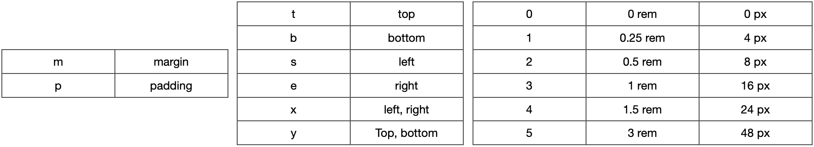
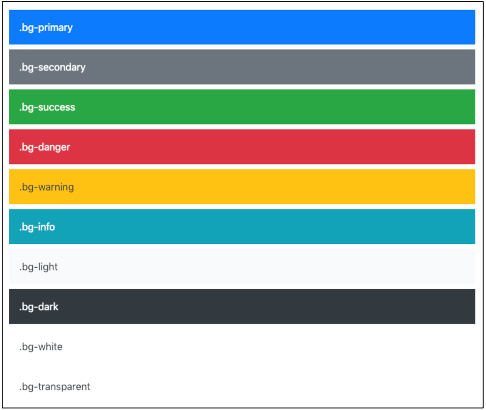
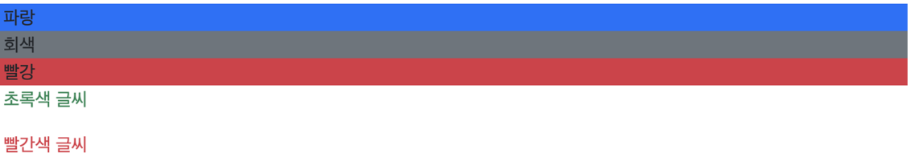
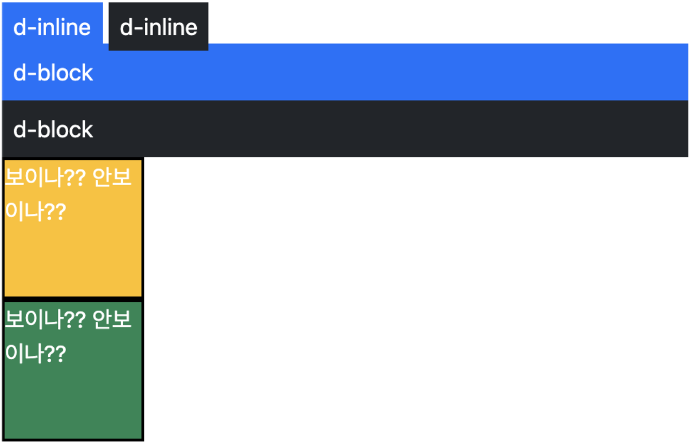
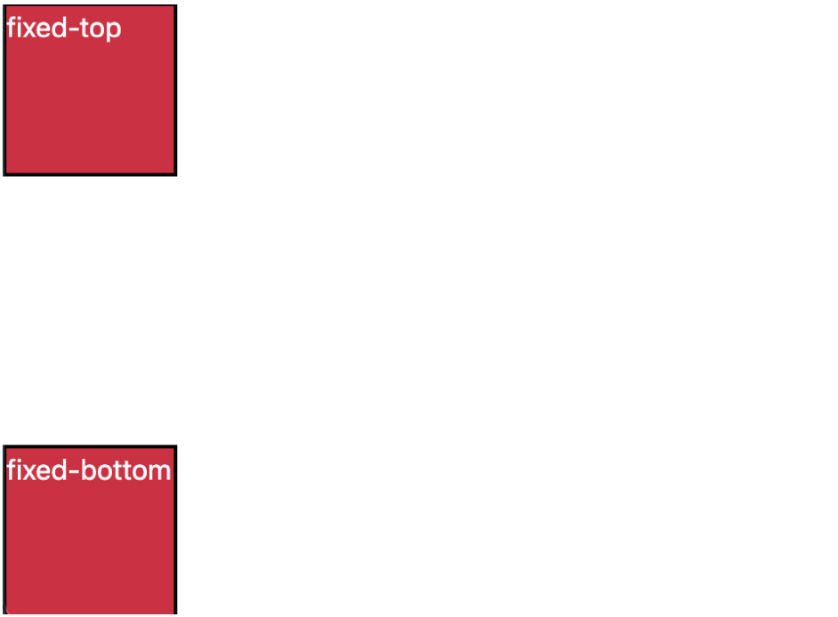

### `Bootstrap`

***

##### 💡 CDN

- Content Delivery(Distribution) Network
  - 컨텐츠(CSS, JS, Image, Text 등)을 효율적으로 전달하기 위해 여러 노드에 가진 네트워크에 데이터를 제공하는 시스템


##### 📖 spacing

- spacing (Margin and padding)

  - <span style='background-color: #f1f8ff'>{property}</span><span style='background-color: #ffdce0'>{sides}-</span>{size}
    - <span style='background-color: #f1f8ff'>m</span><span style='background-color: #ffdce0'>t</span>-3

  ```html
  <div class="mt-3 ms-5">
    bootstrap-spacing
  </div>
  ```

- <span style='background-color: #f1f8ff'>{property} </span><span style='color: gray'>{sides}-{size}</span>

  - `m` : margin
  - `p` : padding

- <span style='color: gray'>{property}</span><span style='background-color: #ffdce0'>{sides}</span><span style='color: gray'>-{size}</span>

  - `t` : margin-top, padding-top
  - `b` : margin-bottom, padding-bottom
  - `s` : (start) margin-left, padding-left in LTR / margin-right, padding-right in RTL
  - `e` : (end) margin-right, padding-right in LTR / margin-left, padding-left in RTL
  - `x` : *-left, *-right
  - `y` : *-top, *-bottom
  - `blank` : 요소의 4개 측면에 margin, padding

- <span style='color: gray'>{property}{sides}</span>-{size}

  - `0` : margin, padding을 0으로 설정하여 제거
  - `1` : (by default) margin, padding to $spacer * .25
  - `2` : (by default) margin, padding to $spacer * .5
  - `3` : (by default) margin, padding to $spacer
  - `4` : (by default) margin, padding to $spacer * 1.5
  - `5` : (by default) margin, padding to $spacer * 3
  - `auto` : margin to auto

| class name | rem  | px   |
| ---------- | ---- | ---- |
| m-1        | 0.25 | 4    |
| m-2        | 0.5  | 8    |
| m-3        | 1    | 16   |
| m-4        | 1.5  | 24   |
| m-5        | 3    | 48   |

- 예시

  - `.mx-0`
    - 가로(왼쪽, 오른쪽) margin이 0

  ```css
  .mx-0 {
    margin-right: 0 !important;
    margin-left: 0 !important;
  }
  ```

  > bootstrap.css

  - `mx-auto`
    - 블록 요소
    - 수평 중앙 정렬
    - 가로 가운데 정렬

  ```css
  .mx-auto {
    margin-right: auto !important;
    margin-left: auto !important;
  }
  ```

  - `.py-0`
    - 위, 아래 padding이 0

  ```css
  .py-0 {
    padding-top: 0 !important;
    padding-bottom: 0 !important;
  }
  ```

- 종합

  


##### 📖 Color

```css
:root {
  --primary: #007bff;
  --secondary: #6c757d;
  --success: #28a745;
  --info: #17a2b8;
  --warning: #ffc107;
  --danger: #dc3545;
  --light: #f8f9fa;
  --darl: #343a40;
}
```



```html
<h2>color</h2>
<div class="bg-primary">파란 배경</div>
<div class="bg-secondary">회색 배경</div>
<div class="bg-danger">빨강 배경</div>
<p calss="text-success">초록색 글씨</p>
<p calss="text-danger">빨간색 글씨</p>
```



```html
<h2>text</h2>
<p class="text-start">margin-top 3</p>
<p class="text-center">margin 4</p>
<p class="text-end">mx-auto, 가운데 정렬</p>
<a href="#" class="text-decoration-none">Non-underlined link</a>
<p class="fw-bold">bold text</p>
<p class="fw-normal">normal weight text</p>
<p class="fw-light">light weight text</p>
<p class="fw-italic">italic text</p>
```


##### 📖 Display

- display

  ```html
  <h2>display</h2>
  <p class="d-inline p-2 bg-primary text-white">d-inline</p>
  <p class="d-inline p-2 bg-dark text-white">d-inline</p>
  <p class="d-block p-2 bg-dark text-white">d-inline</p>
  <p class="d-block p-2 bg-primary text-white">d-inline</p>
  <p class="box bg-warning d-sm-none d-md-block">보이나?? 안보이나??</p>
  <p class="box bg-success d-md-none d-xl-block">보이나?? 안보이나??</p>
  ```

  

- Position

  ```html
  <h2>position</h2>
  <div class="box fixed-top">fixed-top</div>
  <div class="box fixed-bottom">fixed-bottom</div>
  ```

  

  

