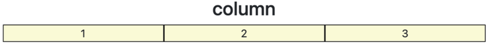
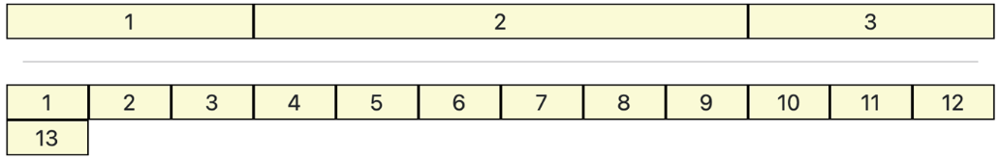
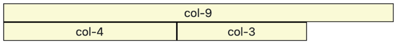
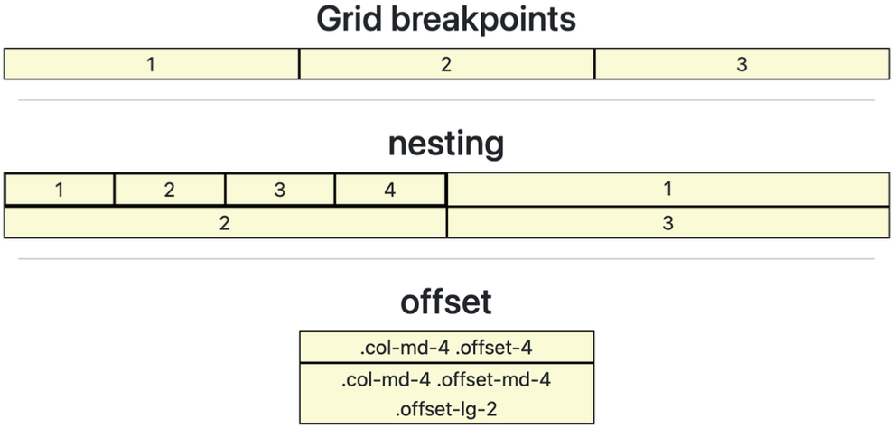
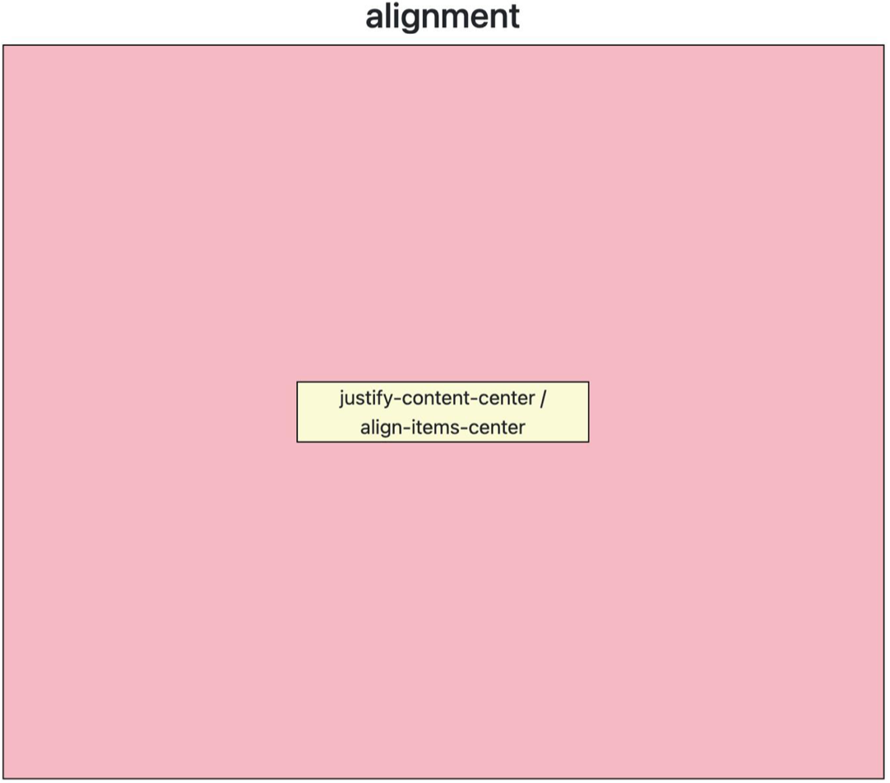
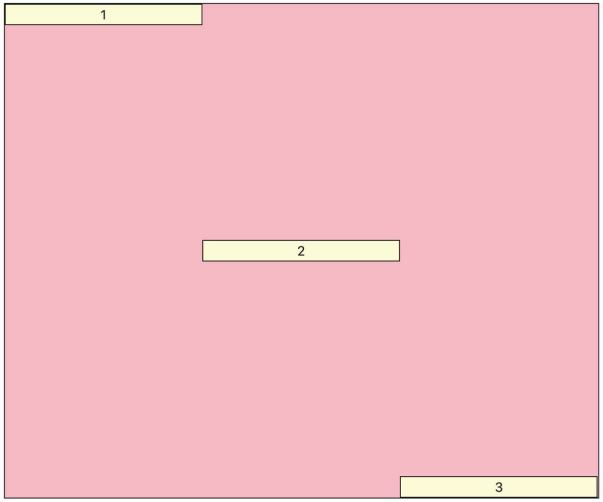

### `Bootstrap - Grid System`

***

##### 📖 Grid System(web design)

- 요소들의 디자인과 배치에 도움을 주는 시스템

- 기본 요소

  - `Column` : 실제 컨텐츠를 포함하는 부분
  - `Gutter` : 칼럼과 칼럼 사이의 공안 (사이 간격)
  - `Container` : Column들을 담고 있는 공간

  ```html
  <div class="container">
    <div class="row">
      <div class="col"></div>
      <div class="col"></div>
      <div class="col"></div>
    </div>
  </div>
  ```

- `Bootstrpa Grid System`

  - Bootstrap Grid System은 flexbox로 제작됨
  - `container`, `rows`, `column`으로 컨텐츠를 배치하고 정렬
  - 반드시 기억해야 할 2가지
    - 12개의 column
    - 6개의 grid breakpoints


##### 👩🏻‍💻 Grid system breakpoints 연습하기

```html
<div class="container">
  <h2 class="text-center">column</h2>
  <div class="row">
    <div class="col">1</div>
    <div class="col">2</div>
    <div class="col">3</div>
  </div>
</div>
```




```html
<div class="row">
  <div class=box col-3>1</div>
  <div class=box col-6>2</div>
  <div class=box col-3>3</div>
</div>
<hr>

<div class="row">
  <div class="box col-1">1</div>
  <div class="box col-1">2</div>
  <div class="box col-1">3</div>
  <div class="box col-1">4</div>
  <div class="box col-1">5</div>
  <div class="box col-1">6</div>
  <div class="box col-1">7</div>
  <div class="box col-1">8</div>
  <div class="box col-1">9</div>
  <div class="box col-1">10</div>
  <div class="box col-1">11</div>
  <div class="box col-1">12</div>
  <div class="box col-1">13</div>
</div>
```




```html
<div class="row">
  <div class="box col-9"></div>
  <div class="box col-4"></div>
  <div class="box col-3"></div>
</div>
```




```html
<h2 class="text-center">Grid breakpoints</h2>
<div class="row">
  <div class="box col-sm-8 col-md-4 col-lg-5">1</div>
  <div class="box col-8 col-sm-2 col-md-4 col-lg-2">2</div>
  <div class="box col-2 col-sm-2 col-md-4 col-lg-5">3</div>
</div>
<hr>

<h2 class="text-center">nesting</h2>
<div class="row">
  <div class="box col-6">
    <div class="box col-3">1</div>
    <div class="box col-3">2</div>
    <div class="box col-3">3</div>
    <div class="box col-3">4</div>    
  </div>
  <div class="box col-6">1</div>
  <div class="box col-6">2</div>
  <div class="box col-6">3</div>
</div>
<hr>

<h2 class="text-center">offset</h2>
<div class="row">
  <div class="box col-md-4 offset-4">.col-md-4 .offset-4</div>
  <div class="box col-md-4 offset-4 offset-lg-2">.col-md-4 .offset-md-4 .offset-lg-2</div>
</div>
```




```html
<h2 class="text-center">alingment</h2>
<div class="row parent justify-content-center align-items-center">
  <div class="box col-4">justify-content-center / align-items-center</div>
</div>
```




```html
<div class="row parent">
  <div class="box col-4 align-self-start">1</div>
  <div class="box col-4 align-self-center">2</div>
  <div class="box col-4 align-self-end">3</div>
</div>
```




```css
@media (min-width: 576px) {
.container-sm, .container {
  max-width: 540px;
	}
}

@media (min-width: 768px) {
  .container-md, .container-sm, .container {
	max-width: 720px;
  }
}

@media (min-width: 992px) {
	.container-lg, .container-md, .container-sm, .container {
  max-width: 960px;
	}
}

@media (min-width: 1200px) {
	.container-xl, .container-lg, .container-md, .container-sm, .container {
    max-width: 1140px;
  }
}

@media (min-width: 1400px) {
	.container-xxl, .container-xl, .container-lg, .container-md, .container-sm, .container {
    max-width: 1320px;
	}
}
```

