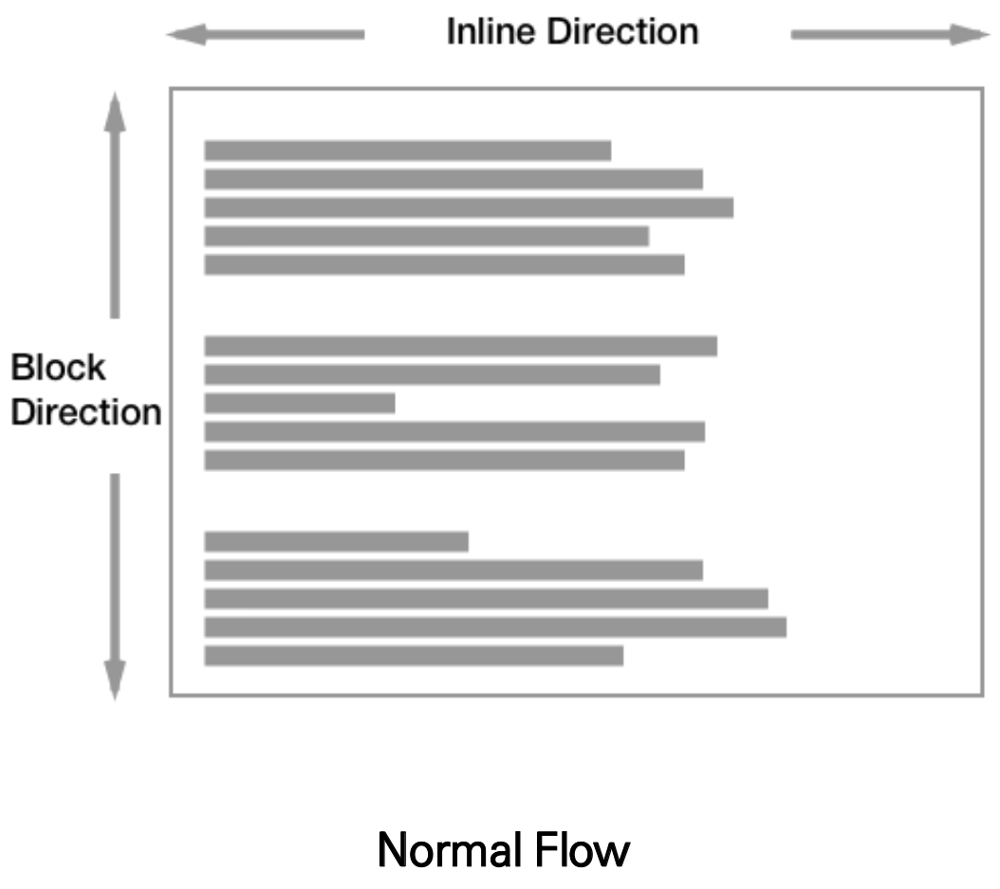
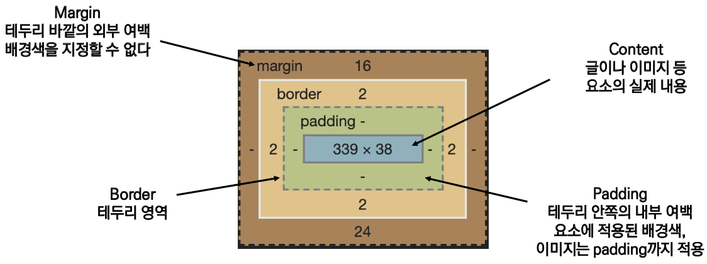
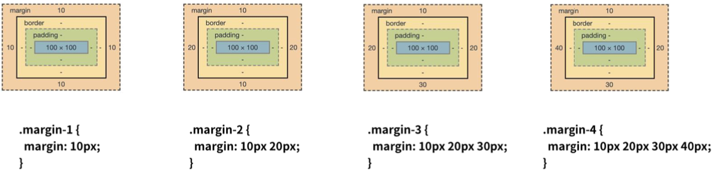
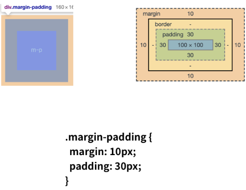
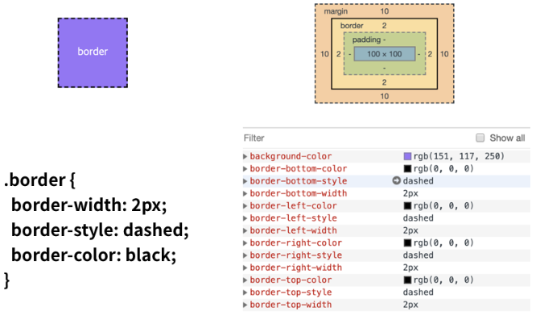
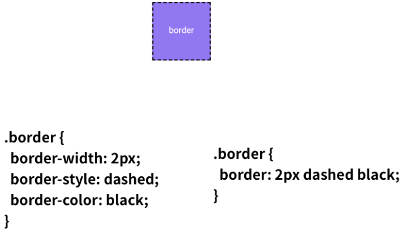
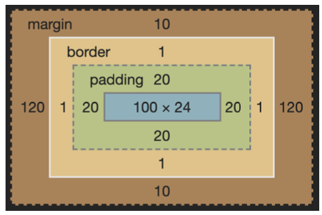
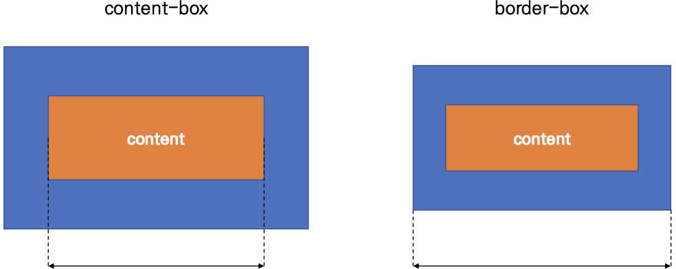

### `CSS Box model`

***

##### 🔎 Box model

- CSS 원칙 1

  - 모든 요소는 <span style='background-color: #f1f8ff'>네모(박스모델)</span>이고, 위에서부터 아래로, 왼쪽에서 오른쪽으로 쌓임 *<span style='background-color: #f1f8ff'>좌측 상단에 배치</span>*

  

- 하나의 박스는 네 부분(영역)으로 이루어짐

  - `margin`, `border`, `padding`, `content`

  

- Box model 구성

  - margin/padding

  

  - padding

  

  - border

  

  

  - box-sizing

    - 직접해보기

    ```css
    .box {
      width: 100px;
      margin: 10px auto;
      padding: 20px;
      border: 1px solid black;
      background-color: blue;
      color: white;
      text-align: center;
    }
    ```

    

    ​											content-box 영역의 너비는 얼마일까?

  - 기본적으로 모든 요소의 box-sizing은 content-box
    - padding을 제외한 순수 contetns 영역만을 box로 지정

  - 다만, 우리가 일반적으로 영역을 볼 때는 border까지의 너비를 100px 보는 것을 원함
    - 그 경우 box-sizing을 border-box로 설정

  

  

