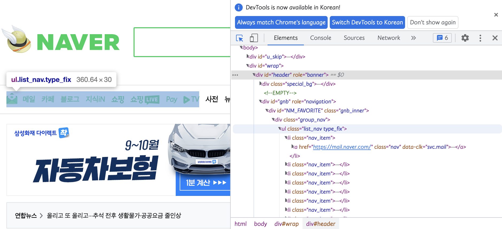
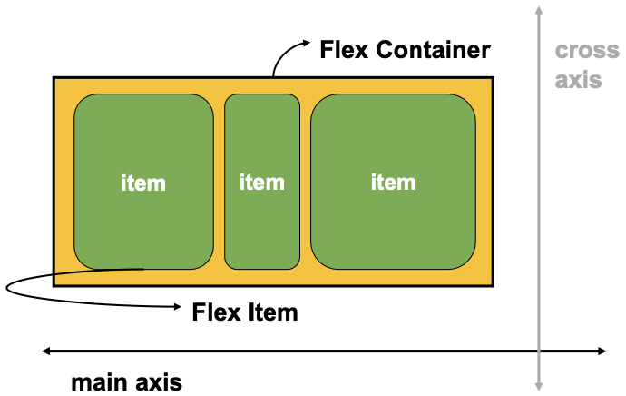
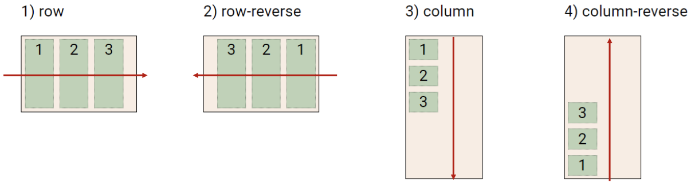
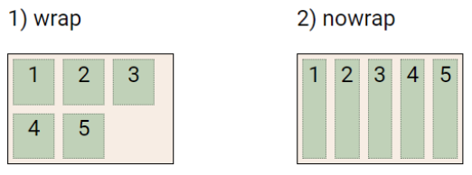
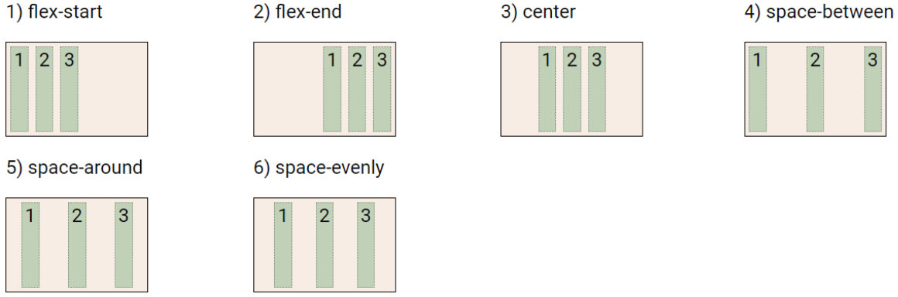
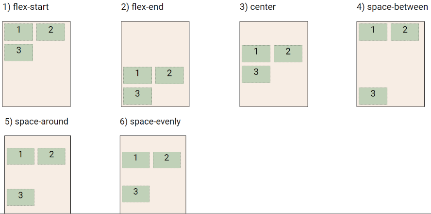
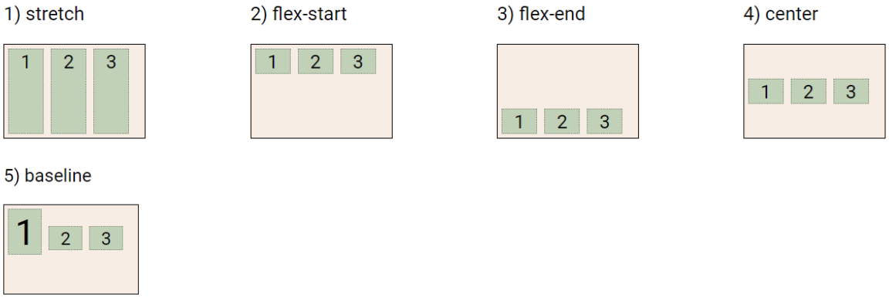
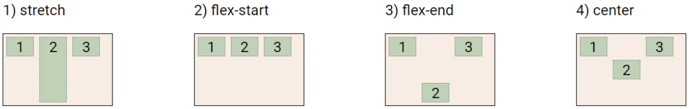
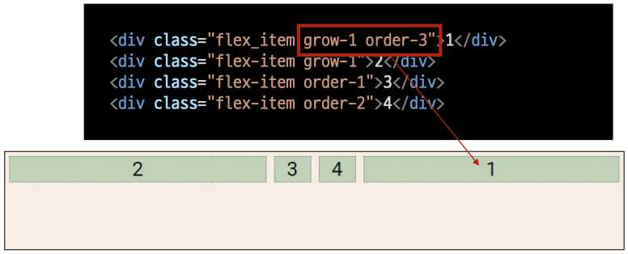

### `CSS Layout`

***

##### 🗒 Float

- 박스를 왼쪽 혹은 오른쪽으로 이동시켜 텍스트를 포함 인라인 요소들이 주변을 wrapping 하게 함
- 요소가 Normal flow를 벗어나게 함

- 예

  

##### 🗒 Flexbox

- 행과 열 형태로 아이템들을 배치하는 1차원 레이아웃 모델

- 축

  - Main axis (메인 축)
  - cross axis (교차 축)

- 구성 요소

  - Flex Container (부모 요소)
    - flexbox 레이아웃을 형성하는 가장 기본적인 모델
    - Flex Item들이 놓여있는 영역
    - display 속성을 flex 혹은 inline-flex로 지정
  - Flex Item (자식 요소)
    - 컨테이너에 속해 있는 컨텐츠 (박스)

  

- Flexbox를 사용해야 하는 이유

  - (수동 값 부여 없이) 수직 정렬 가능
  - 아이템의 너비와 높이 혹은 간격을 동일하게 배치 가능

##### 📖 Flex 속성

- 배치 설정

  - `flex-direction`

    - Main axis 기준 방향 설정
    - 역방향의 경우 HTML 태그 선언 순서와 시각적으로 다르니 유의 *(웹 접근성에 영향)*

    

  - `flex-wrap`

    - 아이템이 컨테이너를 벗어나는 경우 해당 영역 내에 배치되도록 설정

      *(요소들이 강제로 한 줄에 배치 되게 할 것인지 여부 설정)*

    - 기본적으로 컨테이너 영역을 벗어나지 않게 함

    - nowrap (기본 값) : 한 줄에 배치

    - wrap : 넘치면 그 다음 줄로 배치

    

  - `flex-flow`

    - flex-direction과 flex-wrap의 shorthand
    - flex-direction과 flex-wrap에 대한 설정 값을 차례로 작성
    - 예) flex-flow: row nowrap;

- 공간 나누기

  - `justify-content (main axis)`

    - Main axis를 기준으로 공간 배분

    

  - `align-content (cross axis)`

    - Cross axis를 기준으로 공간 배분 (아이템이 한 줄로 배치되는 경우 확인 할 수 없음)

    

  - 속성값

    - `flex-start` (기본 값) : 아이템들을 axis 시작점으로
    - `flex-end` : 아이템들을 axis 끝 쪽으로
    - `center` : 아이템들을 axis 중앙으로
    - `space-between` : 아이템 사이의 간격을 균일하게 분배
    - `space-around` : 아이템을 둘러싼 영역을 균일하게 분배 (가질 수 있는 영역을 반으로 나눠서 양쪽에)
    - `space-evenly` : 전체 영역에서 아이템 간 간격을 균일하게 분배

- 정렬

  - `align-items`

    - 모든 아이템을 cross axis 기준으로 정렬

    

  - `align-self`

    - 개별 아이템을 Cross axis 기준으로 정렬
      - ❗️ 해당 속성은 컨테이너에 적용하는 것이 아니라 개별 아이템에 적용

    

  - 속성값 *(Cross axis를 중심으로)*

    - `stretch` (기본 값) : 컨테이너를 가득 채움
    - `flex-start` : 위
    - `flex-end` : 아래
    - `center` : 가운데
    - `baseline` : 텍스트 baseline에 기준선을 맞춤

##### 🔎 Flex에 적용하는 속성

- 기타 속성

  - `flex-grow` : 남은 영역을 아이템에 분배
  - `order` : 배치 순서

  

  