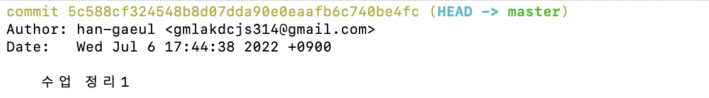

# git


#### git이란?

- 분산 버전 관리 시스템이다.

​		- 버전 : 컴퓨터 소프트웨어의 특정 상태

- Git 파일 관리

​		- modified : 파일이 수정된 상태(add 명령어를 통해 Staging Area로 이동)

​		- staged : 수정한 파일을 곧 커밋할 것이라고 표시한 상태 (commit 명령어로 저장소)

​		- committed : 커밋이 된 상태

​		- untracked : 버전으로 관리된 적 없는 파일


---


#### 명령어

​	- `pwd` (print working directory) : 현재 디렉토리(폴더/파일) 출력

​	- `cd` (change directory) : 디렉토리 하위 이동

​	- `cd ..` : 디렉토리 상위 이동(띄어쓰기 필수)

​	- `ls` (list) : 목록

​	- `ls -al` : 폴더 안에 있는 파일, 폴더 목록

​	- `mkdir` (make directory) : 디렉토리 생성

​	- `touch` : 파일의 날짜와 시간 수정(0바이트 빈 파일 생성)

​	- `rm` : 파일 삭제

​	- `rm -r` : 폴더 삭제

​	- `rm -fr .git` : git 삭제

​	- 단축키 `control + l` 또는 명령어 `clear` : 터미널 내용 지우기


---


#### Git 정보 설정

```
$ git config --global user.name '이름'
$ git config --global user.email '이메일'
```

- Commit을 작성한 사람(author)으로 저장됨.
- 이름과 이메일 정보는 Github에서 사용하고 있는 것과 동일하게 설정


#### 설정 확인

```
$ git config -l
$ git config --global -l
$ git config user.name
$ git config user.email
```


---


#### Git 사용

1. git init(저장소 생성)

```
$ git init
```

- git 저장소를 만들면 해당 디렉토리 안에 `.git` 폴더가 생성
- 터미널에서는 `(master)` 라는 표기가 생김
- git 설정 또는 명령어를 작성할 때 현재 경로를 꼭 확인해야 함

- `Desktop` 에 저장소 만드는 건 추천하지 않음


2. add

```
$ git add . #현재 폴더에 대한 모든 파일의 변경사항을 add
$ git add <파일명>
```

- 작업 위치(Working Directory) 안에 있는 파일을 Staging Area로 옮기기 위해 사용

  Staging Area는 commit을 진행하기 전에 임시 저장된 상태

- `1.txt` 라는 파일을 생성 후 `git status` 명령어를 입력하면 '변경 사항을 추가하지 않았음 (git add를 사용)' 하라는 문구가 나옴


- `git add 1.txt` 입력 후 다시 `git status` 명령어를 입력하면 Staging Area에 추가 완료


3. commit

```
$ git commit -m 'message'
```

- 버전(커밋) 기록을 할 때 알아보기 쉬운 내용으로 작성

- 영어로 작성하는 것이 보편적

  - 참고자료 

    [좋은 커밋 메시지를 작성하기 위한 7가지 약속](https://meetup.toast.com/posts/106) / [좋은 커밋 메시지를 위한 영어 사전](https://blog.ull.im/engineering/2019/03/10/logs-on-git.html)

- 커밋 기록을 확인하기 위해서 `git log` 명령어 사용




4. log

```
$ git log
$ git log -p
$ git log -1
$ git log --oneline
$ git log -1 --oneline
```

- 현재 저장소에 기록된 버전(커밋)을 조회

  - `git log` : 버전(커밋) 기록 확인

  - `git log -p` : 자세한 기록 확인

  

  

  - `git log -1` : 가장 최근 기록된 커밋 확인

  

  

  - `git log --oneline` : 한 줄로 기록 확인

  


5. status

```
$ git stauts
```

- Git 저장소에 있는 파일의 상태를 확인하기 위해 사용
- 파일의 상태를 알 수 있음


---


#### Git 원격저장소 연결하기

1. 경로 설정

```
$ git remote add origin http://github.com/'Github Username'/'저장소'.git
```

- 원격 저장소 정보를 로컬 저장소에 추가
- 로컬 저장소에는 한 번만 설정


* 만약 저장소 주소를 변경하고 싶다면 `remove` 로 기존 연결을 끊고 새로 추가하기

```
$ git remote remove origin
$ git remote add origin '변경할 저장소 주소'
```

- `git remote -v` 로 주소가 잘 변경 되었는지 확인


참고 https://cheershennah.tistory.com/217


2. push

```
$ git push origin master
```

- 지금까지의 버전(커밋)을 push 하는 것
- Working directory, Staging area의 변경 사항은 push 되지 않음
- `git status` 와 `git log` 를 통해 확인하는 습관을 가지는게 좋음


---


#### 참고

- [git 저장소 주소 변경하기](https://cheershennah.tistory.com/217)
- [git 완전 기초 사용 방법](https://chancoding.tistory.com/76)

