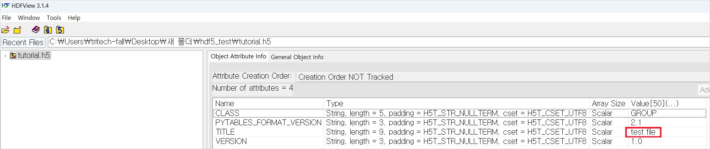
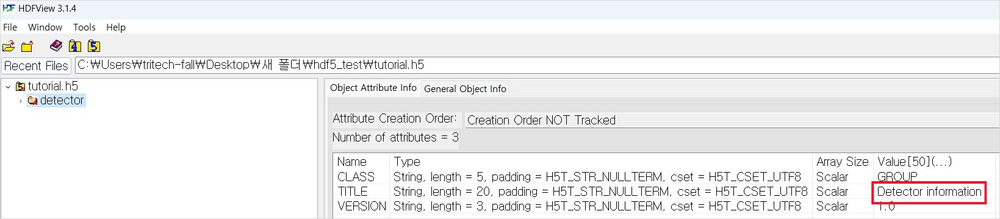
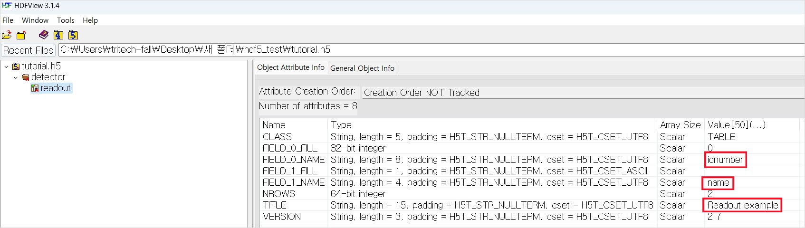
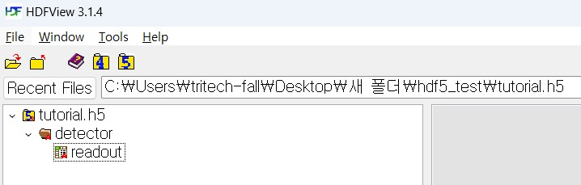
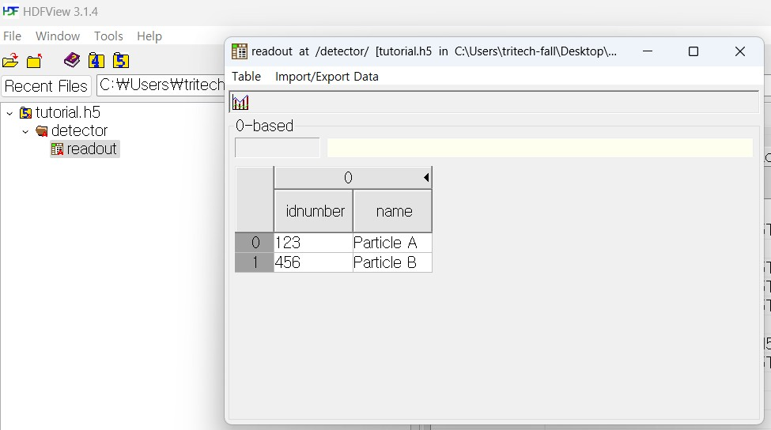
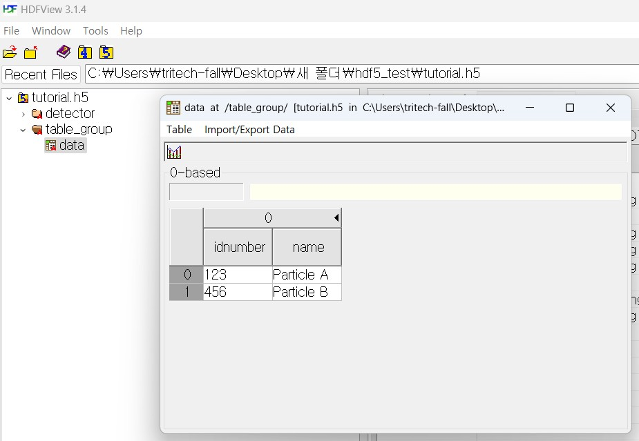

# PyTables

### 개요

------

- Python용 HDF5 라이브러리
- numpy 배열과 함께 사용하여 데이터를 저장, 읽기 및 조작할 수 있는 편리한 인터페이스 제공

### 장단점

---

#### 장점

- 빠른 입출력 속도 : 특히 대용량 데이터를 처리할 때 성능 우수
- 다양한 데이터 유형 지원 : 다양한 데이터 유형을 지원하며, numpy 배열과 유사한 방식으로 데이터를 다룰 수 있음
- 데이터 압축 : 디스크 공간 절약 가능 → 대량의 데이터를 다룰 때 유용하며, 빠른 입출력 속도와 함께 사용하면 성능 향상 기대
- 인덱싱 및 검색 기능 : 인덱스를 지원하여 데이터를 빠르게 검색하고 필터링 할 수 있음
- 단순한 API : 사용하기 쉬운 API를 제공하여 데이터를 저장하고 다루는 과정을 단순화 함. 특히 numpy와의 통합으로 데이터를 변환하거나 별도의 변환 없이 사용할 수 있음

#### 단점

- 학습 곡선 : 처음 사용하는 사용자에게는 시간이 필요할 수 있음
- Python 외의 환경에서의 사용 제한 : 주로 Python 환경에서 사용되며, 다른 프로그래밍 언어에서는 사용이 제한적일 수 있음
- 메모리 사용 : 대량의 데이터를 다루는 데 최적화 되었지만, 메모리 사용량이 높아질 수 있음
- 복잡한 데이터 형식 지원 : 파일의 구조가 복잡해질 수 있음. 파일 관리나 구조 설계에 주의 필요

### h5py와 비교

---

#### 공통점

- HDF5 지원 : HDF5 파일 형식을 다루기 위한 Python 라이브러리
- 다차원 배열 및 데이터 구조
- 데이터 압축
- 인덱싱 및 검색

####  차이점

|                      | h5py                                                         | pytables                                                     |
| -------------------- | ------------------------------------------------------------ | ------------------------------------------------------------ |
| API 디자인 및 사용성 | 상대적으로 간단한 API를 제공하여 파일을 조작하는 것을 간편하게 만듦 | 좀 더 복잡한 기능과 복합적인 데이터 형식을 다룰 수 있도록 설계 |
| 기능의 다양성        | 기본적인 데이터 입출력을 위한 기능을 간단하게 제공           | 데이터의 검색, 인덱싱, 필터링 등에 더 강력한 기능 제공, 더 많은 데이터 유형 지원 |
| 설치 및 의존성       | 추가 의존성이 적게 필요하며, HDF5 C 라이브러리에 대한 Python 바인딩을 제공 | Cython을 사용하며, pytables 자체를 설치하는 데 더 많은 의존성이 필요 |
| 주요 사용 사례       | 간단한 데이터 저장 및 로드, numpy와의 연동이 필요한 경우 적합 | 대량의 데이터를 처리하고 분석해야 할 때 유용                 |

→ 즉, 간단한 데이터 조작이나 numpy와의 호환성이 주요 목표인 경우 h5py 대량의 데이터를 처리하고 저장하거나 복잡한 데이터 형식을 다루어야 할 경우 pytables

### 사용법

---

#### Install

- pip

```bash
pip install pytables
```

- conda

```bash
conda install pytables
```

#### Import

```python
from tables import *
```

#### Create

- 클래스 생성

    - 파일 내에 저장할 데이터의 구조를 정의하는 클래스

    ```python
    class Particle(IsDescription):
        name = StringCol(16)
        idnumber = Int32Col()
    ```

    - 설명

        이 클래스는 `IsDescription` 클래스를 상속 받아 필드와 해당 필드의 데이터 유형을 정의하는 역할

- 파일 생성

    ```python
    hdf = open_file('tutorial.h5', 'w', title='test file')
    top_group = hdf.create_group('/', 'detector', 'Detector information')
    table = hdf.create_table(top_group, 'readout', Particle, 'Readout example')
    print(hdf)
    
    # 결과
    # tutorial.h5 (File) 'test file'
    # Last modif.: '2023-08-16T06:36:17+00:00'
    # Object Tree:
    # / (RootGroup) 'test file'
    # /detector (Group) 'Detector information'
    # /detector/readout (Table(0,)) 'Readout example'
    
    # Closing remaining open files:tutorial.h5...done
    ```

    - 설명

        `open_file` 함수

        - title : 생성되는 HDF5 파일의 제목. 이 값은 파일의 메타데이터로 사용

        

        `create_group` 함수

        - / : 그룹을 생성할 경로
        - detector : 생성할 그룹의 이름
        - Detector information : 생성할 그룹에 대한 설명. 이 값은 그룹의 속성으로 사용

        

        `create_table` 함수

        - top_group : 테이블을 생성할 그룹. 이전에 생성한 detector 그룹에 테이블을 생성하고자 할 때 사용
        - readout : 생성할 테이블의 이름
        - Particle : 테이블의 구조를 정의하는 클래스
        - Readout example : 생성할 테이블에 대한 설명. 이 값은 테이블의 속성으로 사용

        

- 구조

    

#### Input Data

```python
new_row = table.row
new_row['name'] = 'Particle A'
new_row['idnumber'] = 123
new_row.append()

new_row['name'] = 'Particle B'
new_row['idnumber'] = 456
new_row.append()

table.flush()
print(hdf)
```



```python
table_group = hdf.create_group('/', 'table_group', 'table group')
data = hdf.create_table(table_group, 'data', Particle, 'Data Table')

new_data = [{'name': 'Particle A', 'idnumber': 123}, {'name': 'Particle B', 'idnumber': 456}]
for item in new_data:
    row = data.row
    row['name'] = item['name']
    row['idnumber'] = item['idnumber']
    row.append()
data.flush()
```



### 참고 링크

----

[pytables documentation][http://www.pytables.org/index.html]

[h5py docs](https://docs.h5py.org/en/stable/index.html)

